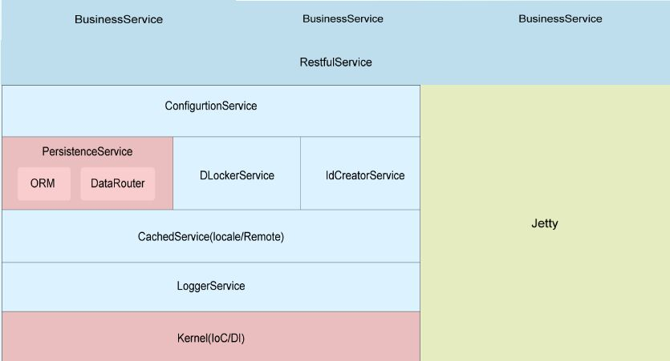
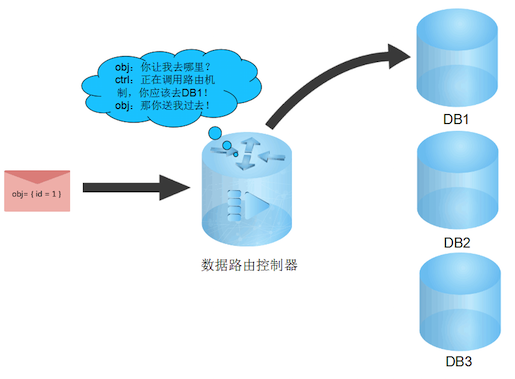
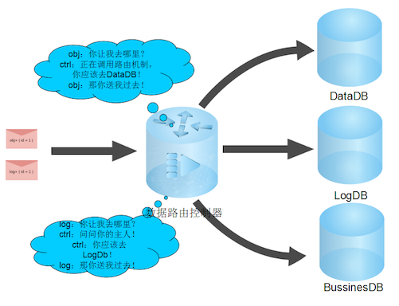
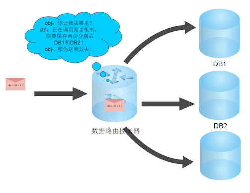
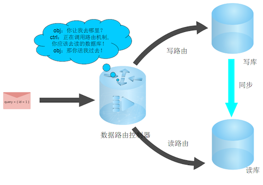
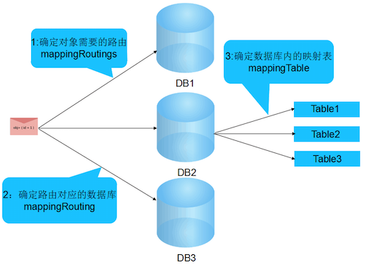
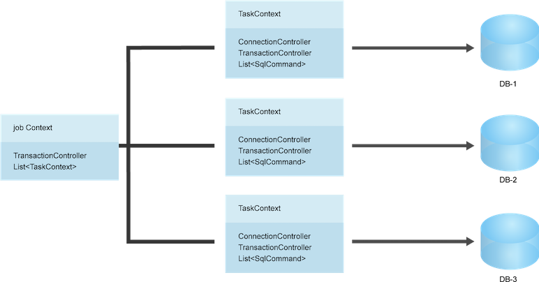
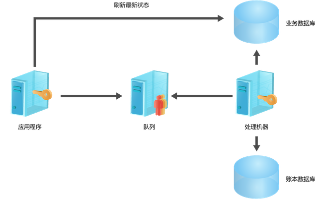

### 摘要  
我们设计并开发了内容中心统一的分布式开发框架。我们把它取名为albian，
albian是基于java的（故以下简称albianj）。他主要是面向海量数据处理、海
量数据访问、并解决互联网开发中经常会碰到的数据海量增长问题，也一并解决
互联网开发团队中，开发人员的水平参差不齐的问题。albianj还应当具有良好
的伸缩性和可定制性。他设计并且运行在简单的
web容器中，比如tomcat或者是jetty，也可以运行在application类型的应用中，
但是它依然提供了企业级开发应该具备的一切效能。  

从业界来说，目前成熟的框架有很多，但是从EJB因为复杂性而被大多数公
司放弃后，spring+Hibernate在业界成为了事实上的标准。总体来说
spring+Hibernate可以解决掉企业开发的很多问题，但是在互联网行业，在快速
开发、海量数据处理和快速迭代引起的统一问题面前，这个组合还是有或多或少
的问题。所以我们最后决定自己开发一个适合我们自己的框架出来，来解决sh组
合不能很好的解决的问题。  

虽然albianj和sh有很多的相似性，可能很多的功能都是重复的实现，但是毕竟
albianj实际来自于我们对于掌控业务和掌控代码的现实需求，所以它更面向于
我们的实际情况，而不是来源于开源组织对于系统的理解或者是某篇论文对于系
统概念的理解。这样，也就意味着albianj相比sh会更实用，并且能给我们带来
更好的可用性和可维护性。  

albianj的使用满足了我们在业务上对于程序代码控制和功能上对于处理海量实
时数据的需要。目前albianj已经使用在我们的生产环境中，主要为内容中心提
供数据的存储和读取之用。目前它一共被部署在上百台的机器上，来完成对于几
十台数据库的各种不同模式的访问。  

在本文章中，我们主要阐述我们设计和开发albianj的一些观点和一些策略选择
的原因，以及我们是怎么设计和实现albianj的，最后我们会列出实际情况下我
们的开发效率和性能数据。  

### 简介  
albianj主要完成的任务就是统一程序员的工作，让程序员在统一的口径
下完成他们的工作，这仅仅是一个长远的战略目标；更现实的目标是alabianj必
须提供一套简单的机制在应对对于拥有复杂部署结构的后端数据库的访问和在数
据量增长的过程中，方便的切合数据的再划分等等功能。在开源的项目中，我们
考察了guzz和hbm shared，但是前者过于复杂，导致我们迷失在了配置文件中，
而且对于他显式的指定数据路由有一定的不可接受；而后者，它仅仅只是一个补
丁，而且这个补丁的质量真的令人堪忧，不支持分布式事务这是完全不能接受的
事实，而且当使用数据路由之后，分布式事务肯定是无法避免的、肯定会有所需
求的重要功能。所以我们综合的考量下来，决定自己来设计并完成整个框架系统。  

对于albianj，其实它和市面上提供的各种开发框架功能类似，最最基本的功能
也仅仅只是IoC和ORM，所以从这2个方面可以看出，我们还是在追求对于OO的控
制。但是albianj不仅仅只是完成这些功能，它更多需要强调一致性。不仅仅是
数据的一致性，而是对于程序员写代码的一致性和可控性，兼具对于各种
albianj中主键的一致性和可控性；其二，它还需要解决一个大多数的框架都没
有解决的问题，那就是数据路由的能力。简单而一致的数据路由功能可以快速的
开发大数据量的业务，并且也可以在短时间让自己的系统重新适应并且无缝的连
连接已经重新切分好的数据。相比传统的开发框架，我们在设计和开发albianj的时候就已经
额外的考虑了更多的内容，并在其中进行了有的放矢的选择，引申出了和以往不
同的开发思路，也实现了我们开始对于albianj设计时制定的目标。  

首先，albianj和别的框架不一样的核心点是“单维性”，简单来说就是一种需
求只会一种办法来解决，轻易不会出现第二种办法。就算为此牺牲一定的编程便
利性，albianj也需要守住这个底线。所以这个模式就和spring或者诸如此类的
框架有质的不同，一方面我们没有必要为了迎合新的概念或者新的技术频繁的对
albianj进行升级和改造，另一方面，我们也没有必要为了多功能而引入不必要
的复杂税。从程序员写代码的角度来说，他们也仅仅只需要学会一种途径就可以
依葫芦画瓢似的解决类似的问题。这样的结果就是代码会无比的统一，熟悉
albianj过后开发也是无比的迅速。这一点是albianj一直在追求的，也是一直在
遵循的一个必须准则。albianj所有的功能都是建立在这个标准之上的。  

其次，和别的框架一样，我们必须也需要使用配置。但是我们和别的框架不一样
的地方是我们没有“约定优于配置原则”。在稍早之前，随着java对于xml的配
置越来越依赖，导致了很多的java程序员40%的时间在写代码，另外的时间都在
写配置或者是copy配置。后来随着各种抱怨的产生，遂订立了一个规则，就是坑
爹的“约定优于配置”。这个出发点其实和hbm的sharing是一样的，它仅仅只是一
个补丁而已。其实我们经过10多年的互联网开发，总结了一下，我们认为，目前
xml的配置一部分是因为功能的复杂而决定了，另外一部分是被滥用了，两点相
加造成了目前的这种境况，然而为了前面的失误，后面加入了一个补丁（约定优
于配置）来解决这个问题。其实并没有真正的解决问题。所以albianj在设计的
过程中就是尽量的对配置做减法，仅仅保留必要的配置，但是在配置和一致性、
可维护性冲突的时候，我们选择了一致性和可维护性，放弃了对于配置精简的需
求。  

第三：albianj是所有组件的总称。其实它里面包括了多个不同功能的组件。对
于这些功能性组件，除了基本kernel以外，所有的组件都是被设计成插件式的。
我们采用了一键安装和尽量透明使用的策略。在一些需要使用的地
方只需要配置项加上某些配置，功能会自动启用。这样在保证解决问题一致性的
同时对程序员又不失开发上的便捷。对于我们的整个系统来说，它不仅仅解决了
开发效率的问题，更是解决了年久失修这个困扰我们团队已久的问题。  

第四：albianj对于我们团队来说，还解决了团队中开发人员水平参差不齐的问题。因为
albianj恪守一致性的原则，只要对albianj使用得当，写出来的代码几乎是一个
模板刻出来的，不管程序员的水平是应届生还是具有开发经验的程序员，几乎写
的代码大同小异。在关键的数据路由等功能性问题上，albianj提供的解决方案
是提供一些接口来供程序员使用，程序员要做的事情就是实现这些接口而已，中
间并没有除此之外的任何代码需要程序员来完成。  

最后：最重要的一点是，albianj的完成是我们整个团队在互联网开发10多年来的
经验结晶。它容易设计并且容易完成，而且因为它是为我们量身定做的，所以在
使用上并不存在任何碍手碍脚的地方。总体上的架构因为全部是我们自己从头开
始搭建，所以解决bug或者易用性问题也是一件非常简单的事情。我们并没有因
为整个albianj的开发而导致业务的延期，相反在业务的开发中，我们不时的发
现albianj改进的点，对此我们加以了改进，生成的效率也有所提升。我们进行
了逐一的更改和优化。这些更改和优化也会一并在这篇文章中体现。  

### 设计概述

#### 目标

在上面的介绍中，我们简单的介绍了albianj的一些设计的思想和准则。并且我
们声明了albianj在系统存在的地位和它的一些基本功能。在这一节中，我们将
详细的说明albianj设计的目标和对我们的挑战。在设计和实现的过程中，我们
印证了一些我们初定的目标，在项目使用和实施的过程中，我们也根据我们实际
的情况对于初定的目标进行了一定的筛减和优化。

1. 首要的目标就是一致性。在开始设计albianj的时候就把albianj的一致
   性作为极致的追求来实现。我们认为在一个软件的声明周期内，一致性起到
   的作用不仅仅体现在代码的可读性上，而且更有利于后期的软件的可维护性
   上。特别当团队的人员开始流动的时候（其实我们一直觉得人员的流动是无
   法避免的），拥有一致性和可维护性的软件会拥有更长的生命周期。而且一
   致性不仅仅体现在可维护性上，还有更多的是可以节省前期程序员的工作量
   和降低bug出现的机率。

2. albianj必须可以应对海量数据的访问。在现在的互联网系统中，海量的数据
   和高并发的访问已经变得越来越普遍。对于庞大的系统来说，应对海量数据和
   高并发流量的策略就是拆分。所以本质上，albianj其实需要面对上百台甚至
   是上千台的后端服务器，他们可能是分布式的存储，也可能是关系型的数据
   库，或者是后端的业务接口服务器。albianj可以提供一种简单而有效的方法
   来应对那么多的机器。实际的情况其实并不仅仅只是这么简单，因为albianj本
   身就在分布式的环境中，它需要部署在成百上千台服务器上，以提供最基本
   的框架服务。

3. 作为一个开发框架，albianj必须要可以随时来应对机器的增加和损坏。
   albianj必须在有限的时间内来应对机器的部署改变，而不需要更改代码或者
   仅仅只是更改有限的配置。传统来说，就算机器一切安全而稳固，整个服务
   也会因为数据量的增加而需要重新审视架构和机器的部署。更多的时候是需
   要拆分数据和移动数据，而albianj需要在面对复杂的架构调整的时候，轻易
   的来应对问题。从而让系统重新稳定架构的成本降到最低。

4. 作为整个系统的最基本的底层，albianj需要适应更多功能的快速加入。并且
   在albianj的规范内快速的形成组件化，做到即插即用的效应。这不仅仅只是
   代码级别所考虑的事情，更多的是需要在设计的过程中就注意对于新功能添
   加的便捷性。也就是说需要从头就开始考虑以后的可扩展性，做到一致性、
   可维护性、可扩展的平衡和兼得。

5. albianj作为这个内容中心的框架，也必须要对程序员做到尽可能的友好，又
   必须考虑一些敏感信息对于系统安全的影响，在这两者之间取得相应的平衡，
   来达到albianj最好的亲和性和安全性。这个挑战不仅仅在于对于albianj的
   使用上，更多的是需要平衡团队内部参差不齐的开发者的编程水平。

6. 因为albianj是从头开始搭建的一整套完整的框架，所以难免会出现bug或者
   是开发者觉得使用不是那么顺畅的地方。albianj还必须提供一整套的完备机
   制来第一时间解决bug或者是易用性的问题。

在总体的设计思想上，albianj的挑战非常的严峻，特别是对于一致性的特别的追求和
对于安全性、易用性、可扩展性之间平衡的需求不是一点点的难度。然而，不管
怎么样，最后还是需要具体的细化到各个技术点的目标上才可以告别空中楼阁，
才会有落地实现的机会，所以我们又对albianj在技术上定下了一些目标，这些
目标组合起来，可以实现上文提到的一些对于albianj的期望。

1. 首先为了解决一致性问题，我们必须使用一致的方法来实现各种功能。albianj
   必须设计和实现一套OOP编程机制，其中包括接口、实现、配置之类的相关标准。
   albianj还必须设计和实现一套代码的命名标准、代码的相关逻辑组织标准。
   必须建立和实施一套我们使用albianj的标准和方法。因为
   我们的业务代码最后都会建立在albianj上，所以必须要夯实作为基础的
   albianj和相关的规则规章，我们才有可能实现严格的一致性需求。

2. 对于albianj来说，它其实是一整套我们经常使用的功能性工具集的集合，所
   以务必要做到在不损失alabinaj整体性的同时，使用合理的切分方法
   来设计和实现albianj的各个子功能集。所谓合理的方法，其实无非也就是系
   统的划分原则，在albianj中，我们使用了”统一依赖、各自管理、各自实现、
   减少干涉”的原则，我们给这个原则取了一个名字：边界原则。具体的办法就
   是各自实现自己的功能，尽可能的减少子系统间的相互依赖，尽可能的减少
   跨系统的生命周期内的依赖。

3. albianj不推荐并且放弃了“惯性原则”，albianj使用显式的声明来完成所有的功能
   性配置或者是代码的编写。每个人的受教育程度不同、开发经历也不一样、
   对待系统的认知和视角也各不相同，所以基本上是无法真正的做到大家
   在同一个认知水平上来处理事务，也就是说“惯性原则”中最重要的“惯性”对
   整个团队来说基本上是无法实现的。所以必须要提供一种技术或者
   是一种机制来约束这个开发者各自的”惯性“，已达到对于整个系统拥有
   一个一致的惯性的理解。

4. albianj作为大家使用的一个功能性集合，必要还要做到albianl自身必须要
   保持简单，并且要做到因为albianj的存在，可以隐藏albianj的后端的业务
   部署关系。不管是业务集群还是数据库集群。开发者
   只要认为使用了albianj就可以简单的把整个系统当成单机系统一样的开发和
   测试。

#### 架构
在设计albianj之初，其实并没有一个非常明确的对于架构的标准。我们一
致的认为架构的设计实现与架构的层次类别区分并不是由某些理论或者是某篇论
文或者是某个观点来进行的，而是在真正的实现过程中，随着功能点的增加和实
现的代码逐渐的增多，会自然而然的去对整个的系统进行审视和调整，这部分的
工作会一直循序渐进的继续下去，永远不会停止下来。

到目前为止，albianj已经演化成了具有8个子功能集的大架构。它们之间
并无复杂的依赖关系，除了简单的依赖于同一个kernel以外，别的所有的依赖都
是按需而定的。

 

在框架开发发展了这么多年的今天，对于一个框架来说，寻找一个架构上标新
立异的机会几乎不可能了。而不同在于在使用的便捷性和框架的设计出发点。albianj主要面
向的就是互联网的开发，这是一个基本的立足点。所以，albianj框架首先
不会是大包大揽的功能性集合，对于一些互联网不会用到的功能一律的进行
生删减，但是对于关心的问题，albianj也结合我们自己的实际情况和需求解决
掉了。从而分门别类划分的这几个功能性子集基本上已经代表了albianj所能精简
的极限了。下面会依次的对这些功能性子集做出解释，并且对于没有被albianj
选择的可能的选型做出取舍的原因。

#### kernel
作为整个albianj的核心，它有2部分组成。一部分是albianj基本上都需要
用到的公共功能；另外一部分也是albianj都需要用到的，并且是更加重要的、
满足我们对于管理service需要的ioc功能。

先说公共功能。这部分包括了很多的功能性的封装，包括但是不仅仅局限于hash
算法、输出型参数、日期操作、网络基本接口、反射基本接口、运行时栈信息、
加密解密安全、数据验证接口、xml解析等功能。他们是所有的albianj功能集可
能会使用到的，但是我们又无法给他们分开归类的功能。我们把这些功能统一的
放到kernel下面的公共功能集下面，以供albianj使用。

这部分的功能对于albianj的使用者来说，也可以被直接拿来使用，但是更多的时
候，除了验证机制以外，别的功能基本上都不太用得着。所以对这个功能包不清楚或者不
知道它的存在并不影响合理的使用albianj。

对于ioc功能来说，这是整个albianj的核心。其二，对于使用albianj作为开发
框架的业务系统来说，也是它们的核心。ioc都是提供了一个控制反转的功能。
将我们的接口和实现分开，然后根据自己的需要加载实现。传统的ioc（比如
spring）会有n多种的注入方式，初始化参数、接口、属性等等。但是
albianj仅仅使用一种方式：接口方式。选取这个方式的主要原因有以下几个方
面：

1. albianj认为提供多种的注入方式会引起代码的混乱和配置的文件的复杂度，对
   于可维护性来说，过多的解决方案可能会适得其反。当有多个同事同事使用
多种方法时，虽然它们的方法方案被限制在一个框架内，相互之间还是会增加
   学习成本，维护成本；

2. 选择接口注入的方式是因为albianj需要对于service进行控制。在比较了一些注
   入方式后，接口注入是最适合albianj的一种方式。为了更好的管理
   各个service和以后的扩展（这会在下一点中有详细说明），albianj必须要干扰
   service的初始化和使用过程。albianj需要给每个service标注它的生命周期，
   已提供包括惰性加载之类的各种功能；

3. 上面讲到以后的扩展。对于albianj来说，目前的service都是在本地运行的，
   不会出现remoting的调用，也不会出现微服务的模式。但是互联网的世界瞬
   时万变，现在不需要不代表以后不需要，为了让albianj活的更长久，又更强
   的生命力，albianj的ioc功能是被设计成可扩展的。以后如果需要加入
   remoting的过程调用，对于albianj来说也仅仅是只需要修改service初始化
   部分即可，并且当加入remoting调用后，生命周期和惰性加载将会更加的适
   用。

对于albianj的ioc来说，它仅仅只是需要一个配置文件来控制，配置好name，接
口和实现，除了配置以外，albianj还要求所有的service都必须实现
IAlbianService接口，如果是使用默认的albianj的service功能，为了方便，
albianj也提供了FreeAlbianService的基类。这些规则都满足以后，开发者就可以根
据albianj提供的方法从ServiceRouter中根据配置的name获取service就
可以了。剩下的事情都是由albianj内部来完成。

所以albianj的kernel提供了一个解析xml的功能，albainj会把配置在config文
件夹中的配置文件根据实际启用的功能集来加载和解析xml。但是albianj的xml
解析仅仅是提供了最基本的接口功能，因为每个配置文件的格式都是不一样的，
所以具体的解析配置文件的工作被丢给了实际的功能集来完成，这样一来方便了
开发者对于albianj的二次开发，二来也是大大的节省了albianj本身的代码和人
力成本。

那么现实的问题是那些service从哪里来？这些service是在albianj启动的时候
根据你的配置已经进行初始化了。显然albianj使用了单例模式对service进行了
控制。albianj在使用的时候需要使用者在进程启动
的时候显式的调用albianj的启动函数，已启动并且初始化整个albianj环境。这
部分的启动不仅仅初始化albianj的kernel，更是初始化了使用albianj的所有已
配置的service和所有已配置的功能，包括后面会讲到的数据路由、ORM、配置等
等。为了更快的启动albianj和进程，albianj的加载方式还提供另外的一种异步
加载功能。但是使用albianj必须在albianj加载后使用。异步加载仅仅是提供了
进程可以在加载albianj的同时加载它所需要的另外的一些功能。

albianj的kernel除了提供最重要的这两部分之外，在kernel内部还提供了线程
池和异常处理，也定义和实现了log接口（关于log后面会有详细的叙述）。线程
池的作用主要是提供异步的数据操作，这部分会在ORM和缓存部分为使用和提及，
而异常是整个albianj的基础组件。这里所提及的异常是经过完善后的异常，
和程序直接抛出的异常并不是完全相同。这里的异常将会包括比原始异常更丰富
的堆栈信息，它主要面向的是程序员开发和业务处理过程中的日志，让开发者或
者是运维更快速的确定发生异常的地点和原由。

就目前来说，albianj的service已经足够我们使用，当面对的压力变大，系统
需要扩展的事情，只要扩展FreeAlbianService的生命周期实现功能就可以
了。albianj给每个service都定义了一个生命周期，状态依次是：

1. Normal：表示service刚刚构建出来，还不能被albianj初始化，并且不能被
   直接使用；  

2. Initing：表示service在构建出来后正在执行albianj的初始化功能，在这里
   你可以初始化刚刚生成的service，典型的例子是当service作为微服务提供
   的时候，在这里可以想nameservice注册service；
   
3. Running：表示service已经在正常运行状态，使用者可以通过albianj框架调
   用这个service；  

4. UnLoading：表示service正在被卸载，一般来说，这步除了设置状态和卸载
   initing的时候加载的资源就没有什么了，但是如果这个service作为微服务，
   那么需要在这里把service从nameservice中注销掉；

5. Unloaded：表示service已经卸载完毕，正在等待GC回收。service到这一状
态后，它将不能被albianj调用，所以这一状态对于开发者来说是透明的；

albianj的ioc是albianj所有功能的基础，通过简单而可靠的方式实现的ioc为
albianj提供了最大的方便。在扩展性方面，albianj也给了开发者在统一的基础上最大
的自由。下面的所有albianj组件都是建立在albianj ioc的service模型的基础
上。所以搞清楚albianj的ioc，基本上就搞清楚了albianj的一半。

#### DataRouter

数据路由其实设计和实现albianj的初衷，也是花费那么多的力气，重新找一个
轮子的最基本的动力。上面提到的kernel其实也是因为
数据路由的存在而设计和实现的，kernel的最初功能只是为了管理数据路由中使
用到的service，但是在实践中发现这部分其实也是整个系统所需，才开始认真的重
新设计和重构了原本属于DataRouter的这部分，然后把它单独的作为一个功能开
放给开发者。

我们设计和实现数据路由很大一部分的原因是：目前没有找到一个合适我们实际
情况的路由组件。数据路由：它主要完成的功能是当开发者对数据库进程操作的时
候，数据路由可以根据配置的路由信息把查询或者是数据提交到正确
的目的地。这些目的地包括但是不仅限于数据库，还有可能是一个分布式的存储，
或者是一个nosql的数据存储服务。目前互联网的现状是，几乎每个公司对于数据库的路由功能相对来说迫
切程度比较大，但是找了一下开源，结果还是挺失望的，发现并没有一个简单而
有效的数据路由可以直接拿到使用。连可以拿
来做二次开发的都没有。那么在无路可走的时候，我们开始自己设计和实现数据
路由。

结合我们的实际情况，首先的问题就是数据存储的异构性。目前我们大量使用了mysql作为主力
存储，mysql确实也因为优异的性能表现扛住了压力，但是这不代表我们
仅仅会在mysql上做开发，可能也会引入别的数据库，比如oracle。所以albianj的
数据路由必须要支持异构的数据存储。在支持异构存储的情况下，后面的扩
展才不会大动筋骨。

其次，根据实际情况，albanj的数据路由必须要支持存储的运维部署。比
如支持双写模式、读写分离模式等等。更高的需求是这些运维模式的支持必须是
无缝的，对于开发者来说是透明的。在支持存储部署模式的情况下，albianj还必须
做到简单而有效的支持数据的迁移等等后期的维护问题。这样在目前我们的运维
人手和DBA人手都不是很充足的情况下，可以做到尽量简单的维护我们的系统，
节省我们的人力成本。

再次，albianj的数据路由必须可以随心所欲的进行控制。比如路由的开启和关
闭，或者是路由的重定向等等。只要存储的数据已经到位的情况下，albianj的
路由必须可以在第一时间进行系统的支持。这部分也需要对开发者透明，仅仅需
要运维的改动就可以实现。

然后，albianj的数据路由还必须支持数据的完整性。对于所有的系统来说，数
据的完整性是必须的要求之一，也是最重要的要求之一。因为数据路由的加入，
使得其实对于开发者来说，后端数据库已经被屏蔽了。后端的数据库是不
是采用分布式部署等等信息全部被屏蔽掉，所以albianj必须要替开发者在
albianj的层面上解决这个数据的完整性问题。这个完整性问题在分布式数据库
的时候被扩大，原本的事务被扩大成分布式的事务，也就是说albianj也要必须
能支持分布式的事务。

最后：也是albianj的一直坚持的一点，在支持这么多的功能的时候，必须要做
到统一。必须要做到配置上的统一、代码级别上的统一。

经过前期实际的项目实施，albianj的数据路由被总结成4种情况:

1. 最简单的一种是直接把一个对象保存到路由指定的数据库.

2. 稍微复杂一点的是需要同时保存多个对象到各自指定的路由数据库，典型的
操作是在保存一个对象的同时再保存一份日志.

3. 再复杂一点的保存多份，也就是多写.  

4. 最后是albianj必须还有路由sql语句的能力，而不仅仅是路由数据对象.

上面的饼已经画的足够的大，现在是实现这个饼的时候了。把空中楼阁落地。
首先确定的一点是这个庞大的数据路由必须在我们的albianj内部实现，
而不是使用类似于mysql proxy这种组件。最简单的原因就是proxy这种组件只能
解决相关的单一类型数据库的问题，它不能解决所有数据库的问题。也就是说不能解决
在扩展中需要的异构数据存储的问题。那么唯一能剩下的就是在JDBC的时
候做手脚了。先来看一段简单代码：

>
    cmdText="INSERT INTO User01 Values....";
    connString = "database=db1;user=root...."
    Connection c = new Connection(connString);
    SqlCommand cmd = new SqlCommand(c,cmdText);
    SqlTransaction tran = c.getTransaction();
    try {
	    tran.begin();
	    cmd.Exec();
	    tran.commit();
    } catch() {
	    tran.rollback();
    }finally{
	    c.close();
    }

这基本上就是实现一个JDBC最简单的模型，我们需要在这段代码中绣出花了，
让这朵花能支持albianj的数据路由功能。仔细看这段代码，其实除了cmdText和
connString这两句以外，别的代码都是已经被公式化的，也就是没办法更改。
而这两句的是仅仅是能定义的两句。其中cmdText中的表名和connString中的
database值是能自定义的，那么现在的问题就是怎么样通过一个规则来
确定我们这里表名和basedata的值。其实这个规则就是确定数据路由。在
albianj中，因为albianj位于底层，albianj只是调用路由规则，并不定义
路由规则，路由规则都是有开发者定的，所以现在的问题又变成了怎么样来
调用规则？

在调用规则之前，还要确定一个事情：在哪里调用规则？或者说为了什么而
调用规则，一个很明显的问题是不可能让程序员自己直接去写JDBC代码，所
以albianj必须要提供一套对象和数据库的映射，那么ORM也就被引进进来了。有了
ORM，又需要更改表名，那么一个地方已经找到了，就是在数据对象转成Sql
语句的时候把表名给拼出来。那么最后一个问题，database的问题，在什么
时候确定database的值？database的使用是在连接数据库的时候，所以必
须要在连接数据库之前确定这个值。而数据库又和路由相关，所以在确定路
由的时候就可以确定database的值。那么最后，albianj演变成路由3部曲：

对着这3部的路由选择，在albianj中也提供了一个基类来完成实现这个功能。
在albianj中，FreeAlbianObjectDataRouter基类就是这个实现类，在通常的情
况下，开发者只有继承这个类就可以了，对于自己的路由需求，可以通过这个类
里面的不同的方法来实现，这个类一共提供了6个方法，分成2组，一组提供给读
服务，另外一组提供给写服务。但是仅仅是这个基类还无法完成albianj提到的路由
功能，整个的路由功能必须还需要配置文件的配合。其中drouter.xml就是配置
路由的配置文件，drouter根据每个对象来定义它的路由，在发生数据操作的时
候这些路由会被albianj自动调用；还有一个配置文件是storage.xml，这是配置
所有数据库连接的文件，这里的配置信息需要和drouter.xml中的路由配合起来
使用。

albianj在这里并不会牵涉到实际的业务数据路由拆分策略，这是因为具体的拆分策略都
是需要根据自己的实际业务来决定，而albianj只是要实现一个可以实现这种策
略的机制而不是具体的事实策略，所以这部分将不会在本文中出现。  

#### ORM

在albianj中，因为一些异构数据库的问题，要实现数据路由，必须要依靠ORM来
解决这个问题，那么现在，我们开始说说ORM。

在albianj中，ORM也是被作为一个基本的组件实现。但是albianj中的ORM和很多开源框
架的ORM有很多功能上的取舍。albianj对于ORM进行了精简，已保留albianj最需要
的部分为前提，把所有不相干的功能全部删除掉。所以albianj中的ORM其实仅仅
只是一个对象和关系数据库的实体和表结构映射和相关操作。它并不提供在ORM层面处理复
杂的对象间关系依赖的问题，它也没有涉及到很多的ORM都会存在的多种功能，
比如查询方言等等。这部分的工作有的被albianj转嫁给了程序员来完成，有的
直接就是不在albianj的设计理念之内，所以被删除了。而被转嫁的部分，在
albianj的设计理念中，可以让程序员更好的完成业务开发，也可以更好的处理数据的加载等
问题，虽然在工作量上看似增加了开发者的工作，其实对于系统整体来说，这部
分的工作可以让开发者更好的应对业务问题和系统压力问题。

但是albianj的ORM集成了上文提到的DataRouter，albianj主要是为互联网开发
而设计和实现的。对于albianj来说，解决大并发和海量数据显然要急迫于解决复
杂而吃力不讨好的ORM中的对象问题、全功能问题等等。也因为加入了DataRouter，albianj必
须要重新设计ORM的数据一致性功能。

数据一致性的问题在ORM中可以简单的转换成事务的一致性问题。当数据库只有一台的
时候或者数据都塞在同一个数据库的时候，数据库可以解决掉事务
的一致性问题，但是当需要使用分布式数据库的时候，显然单机的事务已经
无法满足系统对于数据一致性的要求，所以albianj必须引进能在多台数据库服务器
之间可以保证数据一致性要求的技术。在albianj中，这种技术使用了二次提交
来完成。

在albianj中，每一次的数据库访问被成为是一个job，这个job仅仅与现
实业务相关，和albianj需要访问的数据库实例的数量没有关系。或者说albianj
可以在一次job中访问多个数据库实例。所以，job在abianj中其实是一个分布式
事务的控制中心，它对多个数据库实例的事务进行了抽象和统一接管，但是job
不直接管理各个数据库实例的事务和链接，这部分的工作被albianj交给了task
来处理。在一个job中，需要操作的数据库实例一一对应于task。task接管了对
于数据库实例的操作和事务过程。从而可以让albianj支持分布式事务。

albianj的分布式事务并没有采用并行策略，也没有采用嵌套策略。而是同时采
用了这两者的结合体。因为分布式事务的性质决定了在一些极端的是情况下，数
据库中的数据还是会有可能存在不一致的情况。这是采用分布式事务的时候无法
避免的问题。但是albianj也进行了最大程度的去规避这个严重的问题。albianj直
接使用分布式锁搭配上job-task结构就可以处理规避掉这个问题。

albianj在对操作数据的接口中，置入了通知机制，当albianj的事务发生错
误的时候，首先是自动的去回滚，但是当发生了硬件级别的错误后，比如断电等
等问题，那么这时候自动的回滚无济于事，所以albianj会通过通知机制来通知
到系统的维护人员，维护人员会对于这个数据进行回滚。那么在这个回滚的时间段，
albianj的锁服务（下面会讲到锁服务）一直锁定着资源保存事务发生时的状态，最
后会由维护人员把这个资源释放。这种极端的情况几乎是不太可能发生的。现实
中，因为业务的特殊性问题，albianj目前服务的严重的资源抢占情况比较少，
所以这套流程还没有真正的派上什么用处，但是albianj为分布式事务提供了这
种机制，以满足以后系统扩展所带来的数据一致性问题。

显然，albianj的分布式事务对于使用的环境要求是相对比较苛刻的，而且产生
的效果并不一定能达到100%的事务完整性。但这并不是我们故意为之，而是因为
分布式事务本身的不可控性导致的。分布式的不可控性到目前为止其实都没有一
个非常完善的机制来解决，而是尽量的使用各种策略方法来规避各种问题，以达
到事务的一致性。

那么是不是就没有一种办法来作为替代，来解决这种不可控性？所谓：魔高一尺，
道高一丈。方法总比苦难多。所以前辈们又研究出来另一种方案来替代albianj
所使用的方法，这个方案总结下来就是：拆分-重试-记录。

我们把它称为“记帐”模式。把整个的事务切
分成多个单个事务，最后由job把这些事务的对象发送到一组消息机器。这时处
理方式分成两部，前台直接给用户返回提交成功；服务器开始自己的工作。服务
器端会有一组机器不停的去取消息中的数据，
取到数据后就执行，并且每次都记录下取到的数据和版本号等等信息，这些信息
用来作为判重的依据，这样依次的执行队列中的消息，当执行过程中发现异常的
时候，还是自动的去回滚消息，如果发生硬件级别的问题，也是通过通知机制来
强行的恢复数据。

记帐方式相比albianj方式的优点是它可以重试，可以在网络不是那么稳定的环
境中进行安全的事务，而albianj事务的解决方案其实就是一锤子买卖。它无法
实现在网络不稳定的情况下进行不断的重试来
实现分布式事务。但是albianj说使用的方法的成本更低，性价比相对第二套方案更高，对
于开发人员来说，也是相对更加的方便。所以我们最后采用了目前这种直接通过
job和task的抽象，然后管理数据库实例连接和事务的方式。

事务的问题解决后，albianj开始设计和实现数据访问接口。在albianj中，
对于数据的访问一般都是通过JDBC来处理，目前albianj提供的接口有mysql和
sql server的。当然也可以很方便的就实现oracle的。对于一个数据层操作来说，
也就是简单insert、modify、delete和select功能。这些功能都需要albianj
使用反射和配置文件配合解决。这里的配置文件是persisten.xml。它是一
个数据实体结构和数据库表结构一个对应关系的文件，albianj提供了对于字段
各种属性的配置，比如是否主键、长度、数据类型等等。每个albianj使用的实
体必须在这里登记以便albianj引擎可以在启动的时候加载这些实体的信息，然
后供后面的ORM使用。这个配置文件还提供了和缓存的集成，可以通过使用一个
cached的配置节就让实体自动的支持缓存的操作。这样我们在albianj的
persisten层也要提供一个对缓存支持的操作，所以就有了find簇函数和load簇
函数的区分。find簇的函数表示先查找缓存，当数据无法在缓存中找到的时候，
在调用load簇函数从数据库中直接获取。

为了给程序员提供最大的方便，albianj还集成了save方法。简单来说就是当这个
实体的数据数据库中存在的时候就更新，没有的时候就执行插入操作。那么这就
牵涉到两个问题：怎么让albianj知道数据是不是在数据库中存在？还有一个：
如果更新，怎么知道数据库中的数值和目前保存的数值有什么改变？

要解决这些问题，albianj对所使用albianj的对象进行了统一的接管和管理。
albianj提供一个IAlabianObject接口，来完成对象的统一工作。按照惯例，
albianj也提供了一个基类FreeAlbianjObject供开发者使用。在albianj中，更
多的会被推荐使用FreeAlbianObject基类而不是IAlbianjObject。因为使用
IAlbianObject开发者还必须要自己实现albianj制定的规范，而这个规范
FreeAlbianObject已经实现了，所以没必要再实现一次。而且自行实现还有考虑
不周或者是实现失误的风险，还不如直接使用FreeAlbianObject方便。那么这个
接口到底提供了什么功能呢？它包含了一个IsNew属性，这个属性属于albianj的
kernel属性，开发者是无法更改的，这个属性标明了实体对象是否是新创建或者
是从数据库卡中获取获得。另外这个接口还定义了一个私有的map来管理这个实
体原来版本的值（如果有的话），在albianj执行ORM的时候，albianj会通过这个
map中的值和对象中的值进行比较来确定哪些字段需要更新。那么这也说明了从
另外一个角度来说，当有对象需要更新的时候，必须先从数据库中先load一下最
新的数据，然后才能去使用已经发生更改的对象来更新数据库。  

另外一种特殊的情况发生在读取的时候，读取数据的时候并不一定都是通过对象
的唯一Id来获取，虽然albianj推荐使用唯一id。所以albianj提供了IFilterCondition来
实现对于数据的筛选，为了更快的满足业务，albianj还提供了
IOrderByCondition接口来提供对于数据的排序。这是albianj为数不多的不OO的
地方，也是albianj认为为了节省劳动力而可以变通的地方。

albianj的ORM重点并不在于实现全部的ORM功能，它删掉了诸如延迟加载等等很
多原本属于ORM的功能，但是却独树一帜的和数据路由功能结合在了一起。
albianj的ORM通过合理的工作分配和调度，使用最小的代价实现了最大的实用价值。

#### 分布式锁服务

在albianj的设计中，分布式锁服务是从开始就被认为是一个极其重要的主键。
但是因为业务实际情况，导致了在整个系统中，发生资源抢占的情况并不突出，
可以说是几乎不存在，这是特殊业务导致的，并不是albianj本身的问题。
但是我们也确实考虑了分布式锁服务的机制，并且认为还是很有必要实现它，以
保证在一些极端的情况下，数据仍然保持绝对的一致性。我们将会在下一篇的文章中详细的
论述我们的分布式锁服务的构建，这块和分布式存储一样，是一个单独的组件，
详细请查看分布式锁服务的文章。

#### 对象唯一ID生成器

albianj作为在分布式系统场景下使用的一个基本开发框架，id生成器也是一个
必备的功能。作为一个在分布式系统这个特定条件下的说使用的id，这个id必须
满足几个特点：

1. id必须唯一，这个好像是废话，但是确实是id的最主要的功能；

2. id必须要自带业务功能，必须要做到“望文生义”，必须看见id就能知道这个
id所表示的意思；

3. id必须是可以有一定的规律的，这个规律id生成器能自己实现最好，如果这
个规律有很强的业务性质，id生成器无法实现，那么也要流出空余的槽位；

4. id必须能明确的携带它的生成信息，以方便发生问题时第一时间定位现场；

5. id必须满足业务和数据存储的需要，必须要在合理的范围内生成；

根据上面的几点，albianj一共设计了3种id生成器，一种生成的id是给log
使用的，这部分会在log部分中详细说明。剩下的2种id生成器一种是albianj自
带的，它所生成的id是一个32位长的字符串；另外一种是一个单独的由c写成的
服务，它所生成的id是一个int64的值。

字符串的id直接由albianj生成，它依赖albianj自带的kernel属性文件，位
于config目录下。这个字符串由4部分组成：

4位长的machineid-7位长的appname-14位长的时间（精确到秒）-4位长的随机数

对于machineid和appname来说，它们如果长度长于规定的值将会被截取，如果长
度长于规定的值，会在左边进行pad操作。这样，albianj就可以保证控制生成的
id一定是32位的长度。这个生成的字符串起初被设计用来作为对象在数据库中的
字段，因为字符串的扩展性和自定义性实在太好了，他的诱惑实在太大，但是当
用字符串作为主键的时候，引起的性能问题也相比int会慢好几倍，所以最后
albianj放弃了用字符串作为对象唯一标识的做法，但是这个id被用在了job上，
他被用来标识job，让job在整个系统中唯一，并且也被用来处理当系统发生异常
的时候，让运维可以快速的通过id定位事发现场，进行进一步的处理。

我们在albianj真正用来做对象唯一标识的是int64的整数型id。整数的id相对于
字符串来说肯定是能快上好几个数量级的，特别是在索引筛选的时候。所以
albianj最后选择了用这个方案来解决对象唯一性问题。

整数型的id也采用了2种方式。一种是二进制按位移动构建的，另外一种是10进
制，采用乘法的方式实现的。二进制的方案是实现简单，保证不会溢出，但是程
序易懂人类难理解。10进制的方法实现也简单，但是如果保证不溢出的话需要精确
的计算，还有一个是逼格不够高，总是觉得有点土，但是好处是人类能看懂，而
且很容易的就能分辨出来。不管是二进制还是十进制，他们的实现思想都是一样
的，就是按照位数进行左移。

一个数由4部分组成：时间戳、生成id的machineid、id的类型、随机数
。二进制的数前32位是时间戳，接着8位是machineid，然后是10位的类型，最
后是10位的随机数。而十进制的组成是按照真实的数据位来划分的，真实的数据
位就是十进制为一位，而十进制为了规避int64的最大值问题，还必须要舍去掉
最高的一位，所以一共就只有19位，而又因为兼容原来的数据类型而不至于更改
所有的数据库表，所以我们的id还是能带符号的，这样就被减少了一位，所以一
共就只有18位可以供使用。所以十进制的id是：32位二进制的时间戳转换成十进
制后左移（这里是直接按照十进制移动，而不是二进制，下同）9位，然后接3位
machineid的值左移6位，再接4位随机数左移2位。最后的2位空出来是为了给程
序自定义数据路由使用。这里没有type对吧？因为在我们的系统中，有明确对象
类型的对象才会使用十进制数的id来区分，id生成器已经最后空出来了2位，就
是给开发者自己标注使用的，所以这里的十进制id是没有显式的加入type信息的，
因为对我们的业务来说，这些type都是已经被定义并且被固定的。而且也不用担
心id会重复的情况，不一样的type会使用不同的id随机数槽进行计算，就算在单
位时间内生成同样的两个id，也因为type的不同，他们不会被保存在同一个数据
库中作为同一个类型对象的主键，所以并不冲突。但是为了后期在使用上有
更大的自由使用幅度，albianj的id生成器也有一种后4位递增的规则id，以保证当业
务需要使用hash或者是取模运算做数据路由的情况，这种情况还在id中加入了
type的值。

为了更好的数据库性能，albianj的id生成器生成的id都是自增的，但是它
并不保证在相对狭小的时间内递增，而是保证在一大段的时间内单调递增，这个
一大段的时间可以确立在1s-2s这个时间段。这也就是说并不能把id生成器生成
的id用来做时间向量。但这并不会极大的影响数据库的性能，
从理论的角度出发，可能会让数据库的索引有分页，断页的操作，但是从实际的
情况来看，基本上对于数据库的影响是没有的，所以可以放心大胆的这样设计和
实现。

在设计的时候，albianj的id生成器是接入nameservice，使用nameservice来保
证id生成器的高可用性，但是在实践的过程中，发现其实id生成器主要依赖的仅
仅是一个时间戳，albianj可以把生成的id看成是一个时间向量，而id生成器服
务是一个无状态的服务，所以最后albianj放弃了原来接入nameservice的计划，
而是使用了平行部署+负债均衡的方式来实现了id生成器的高可用性。

albianj实现id生成器的时候采用了短链接的方式，也提供了长连接的方式，但
是默认和推荐使用短链接。这是和我们现实的环境有关的，albianj面对的服务
器集群有可能是跨机房部署的，在大内网内，长连接相对短链接来说不是那么的
稳定，使用短链接可以有更高的健壮性和可用性的保障。

为了更好的使用id生成器，也为了兼容现实中正在使用的多语言情况，albianj
还给id生成器集成了一个restful服务，通过restful服务，可以满足所有站点对
于唯一id的需求，也大大的方便了隐藏后面的id生成器集群。

#### log系统

作为一个要在分布式系统中运行的框架，日志系统是一个必备的功能。不管是开
发人员还是运维人员，但系统出现问题的时候首先是由监控系统发现，但是监控
系统一般只能是发现问题，并不能诊断问题的原因，这时候就需要日志来帮忙。
日志：它是系统在线上运行时的黑匣子，通过日志往往可以救我们一命。

albianj的日志还结合了异常处理系统。对于抛出问题的异常，albianj会详细的记
录堆栈信息，以便后期的维护和检查使用。albianj也顺带解决了可能的信息泄
漏问题，类似于java中经典的tomcat抛出的带有内存信息的提示信息和c#报出的
“黄页”。albianj解决这个问题的方式是使用2种不同的方言来分别给出信
息.当发生异常或者是发生错误的时候，albianj定义了一个总体的、模糊的、概
述性的信息以提供给用户，而会把详细的堆栈信息记录到我们的日志系统。两者
之间通过使用上文讲到的id生成器生成的id和一些干扰的id作为关联，以方便运
维人员方便的定位到底是哪台服务器出了问题。albianj并没有使用类似于linux中
的errno的机制来逐个的定义错误，这是因为errno实在太难控制和管理，随着时
间的推移，项目需求的增长，团队的各种变迁，最后如果使用使用errno，首先
得有一个相关的冗长的文档来解释，其次是必须再专门派一个人去维护整个文档
和所有的errno的定义。而这里说出现的异常信息或者是错误信息，作为客户并
不需要具体的出错原因，而只是仅仅可以在报告错误的时候能有一个标识，而对
于系统来说，根据这个标识就可以查找到日志，这样就可以获取出错的信息，仅
此而已。而对于如果是相同的异常或者错误，使用类型或者是通过出错的地点就
可以知道是不是同一个异常，所以根本没有必要用类似于errno这样的重型机制
来解决异常和错误的问题。  

albianj的log基于log4j实现，这样做的好处是大大的方便和节省了很多代码量
的开发，第二个好处是log4j几乎实现了所有的日志可能发生的记录行为。这两
点满足了albianj对于系统的需要。当albianj启动的时候，就会去建立日志文件，
当日志增大到一点的size后就会被切分到另外一个新建立的日志文件。建立的文
件名上都有新建的时间点，以便查找的时候可以尽可能方便的定位。

目前因为人手的问题，albianj的日志还是散布在各自的服务器上的，这给日常
的运维带来了一些额外的工作，并且也并不是那么的智能化和自动化。后期，我
们将会设计和开发一个logdb。logdb不仅仅会统一而集中的收集和管理各种日志，并且允许
在收集日志的时候加入需要的一些特殊业务。logdb已经在考虑之中，后续会有
logdb的文章被推出来。

#### 缓存系统

在现在的互联网企业，几乎没有一家敢说自己可以不用缓存，我们当然也不例外。
在设计和构建albiaj的时候，也把对缓存系统的支持作为一个必不可少的组件加
以了考虑，作为albianj一贯要求的标准，在实现albianj对于缓存支持的同时，
尽可能的做到albianj所强调和坚持的一致性原则。经过努力，albianj不但把对于
缓存的支持实现了，而且还做到了对于开发者来说绝对的一致性和未曾强调的一
键使用。

在现今的互联网大环境下，缓存最大的使用场景就是在数据库之前架设，用来把
相同请求的数据暂存在内存中，然后在单位时间内或者是某事件未触发的情况下，
供客户端请求，以减少客户端大量的并发请求被直接发送到数据库，导致数据库
扛不住压力而down机。在albianj中，缓存主要的用处也是在于缓存数据库的数
据，减少对于数据库的请求。但是albianj并不会牵涉到缓存层的物理部署，也
不会直接实现缓存，而是作为一个客户端来使用缓存。

albianj主要支持的是分布式的redis。albianj内置了redis的客户端，并在
redis的客户端上进行了二次开发，以让albianj满足对于缓存的需求。albianj
的缓存依赖于config中的cached.xml配置文件，在这个配置文件中，可以配置
redis的服务器信息，也可以配置redis的部署情况信息，albianj都会对此加以
支持。但是albianj并不支持redis的集群功能。这是albiaj使用缓存的出发点决定
的。albianj只是使用缓存作为一个缓冲，而并不是拿来做存储，虽然redis也有存
储的功能。所以这部分数据的定位应该是易失且可失数据，不存在也不会干扰程
序的正常运行，如果要做高可用，一个多主+各主一个master就可以实现了，如
果需要合理的利用各台机器，那么就必须要重新在客户端层再增加一个负载均衡
层，使用算法执行多写主操作，现在有开源的组件可以使用，但是相对来说代价
有点大，所以albianj只使用最小的功能就可以满足albianj对于缓存的需要。

在albianj中，最大的需求就是在ORM中缓存数据。albianj在persisten.xml中增加
了一个cached的配置节，可以通过这个配置节让albianj接管的对象打开缓存功
能，开发者借助这个配置节就可以让albianj自动的实现缓存功能。ORM在使用缓
存的时候因为是要发生网络连接、发送数据等等步骤，所以ORM中集成的缓存功
能被设计了异步执行。从而可以不用担心对于主流的业务造成影响。

还有一种情况是开发者必须要自定义缓存，可能存储的不是直接从ORM中取出的
数据，而是已经经过业务加工的数据。那么albianj也考虑到了这点，albianj也
暴露了直接操作缓存的接口，以供开发者实现自己的缓存目的。

albianj还支持本地缓存，然后本地缓存一般不推荐使用。本地缓存经常会越用越大，
内存也容易溢出。但是albianj还是设计并且实现了它。使用LRU机制对于本地缓
存进行了瘦身处理，还规定了缓存的最大大小来强制性的约束缓存的使用。
albianj实现本地缓存的主要目的是给albianj本身自己用的。在albianj中，由
于实现的需要，中间存在很多的反射等调用。每次调用反射都是一件很浪费性能
的事情，所以我们需要使用本地缓存把这些信息缓存起来。而这些信息又不大，
远远小于内存溢出的阀值，也远远小于我们定义的缓存的最大大小。所以
albianj可以安全的使用本地缓存来给自己提供性能上的提升。

总的来说，albianj不是真正的去实现一个缓存服务器，而是将目前大家都使用
的缓存服务集成到albianj内部，以供其使用。albianj的缓存集成既可以实现对
于自身功能的需求，又对开发者提供了一致的接口，并且透明化的处理，而且还
未定制化暴露了接口。从albianj的一站式定位来说，缓存的集成再次体现了
albianj所强调的统一化。

#### 配置系统

作为一个IT从业者，当系统发生故障的时候，经常需要我们快速而准确的去排除，
而且一个很重要的前提是不能让现在已经上线的系统停止下来。这就像是一架飞
机正在正常的飞行，突然引擎出现了问题，这时候需要机械师现场排除故障，而
且不能让飞机降落更不能让飞机掉下来。其中的难度当然是可想而知。正是因为
有了这种需求，我们才需要一个可以在系统运行的时候，可以动态改变系统运行
方式的一种方法，而这种方法对于albianj来说，就是内置一个配置系统。

albianj的配置分为两部分，一部分是albianj依赖的xml配置，它主要负责为
albianj的正常运行提供原信息。这部分的配置目前是无法在运行时更改的，如
果要更改必须停止服务。albianj解决xml配置是提供了一个统一的接口：
IAlbianServiceParser。同样，albianj也提供了一个FreeALbianServiceParser
来保证统一性。但是albianj没有提供一个完整的解析xml的算法，而是提供了一
个完整的xml的parser类：AlbianXmlParser。开发者可以自定义自己的xml解析
接口，解析xml的格式。然后通过使用AlbianXmlParser类来完成对于xml的解析。
这部分信息除了本地加载还可以提供远程加载服务，使用远程加载，可以间接的
实现配置重置，但是我们并没有对这个功能加以很多的测试，所以并不推荐使用。  

重点要讲述的另一部分：动态配置。albianj使用数据库作为动态配置的持久化
层，使用albianj提供的缓存系统作为抵挡高并发的解决方案。albianj的动态配
置为树形结构，级数最多支持6级。理论上每个节点都可以有任意数量的子节点，
并且子节点还可以继续派生子节点，每级子节点都可以作为叶子节点存在，作为
叶子结点的值可以是除二进制外的任意类型。

albianj为配置系统的使用提供了各种不同的接口，包括简单运维的接口也一并
提供了。albianj将动态配置的管理分为：初始化，运行中两部分。结束之所以
不加以考虑是因为albianj使用的是主动+被动的缓存策略，放弃了更改通知这一
原先流行，现在已经落后的策略。需要使用albianj的动态配置系统，必须在第
一次使用的时候或者是缓存集体失效的时候初始化缓存，这一步经常被称之为”
充缓存。albianj还为了解决缓存的集体失效问题，对于不同类型的缓存或者对
于不同用处的缓存做了不同的过期时间处理，对于不经常变动的缓存直接进行了
不过期处理。albianj会自动的发现和使用缓存，和开发者无关。

然后，当缓存失效的时候，albianj会自动的去再次从数据库中获取值并且加载
到缓存中。当albianj的动态配置项发生变动的时候，albianj也会主动的去更新
缓存中的配置项，如果此次通知失败，albianj提供了一个可以控制到具体缓存
项的接口，以维护者或者运维人员手工的去更新缓存。

主动缓存和被动缓存的使用使albianj放弃了原始而容易引起不一致性的通知机
制更新配置项的方法。目前的很多项目基本上都是基于zk来进行动态配置项的一
致性管理，但是因为网络的问题或者是环境的问题，zk其实是无法保证一定会更
新到缓存的，一旦无法更新到缓存，那么就会引起配置项的不一致性。也有团队
使用自己的消息队列来完成一致性的管理，鉴于我们以前使用的经验，这也不是
万无一失的，以前在5173的时候，我们就会经常因为动态配置项不一致而重启我
们的服务器，因为除了重新加载一遍所有的配置项，基本上没有什么办法来应对
这个麻烦的异常。  

albianj的动态缓存在数据库中被分成6个表，每个表存储一级节点的值。对于最
后的5，6节点表来说，数据可能会面临好几个级数的增长。这对于使用albianj
的配置系统来说也不是问题。albianj本身自带路由功能，所以可以方便的将数
据量过于庞大的表进行拆分，只是albianj对于动态缓存的策略是使用父节点进
行拆分，所有同一父节点的子节点必须全部存储在一个表中，以方便albianj加
载数据。

因为动态配置项对于整个系统的重要性，我们对于动态配置项表还增加了一定的
记录处理。每个表都增加了lastmodify，lastmender，createtime，author等信
息，以方便查找最后一个更新的人员来问询更改的目的。也为了方便的对于动态
配置进行控制，albianj还为配置节点信息增加了enable的字段，以方便管理人
员快速的开关该配置项；最后，albianj的动态配置项都不会被删除掉，而是由
albianj进行了“软删除”处理，albianj对于动态配置项增加了isdelete项，以方
便此项控制。

为了更好的识别动态项，albianj特意在id生成器中申请了id为00的id作为动态
配置项的id，以方便维护。

#### Restful服务

restful是目前为止albianj所支持的最后一个组件。它是我们的内容中心刚刚起
步的时候才被提起，后来慢慢的被使用的越来越多，直到目前，内容中心和我们
内部的一些接口基本上都走了这个内置的restful。

对于restful，albianj开始其实并无多大的需求，腾讯内部有一个微服务的服务器，
使用tcp来完成内部的通讯，同时带有负载均衡等等功能。但是由于这样或者是
那样的原因，使用起来各种的不便，而内容中心的主要职责是提供一致的接
口，所以其实微服务并不太适合网站的开发，而是适合类似于手机或者是内部的
多任务管理的使用场景。而网站，还是restful这种多服务器平行部署比较适合，
一来比较简单，二来维护和扩展也相对方便。

所以albianj设计和实现了restful的服务。restful的内部构建其实很简单，只
要就是一个类似于MVC的模式，而对于restful来说，V只有两种可能的情况：xml
或者是json，所以这部分基本上就相当于省略了。所以对于restful来说，就是
简单的controller和action。albianj基于jetty二次开发了servlet，重新实现
了doget个dopost接口，并且albianj通过kernnel的集成，使用kernnel提供的
service管理功能，将restful的service全部管理了起来。对于每个action，
albianj提供了AlbianRestfulActionAttribute来标识，每个action还提供了一
个verify的接口，以方便对于每个action进行访问的有效性验证。

为了开发者更好的体验，albianj统一了action的函数签名，albianj提供了一个
访问上下文的AlbianRestfulActionContext对象来管理对于action的访问。
action context中包含了当前上下文的resuest、response、sessionid等等信息，
这些信息都是通过jetty或者是客户端提供而得到了。

当restful的接口返回的时候，对于开发者而言也很简单。albianj也对接口的返
回进行了统一。albianj在action context对象中开放了一个result的属性，开
发者只要将返回值正确的设置到这个属性albianj将会自动的进行返回处理，直接
对开发者进行了透明化的隐藏。

### 成效
内容中心是第一个真正全面的使用albianj的项目。因为我们的一些业务的特殊性（比如我
们对于资源的面对经常是无抢权更新的），albianj在一些完整性或者是一致性
上都做了相关的一些让步。做出让步并不是指albianj不能做到，而仅仅是为了
系统的简单，我们对于albianj进行了裁剪。但是一些基本的功能和一些基本的
要求，albianj还是一丝不苟去实现的。

使用了albianj后，我们统一了开发者的代码规范，我们也统一了我们维护系统
的一致性。但是在实际的研发过程中，其实并没有给开发者带来更多的在开发时
间上的紧迫感，相反，还可以为开发者赢得相对宝贵的时间。因为albianj在
persisten上做了大量的工作，使得开发者可以完全的不同考虑后端数据库的部
署和数据的拆分对于系统的影响。如果使用标准的三层架构，那么DataAccess层
其实albianj已经帮开发者解决掉了。而对于开发者来说，增加分布式锁，编写
业务性质的数据路由服务，配置albianj的基础配置文件这3项是不管使用什么技
术或者组件，由于系统结构的变迁，这是省不掉的。

因为albianj对于persisten层的精益求精，导致了开发者在开发分布式数据库的
程序的时候几乎是0成本的。而且对于后期的扩展性也有极高的支持。对于分不
分表经常出现的需要重新平衡数据的情况，虽然albianj并不能解决掉这个问题
（因为这个问题主要和业务相关，和albianj并无任何的关系），但是albianj可
以在通过更新几个配置文件不动一行代码的情况下就给予完全的支持。  

对于使用albianj的系统，系统的维护也变得相对的简单和快速。因为albianj不
停的强调和强化统一，并且albianj也提供了一站式的开发解决方案，所以对于
开发者来说，他只需要在合适的地方填空合适的代码就基本上可以完成复杂的业
务开发。而对于系统本身来说，因为albianj是为我们量身定做的，而且从设计
上就强调了可维护性，所以整个系统都不会出现复杂税的现象，所有的主键也都
是“一键式”启用的，对于开发者来说，很多的功能都是透明性存在的。

我们对于使用albianj的开发者也进行了实验。参加这个实验的有两个人：一个
是A，刚刚毕业的硕士，没有任何的经验；另外一个是B，起先毫无java经验开发php的开发
者。他们使用的结果如下：

A： 1天上手，2个小时就可以正常使用；
B： 2天上手，2个小可以正常使用；

后来我们分析，A快于B主要是因为A其实在学生时代其实有java的经验，所以上
手比较快，而B其实满脑子的PHP思想，要一下子转变还是比较困难一点的。但是
不管怎么说，这个结果可以说明，使用albianj都可以快速的属性，进而可以快
速的开发系统。

### 总结

我们之所以设计和实现albianj并不纯粹是因为好玩，更不是为了重新发明轮子。
但是不得不说，我们设计和实现albianj是更好的发明了互联网圈内的轮子，这
个轮子可能缺了一个幅，有可能采用了真空胎的结构，所以可以说，它只能很舒
服的被适用于互联网开发内，对于企业的开发，其实并不是那么的合适。

从我们设计和开发albianj，其中可以说明几点：

1. 现在的开源为了有更好的覆盖面，它们已经被加入了更多的功能使用场景，
但是对于一些特定的场景，特定的一些痛点，往往缺乏有针对性的支持，所以现
在来说，其实使用开发的成本已经越来越高了，使用开源软件，特别是这种开发
框架类的，不但要有使用的能力，甚至还要有阅读代码和二次开发的能力。  

2. albianj在实现过程中使用的一些技术，也并不是很难或者是很潮的技术，更
   不是那种能拿出来唬人的技术，只是一些平平常常的，就像家常菜一样口味
   的技术。这说明其实框架的开发并没有那么难，更没有那么神秘，一般的开
   发者完全可以自行的来实现。  

3. albianj在设计和实现的过程中，放弃和裁剪了很多的功能，只实现了我们需
   要的功能。这说明一个框架的好坏，甚至是好用不好用并不能指望于这个框
   架的功能是否完全，而是这个框架是否适合你的使用场景。一个简单、好用、
   适用、够用的框架才值得去用。  

4. 作为开发一个总体上的框架，一致性和可维护性必须从设计开始就要加以考
   虑，并且在实现的时候必须加以一丝不苟的执行。这样设计和开发出来的框
   架才能让开发者快速的熟悉和使用，让代码的管理者对于后期的业务扩展和
   重构更加的自信。所以在前期，就算99%的技术和时间都花在一致性和可维护
   性上也不为过。

5. 对于开发者怕出现bug的问题，其实有句话叫做：多做多错，少做少错。但是
   你不能仅仅因为怕出错就不去做。所以从设计和开发albianj的真实实践中，
   我们总结出一个开发伦理：如果不能解决所有的bug，那么就必须提供一个可
   快速修复bug的机制。

6. 作为一个管理者，有效的控制是必须要追求的。从系统实现的角度来说，要
   做到有效的控制，必须要做到统一性和单维性。统一性保证方法的实现和维
   护，单维性保证实现的时候能不偏离方向。

最后：技术是不能解决掉所有问题的，技术最多能解决掉70%的问题，剩下的30%
是需要靠管理来进行制约的。技术可以解决一切问题，但不是一切问题都可以被
技术解决的。

