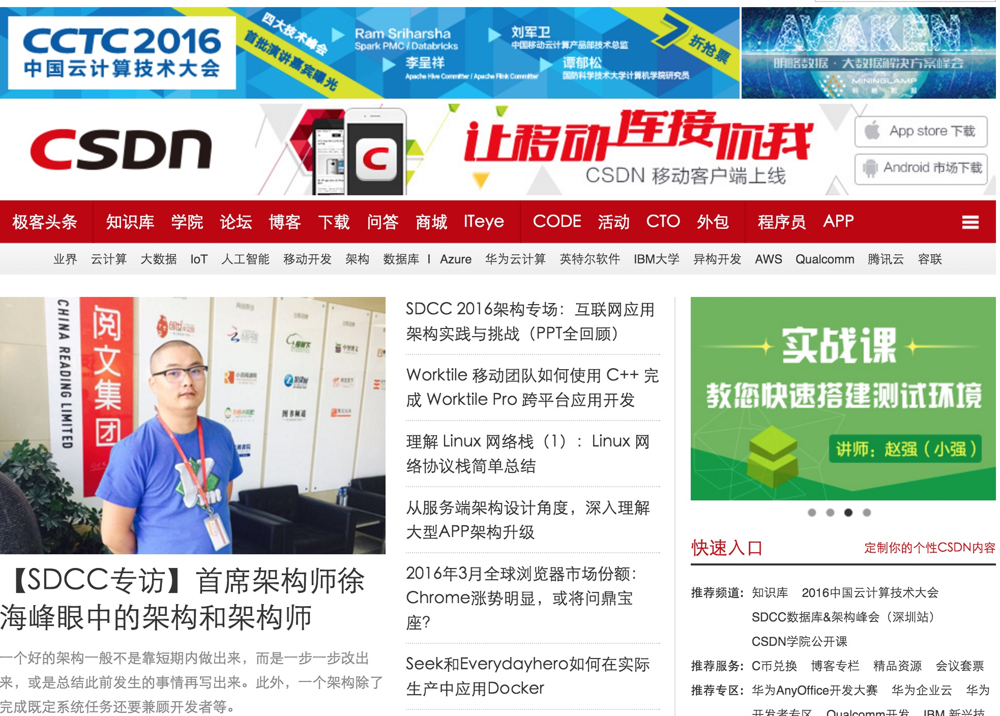

前几天在csdn的《程序员》杂志上发表了一篇关于我写的[dfs](/2015/DFS.html)的文章。借
着这次机会，csdn的编辑钱兄邀请我上4月份的sdcc深圳场做一个演讲。为此，他们还专门
采访了我。刚开始他们准备让我在几个主题里面挑一个，后来我和他们说，这些主题我都可
以，他们可以随便选。钱兄就建议来一个综合的。我觉得这样也可以。然后就有了下文：

<b> CSDN：请简单介绍下您和目前的工作，以及关注的领域。</b>

徐海峰：大家好，我是阅文集团（由盛大文学和腾讯文学整合而成的集团）的首席架构师徐
海峰，大家可以叫我大嘴。我目前的工作主要在分布式存储、分布式计算、公司内部框架的
架构等工作。今年我还给自己加了一个工作项：推动我们的一些项目在GitHub上开源。

对于我自己来说，我一般比较关注分布式存储和分布式计算、高性能运算等。其实业务系统
的框架架构等工作很久之前就做过了，只是后来更关注分布式计算，所以现在我把它当成了
副业，我的主业主要还是高性能运算。

<b> CSDN：您有着10年的互联网开发经验，您是如何走上技术这条路的？</b>

徐海峰：为什么看见这个问题，我第一个想到的字就是“熬”？其实确实也只能说是熬吧。
开始的时候是技术不太过关，我就开始熬技术方面的。当时也傻乎乎的，办法也不多，就想
到买几本书看看。然后没想到看书竟然后来发展成了我的一个习惯。这10年来，我一直看书
，我霸占了我家的一个半书架，里面都是我的书。这还不算上被我淘汰掉的很多书。在技术
行业就是这样，等你技术ok了，你的机会就来了。还是那句话，熬着，磨练自己，机会只留
给有准备的人。

<b> CSDN：您现任职于由盛大文学和腾讯文学整合而成的阅文集团，也曾在携程、5173工作
过，可否简要回顾下自己的工作历程，有什么心得和体会可分享？</b>

徐海峰：先说一下这3家公司的区别吧！现在的公司阅文集团，因为我的自主性大一些，所
以可以干预很多地方，虽然现在属于刚刚开始，但底子算是比较好的；Ctrip，我当时去的
时候就是磨练心智的，Ctrip在当时比较古板，技术也是相对挺low的（所以待了11个月实在
受不了了，必须要走了）；5173的话比较自由，很多事情都可以很简单的完成，而且同事之
间关系很不错，我们到现在都一直在一起玩，我也在里面待的最久。

这么多年，我认为公司对人的关系挺大的，判断一家公司的好坏，不能单一的看付多少报酬
，虽然这是第一选择，但是还要看给你做多少的事情，你想做什么，到你能做什么，再到你
能实现什么是有一个很大的跨度的。如果这家公司能给你想法上的自由，行动上的支持那就
应该待的久一些。

<b> CSDN：您目前是阅文集团的首席架构师，此前也是携程和5173的架构师，在每一个阶段
中您对架构是怎样的理解？以及您对于架构师是如何定义的？</b>

徐海峰：我个人觉得架构挺简单的。我一直和我下面的人说，做架构要比用架构简单，因为
你是游戏规则设定者。你既是运动员还是裁判，你再干不过人家那就没法原谅了。另外，架
构好比画圆，不管你怎么画，最后总归要圆回来。当然一个架构的好坏还得看业务模式、人
员素质、使用便捷性等因数。

一个好的架构一般不是靠短期内做出来的，都是一步一步改出来，或者是总结前面发生的事
情再写出来的。

我现在说得好像挺简单，不过也有迷茫的时候，记得当时我做一个单点登录都要想很久。在
5173时，我认为技术就是无敌的，那时候刚刚接触分布式计算等技术，一切都是崭新的，充
满着诱惑，几乎每天都干到很晚。后来到了Ctrip发现原来技术差一些也行？其实在Ctrip我
算是闭关，在那里看了很多的书，有技术也有人文类的。一年时间也想通了很多的问题。

架构不仅和技术有关，还和人有关。一个架构除了完成既定系统任务还要兼顾开发者等。现
在我的同事经常说我喜欢在技术上“强奸”别人。其实完全不是这样，只是我想过几乎所有
的方式/方法，而且我选择了我认为最好的那种。既能做到架构的简洁，又能做到对于开发
者快速的接受。像架构这种东西，不是越灵活越好，我恰恰相反的认为，架构这种东西，特
别是需要靠别人编程配合完成的东西，越限制死越好。

架构师的定义，我还是觉得他既是裁判又是运动员吧。当架构师不难，难的是怎么让运动人
忘记你裁判的身份。我一直在公司说的一句话：

我真正的成功在于你们都应该不知道有我这个人存在。特别是在系统上线后，如果在没有我
的情况下，系统能正常运行，那我才算是牛。我也一直朝着这个目标努力。目前来看，在
Ctrip、5173这两个地方都实现了这个目标，我希望在阅文集团也能实现。

<b> CSDN：您认为具备哪些素质才能成为是出色的架构师？</b>

徐海峰：首先是要忍。一个公司的架构或者是技术线并不是一朝一夕来决定的，它有很多的
历史原因，也有很多的无奈之举。所谓的存在即合理，千万不要上来就去大刀阔斧的砍下去
，对于一些觉得不顺眼、不那么完美的事情要学会去接受，等待时机再干掉它；

其次是要自我进化。作为架构师，一般都是在公司内部技术比较牛的人。现在这个世界是日
新月异的变化着，作为一个公司的技术领航人员，在技术上必须要保持一定的先进性。时刻
需要进化自己，不断的补充新的知识；

再次代码能力不能丢。我一些朋友也是做架构师的，他们对我现在还在写代码觉得很吃惊，
而我对他们现在不写代码但是确是架构师也很吃惊。一个架构师连代码都不写了，难道就做
做Slides？画画图？然后开几个演讲？这就太颓废了一些。不仅对公司不好，对自己也不负
责任啊。

最后要学会忍受寂寞。牛的人都是寂寞的。往往一个挺好的事情，当你满怀信心的和同事们
说的时候，他们一脸的迷茫。几乎是没有人点头的，更不要说受到支持。这时候就要学会忍
受这种“寂寞”，并学会去处理这种“寂寞”。

总的来说，我还是认为架构师和管理者还是不太一样。架构师必须要首先做事情，然后再做
人，当然做事情的时候也要追求合理的方式方法。

<b> CSDN：目前，阅文集团的架构是怎样的？可否简单介绍下阅文集团整体架构的一些架构
特点？以及作为架构师，您的工作重点有哪些？</b>

徐海峰：说实话，阅文的架构还是比较乱的。毕竟是3家公司合并成的。目前我们的架构硬
性上来说简直可以开展览馆了。数据库有：MySQL、SQL Server、Oracle等；应用层有：
Java、PHP、C#、Python等，而业务系统还分属在不同的机房。这是没办法的事情，毕竟以
前是分属3家公司，现在合并了，这种历史预留问题是我们要面对的也是必须要解决的。

现在我们决定把数据库从Oracle和SQL Server上迁移到MySQL上。应用层基本上以后就只有
Java和PHP了，Java做Service，PHP做页面，各取所长吧。目前我们已经在推进这个事情了
，去年先把内容统一了，今年开始统一应用层和应用层的数据库等。毕竟饭要一口一口吃，
罗马也不是一天建成的。这种“乱”的现象正在一步一步的被改进，我相信用不了多久就能
统一吧。

我在阅文的时间其实刚刚2年，我是2014年4月15日入职的，那时候还叫腾讯文学。这两年来
，我一直在负责分布式存储和分布式计算的工作。第一年我一个人写了一个分布式文件系统
（DFS），后撰写的文章也发表在《程序员》2016年4月期上。然后抽空算是帮忙吧，贡献了
一个编程框架，叫Albianj。Albianj主要做分布式业务系统用，自带了分布式事务、OEM、
数据路由等功能，它可以让你用单机开发部署到线上，更改几个配置文件立刻就变成分布式
系统来运行，目前也在我们公司大规模的使用。上文中说到的业务系统的迁移就是使用
Albianj来完成的。后来配合内容中心的统一，我还写了一个id生成器，这就是我要在SDCC
2016深圳站之架构技术峰会上讲的，中间因为调度的需要，还开发了一个调度系统，比当当
开源的那个功能要多一些（当当的海峰会不会杀了阅文的海峰？）。从去年7月份开始，我
也开始接管团队，我们团队在做几个东西：一个RPC的通讯协议、Nameserver、LogDB等工作
。

我今年的工作重点应该不会放在具体的实现上了，我更多的会去做一些系统整体性的架构设
计等工作。还有就是开源的工作，我也一直在不停的推进这件事情。目前来看，上面提到的
几个东西都会开源。到时候欢迎大家去GitHub，一起讨论这些方案和实现。

<b> CSDN：您如今是如何安排自己的新技术学习、研发团队管理、编程、生活等时间的？
</b>

徐海峰：对于学习，我恰恰和别人相反。我不太去关注新的技术，我倒是挺喜欢那种老掉牙
的技术的。开始我是写C#的，后来我尽然去写了C。其实就像我喜欢用VIM或者是Emacs而用
不惯Sublime Text一样，我对于新的东西到不是那么的感冒。我一直觉得现在技术不管怎么
变化，都是从那些老掉牙的技术演化而来的，金矿还是在老掉牙的技术中。比如现在分布式
文件系统的存储技术，几乎和操作系统原理中的磁盘管理一模一样，只是加了很多平衡性、
一致性之类的算法，所以我现在在看汇编。对于汇编，我开始非常抗拒，但前几天的一个系
统Down掉让我重新重视了起来。很多时候，在Online环境中，你根本就是无法Debug，就算
用GDB也仅仅是把Dump文件拿下来，但那次我把源文件给弄丢了，不看汇编不行，所以我还
是下定决定好好的看看汇编。汇编也没有想象中的难，除了繁琐一些，别的都还好。也不知
道是不是我学的不精，还是还没深入下去，没到难的地方。

管理团队这个事情其实我已近很久没干了。去年开始又需要扮演这个角色了，我才捡了起来
。要说工作嘛，肯定是一个人的时候舒服，人多了黑管理者带来了比较多的乱七八糟事情。
我一般管理分为2部分：

首先在生活上，我会给与一定的照顾。对于一些可以变通的地方我也不是那么的强求。互联
网公司嘛，本来就是比较自由的，而且我们的工作还不太算是简单的业务实现，而是需要一
定的创造性的，所以在这个上面我一直比较松。另一方面，在技术上，我被我同事称为“魔
鬼”。我同事说我发起火来六亲不认（PS：我已经很少发火了）。我规定对于屡教不改的我
要惩罚。这算是我这里的“私刑”。第一次屡教不改的错误，解决方案抄100遍，第二次200
，依次类推。我觉得犯错误不要紧，谁能无过？关键是你是不是真的用心去记住这个错误。
我对待错误的态度是，第一次叫做不知道，第二次叫做不小心，千万不要有第三次，第三次
在我这里就是故意。既然你故意，那我就用故意的办法治你。我是公司内第一个让下属抄“
100遍”的上司。100遍这种惩罚虽然恶心、下流、卑鄙，但效果却是出奇的好。凡是抄过
100遍的人，至今还没有人抄200遍。编程和生活我还是放在一起说吧。因为我爱人和我说，
在我的生活中，没有生活。我是把爱好玩着玩着最后玩成工作的人。高中的时候就对编程很
感兴趣，后来找工作的时候发现除了编程我啥都不会，所以最后爱好变成了工作。也不知道
这到底算不算是我的优势，我可以花更多的时间在编程上。我觉得时间是一定的，所以你的
时间花在了这里，那么那里就会少一块。我经常性把编程和生活搞乱在一起的。我会在洗澡
的时候想问题，我会在出去玩的时候带着电脑，甚至去年7月份前同事结婚，我们一起去马
尔代夫，早晨起来我还坐在阳台上写代码。完了被朋友笑称：在扔美金写代码。也因为这样
，我觉得我无形中比别人多挤出来了一些时间吧！开始时没有什么效果，但是久而久之，效
果很明显。现在确实感觉知道的比一般的人多一些，贵在坚持啊！

好好准备，安安心心坚持，机会还是留给有准备的人。

<b> CSDN：在本次SDCC 2016（深圳站）架构峰会上，您想分享的话题是？</b>

徐海峰：这次我分享一个主题：id生成器。说到id生成器，没听过的会很诧异，这也好意思
拿出来说？知道一点的，会和你说Snowflake算法。Twitter的Snowflake算法确实不错，但
是我认为它还能做得更好。我们的id生成器是在统一内容时发现要用。以前我们也是用数据
库的解决方案，但统一内容中心的时候，数据库方案已经不能用了。当然我们也参考了
Snowflake，但是都被否决了。最后我决定自己来开发一个。开始没觉得有多难，其实本身
确实也不是很难，但是需要考虑的相关问题却要很多。一个小小的id，仅仅自是一个uint64
的值，里面却包含了很多的信息和对于取舍的考量。此次分享具体的包括：我们前期怎样使
用数据库生成id、我们为什么放弃Snowflake算法、再到后来我们自己的算法，以及此后我
们特有的排序id算法，来听一下你就知道。

<b> CSDN：您最期待在SDCC 2016（深圳站）架构峰会上看到哪些内容？</b>

徐海峰：我还是想看到更多的自创的东西，而不是使用的心得什么的。这不是说使用的心得
什么的不重要，也很重要，可以让很多人少走很多的弯路。但是技术的发展毕竟是靠创新的
。使用仅仅只是站在了巨人的肩膀上，我更喜欢看到更多的巨人自己站出来。

对于技术的纵向选择，我这个人并不挑食，只要是好的都可以接受。不管你是运维、DB、架
构，这些都可以相互借鉴。

* * *
这是我得第二次被采访，上一次被采访是去年的11月份，sacc对我做了演讲之前的采访。
相比上一次采访，这一次显然更加的放松一些，说的话也多了一些。  
这些年来，技术圈内也是出现了很多的炒作现象。不是说不能炒作，而是说不能过分的
炒作。虽然我也认为我们现在的年代已经不是“酒香不怕巷子深”了。但是，我们也要在
一定的限制内来运行炒作。而不是泛泛而谈，硬是把死人给炒活了、把原本只是一个
程序员水平给炒成cto。  

PS:话说上首页的感觉还是不错的！！！   

