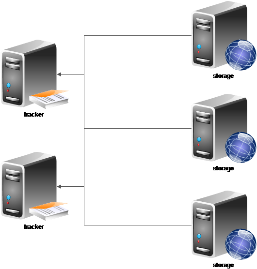
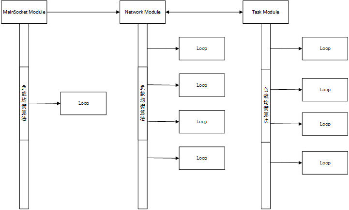
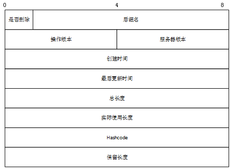

## 关键词解释  
1. 逻辑集群：具有相同groupname和syncgroup的storage机器组成的集群。  

### 摘要  
  我们设计并实现了一个分布式文件系统(以下简称DFS），它是基于linux的文件系统，并面向大规模数据
存储、海量数据访问、具有良好可伸缩性的文件系统。DFS设计运行在廉价的linux系统中，但是它依然
为数据提供良好的一致性和完整性。  

  虽然DFS和业界很多的分布式文件系统有很多的相似性，但是它还是更面向我们当前遇到的一些业务的实际
问题。并不是构建在某些论文或者大理论之上，所以它对于我们来说他拥有更好的业务适应性、维护性和可用性。  

  DFS的出现完全满足了我们对于分布式文件系统的要求。它现在已经部署到我们的线上系统中，来给我们的书库
提供存储和访问的能力。目前为止，我们已经小规模的实验性部署了9个数据节点，存储了600g的数据，但是现在
线上数据还在源源不断的导入进DFS，保守估计前期将会有超过1T的数据用DFS来存储。目前还有一个业务也将会
部署到我们的DFS上，保守估计这个系统会有20T左右的数据。  

  本文档中，我们主要讨论DFS对于文件在分布式应用中的架构和特性，最后会列出我们的测试数据。  

### 简介  
我们的DFS系统目前的业务主要用于存储文章的章节内容。对于一个阅读性质的网站，其中最大的存储量就是由
作家生成的文章。这些文章量大并不适合使用传统的关系型数据库存储。将文章在系统中抽象，它仅仅是一个对象，
所以我们首先想到了将它存储在某个固定的文件系统中。但是目前很少有文件系统能保证水平扩展的能力，可以增加
机器来解决数据量和访问量的问题。对于数据来说，它还应该具备维护数据的完整性、一致性的能力。
也许开源中，最合适的就是FastDFS了，但是它同组内完全镜像的方式对我们来说无法接受，
它不能实现增加机器就可以平滑的增加我们的性能和吞吐量。  

所以我们自己设计并完成了一套DFS，我们的DFS在一些基本的要求上，和别的分布式文件系统都有很多一致的追求目标,比如：数据的完整性、
一致性、数据的恢复能力、可伸缩性、可靠性、可用性、以及成本问题。但是它也有区别于别的分布式文件系统的地方：
比如不需要兼容任何的公共接口，不需要考虑文件的索引问题。所以我们在设计的初期就对DFS采取和别的分布式文件系统
不一样的策略，并进行了折中的一些选择，引伸出了完全不同的设计和实现思路。  

  首先，我们的DFS不需要保存信息的元数据。在我们的整个系统中，文章的内容只是文章的一个属性，而并不是文章的
全部信息，所以在关系型数据库中保存文章的属性信息是在所难免的。所以这种模式就决定了我们可以将这个分布式文件系统
做成类似于KV的结构模式。也是因为没有元信息，整个系统的架构将会大大的简化。相比于google的GFS或者是apache开源的
HBase，去掉了metedata服务器，整个系统唯一的单点隐患被剔除掉。可用性上也得到了很大的提升,而相对于DFS系统本身，
我们通过key可以精确定位所需要的内容。  

  其次，和GFS一样，我们认为我们的磁盘是很容易毁坏的，所以数据的完整性和安全性是很重要的一个命题。第一个版本我们
采用实时同步和单盘恢复的两种同步方式来解决。在同步的过程中也有可能出现同步不完整或者同步出错的情况，这个情况将会
在下一个版本中采用出错同步再次同步的方式来解决，相对于同步完的数据，在下一个版本中还会有数据的完整性校验机制来解决
数据可能会引起的完整性问题。  

  第三，我们的DFS和传统的DFS一个很大的不同就是我们的数据将会面临经常被更改的情况。不仅仅只是尾部增加操作，而是不知
修改位置的增删改操作兼具。又因为没有了元数据信息，所以我们的存储内容必须自带元信息，而且必须给用户给与适当的放大或者缩小
的功能和方便，所以我们合理的将文件稀疏化，合理的放置了文件的空洞来解决频繁的增删改问题。  

  第四，放弃了系统级别的元信息导致内容自带自解析信息，所以对于我们来说，数据的一致性也是一个需要解决的问题。没有了
元信息服务器，我们没有了可以唯一控制文件被线程安全的写入的机制，我们也无法控制同步中对于同一部分内容先后执行次序的问题，
这一节将会在数据一致性模型中详细讨论。  

  第五，我们的DFS不需要缓存，因为DFS的内容是稀疏性质存放，而且章节内容也是随机读取的，所以这部分的内容应该是由业务来承担，
而不是DFS自身来承担。DFS仅仅需要做好数据的存储、安全、唯一、备份功能就可以了。  

  最后，我们不需要兼容任何的标准或者是接口，包括posix的api，这样就对我们的DFS进行很大的简化，并且我们的dfs基于linux的文件系统，
所以我们没有必要要深入到linux的内核进行对于vnode或者是inode是控制。我们只需保证我们的DFS能在linux系统io接口的标准上安全而唯一的
存放、访问就可以了。  

### 设计概述  
#### 目标  
  在上面的介绍中，我们介绍了一些DFS相当于市面上通常的DFS所存在差异和相同点。在设计满足我们所需要的DFS的过程中，
我们的设计目标既有已经被证明可行的，也有相当一部分是需要自己的摸索的。可谓是机会和挑战并存。之前，我们也提到了
一些我们的设计目标点，这里我们讨论一下我们的设计目标。  

1. 整个系统必须可以简单而容易的水平扩展，尽量做到增加机器就可以完成系统的存储量和系统的吞吐量的提升，而且这部分工作必须
让系统自动来完成，随着机器的增多，我们的人手将无法从容的应对手动管理机器的行为。  

2. 系统也必须支持一定界限之内的垂直扩展，类似于增加磁盘挂载点、增加磁盘容量等等操作也必须要在系统给与支持，并且这个支持完全
是自动化的;  

3. 系统必须是由廉价的机器组成的，所以机器的失效应该是经常发生的一个故障，在整个的系统中，这个故障将被看做是一个正常的系统事件，
系统必须能快速（30s之内）的发现这个异常，并且将访问避开这个发生故障的机器;  

4. 系统必须充分发挥每一台机器的性能，简单的主从模式并不是我们的首选，我们更需要多主的模式来应对海量的访问；  

5. 系统必须支持大小文件的存储和访问。我们的业务存储数据量基本都是文章内容，一般在KB级别，但是也会有一些完本的数据等需要存放，
所以我们的存储将会变成MB级别，对于这两者我们必须都进行支持，对于GB级别的大文件，腾讯有TFS来使用，而且效果不错；  

6. 系统必须保证数据的安全性和数据的一致性。这一点不需要太说明，几乎每个系统都需要保证这2点；  

7. 系统必须支持数据的频繁更改，对于DFS来说，modify总是最难实现的，它不仅仅会引起文件的空洞问题，更是数据一致性的杀手。很多的DFS
不从根本上支持modify功能，它们把modify认为是一次新的insert，然后通过版本号或者类似的方法来确定先后顺序，最后再通过合并减少文件空洞
并且解决掉数据的一致性问题；但是我们的业务决定了我们必须要面对这个问题，相对于我们都把modify认为是insert，我们的磁盘浪费实在
太大，得不偿失；  

8. 机器的增加、磁盘的增加或者挂载点的增加，都不会让数据进行再平衡。在分布式系统中，数据的再平衡往往是耗时最长的工作，而且控制度也
不是非常的准确，经常需要多种措施一起才能保证数据的平衡和一致，所以在我们的系统中，除了灾难恢复或者同步以外，不存在任何的数据再
平衡现象；  

9. 还有一个不得不吐槽的问题，内部的网络总不是那么的好，经常会出现波动的情况，所以我们的系统必须可以承受一定的网络颠簸，这里
不仅仅是对于客户端到存储这个链路来说，而是整个的DFS系统内部，也要对网络的通讯进行一定的考虑，从而可以让系统之间的分布式状态机
能顺利的运行。  

#### 架构  
为了达成目标，我们对DFS进行了最简化的设计。和目前的大家经常和使用的DFS不一样，我们的DFS去掉了元数据功能，但是保留了该服务器节点(
以下我们统称这个节点为tracker）。这点很像FastDFS。简化掉存储元数据的原因我们在上面曾经论述过，简化
后的服务器只剩下了tracker和存储服务器（以下简称storage）。  

 
tracker的主要用途从存储元信息变成一个状态控制服务器和负载均衡服务器，或者说它成了一个类目录服务器。一方面它主要和系统中的storage配合，对storage进行健康检查和状态维护；
另一方面，tracker还需要对客户端的访问进行路由工作。这样的无元数据的设计不仅仅只是从根本上解决了元数据导致的单点问题，
而且还大大的减轻了数据的完整性在系统中的压力，从实现的角度，也大大减少了代码量，
使tracker节点变成一个可任意水平扩展的节点，从而解决了系统中最不稳定的一环.  

相对tracker来说，storage的工作将会复杂很多，它不仅仅要做文件系统本身的“增删改查”工作，还需要肩负一个同步的工作。为了简单，我们把storage
的存储文件只做镜像同步，不做相对复杂的打散再存储工作。也为了尽量合理的利用机器并且可以快速的通过增加机器的方式来达到我们对于存储量和性能的提升，
我们对同组内的storage进行了分片处理，也就是逻辑集群。在同一个组内，分成一定量的syncgroup，每一个syncgroup内部的服务器是镜像的，不同的syncgroup内的storage之间是
平行的，在同步上不存在任何的关系。这一设计在维护的时候增加了一个人工的syncgroup工作，但是它简化了同步打散的算法，最重要的，增加机器不需要移动原先
的数据，使得几乎可以认为增加机器就是在增加DFS的存储量和吞吐能力。  

storage的改变不会迁移数据，也会导致性能的热点问题。新加的storage负载可能不够，但是老的数据被频繁的访问。对于我们来说，老的数据基本上都是被用来做读取之用，
业务的服务可以规避掉这个问题。对于写来说，本身就不会有太多的请求，所以这样的设计是我们所能接受的，对于我们这种特殊的需求，这并不是一个问题。  

不管是tracker还是storage，它们在linux中都是一个用户层面的进程，并未涉及到系统的内核，它们也都有自己的api，并没有为了兼容poixs等接口带来复杂度。
这样的设计方便了以后的维护和管理，也方便了实现的时候，只要考虑DFS本身的问题即可，无需为一些“杂事”而分心。  

#### 进程内部结构模型
在DFS内部，除了storage的sync模块和storage的心跳模块发起请求的部分之外，余下所有的功能全部依赖于一种线程模型，我们把它称之为module。  
module模型主要是把进程分成逻辑上隔离的3个部分，mainsocket module、network module和task module。  

 
为了socket accept的简单，DFS把mainsocket module设计成单线程module，该module只负责接收main socket的连接，然后获取DFS中的jobcontext对象，
将请求通过负载均衡算法发送到network module。  

network module为线程池设计，但是在mainsocket module中，经过负载均衡算法的发送，它保证了一个socket只会被一个network module的线程处理，
所以这里的处理是线程安全的。DFS会根据socket buffer的实际大小和服务器设置来决定读取数据，并且把数据依附在taskcontext对象上，和jobcontext一起
通过负载均衡算法发送到task module。  

task module和network module一样也是线程池设计，同样发送到task module后的处理也是线程安全的，task module是整个任务真正被处理的地方。不管任务
是否执行的正确，task module都会装配好回复client使用的response信息，然后按照原路返回给network module，network负责将response信息发送给client。  

#### 类目录服务
上面提到我们节省掉“元数据”信息，然后整个设计都变成了“无中心化”设计，那也就意味着在DFS中不会存在目录服务。但是为了满足DFS容灾的需求，我们设计了一种轻量级的类目录服务。
这种服务不会具体的提供到数据存储的目录或者是文件，而仅仅是提供存储的服务器。又因为我们的逻辑集群内的storage之间是镜像的，所以也不会存在数据迁移的问题，虽然省略掉了元数据
这一块，但是我们还是可以用这种类目录的方式定位到我们的storage。  

我们的定位服务有点类似于ceph的CRUSH算法，只是我们的算法没有ceph那么的灵活，一些ceph设置灵活的条件被我们固定了下来，
所以就不会像ceph那样有很多的条件因素来决定。在我们的定位服务中，永远只会有一个满足条件
的storage被返回，以驱动数据的访问。这还是得益于我们的逻辑集群内镜像的设计，它不存在把数据打散或者是重新平衡的问题，只要逻辑集群内的storage都保证会完全镜像，
所以返回一个storage也足以应对我们的需求。  

在处理满足条件的storage之中，我们也会根据实际的情况对storage进行筛选。在tracker中，所有的storage都被保存成一种hashtree结构，通过groupname和syncgroup来分组，
然后通过心跳、磁盘大小等等物理条件和设置的平衡策略来选择唯一满足的storage给提供服务。这样的设计简化了算法，并且也保证了系统的事务性。  

#### 存储模型
在我们整个系统中，文章只是一个对象。但是在DFS中，文章的内容虽然也是对象，但是它还是被分成了2种：一种是大文件，一种是小文件。
对于文件的区分，我们会通过配置设定一个阀值决定。  

大文件将会作为sinalefile单独存储。它不会有带有别的信息，唯一需要使用的信息是lastmodifytime，这部分会在访问和同步中涉及。  

对于小文件，DFS会把这些零零散散的内容合并成一个chunkfile，在合并内容的同时，也把零零散散的随机IO变成了顺序IO。这样不仅仅解决了海量小文件
对于系统压力的问题，也解决了随机IO导致的性能低下的问题，一举两得。相对于singlefile，chunkfile内的内容存储就不一样了。DFS无法简单的只存储
内容，所以我们在内容前面给每一个需要存储的内容加了一个metadata。metedata主要存储了文件的存储日期、是否被删除、最后更新时间，总长度，实际使用长度
，等等一序列的数据元信息。但是这些属性里面最重要的是一个类似于MVCC的值，在DFS中是opver，操作版本，它解决了版本问题。  

 
对于DFS来说，它关心是文件的名字，不管是singlefile还是chunkfile，DFS只会受限于名字不能产生冲突。所以文件名必须带上storage的machineid。machineid是在
group内部唯一的。文件名带上machineid后，首先，它能确保文件的归属问题，可以把唯一范围缩小到单机，但是在单机内部还不能保证文件的唯一性，所以，我们给文件名带上另外的
一些信息，包括但不限于创建时间、顺序数、线程ID号。至少由这4部分组成的文件名才能确保该文件在DFS系统内唯一。  

对于storage，我们首选使用的是多而小的磁盘，这样可以让系统的并发达到最大化。而对于整个系统来说，我们又必须要支持磁盘的大容量。所以我们增加了多挂载点的功能，
原则上，每台storage机器最多可支持256个挂载点，这些挂载点会根据一定的规则进行数据的平衡策略。通常采用的是轮询的策略，也支持最大剩余空间等等策略，这部分
可以根据自己的需要自己来决定。对于多挂载点的支持，唯一的要求是同一逻辑集群内，必须做到镜像。  

对于磁盘的剩余空间，我们也会做相应的处理，DFS并不会使用全部的磁盘空间来存储数据，具体最后剩余多大的空间也会让系统的使用者根据实际的使用情况来确定，一般
我们的推荐值是大于4G，这个数字并不是信口开河设置的，而是根据storage和tracker时间的心跳时间差和单位时间内最大上传量计算所得。如果想把剩余空间缩小，
那么可能需要先把心跳时间差缩小（现在是30s），这样会导致过于频繁的心跳检查，对tracker会照成一定的影响。  

#### 数据一致性问题  
在分布式系统中，数据的一致性问题是被比较多的提及和难以解决的点。一般数据一致性出现问题的地方在于数据的版本控制和数据同步上。一旦在数据的版本控制上
出现纰漏，几乎数据的同步是肯定会发生一致性问题的。所以要解决数据一致性的问题，主要的工作还是在数据的版本控制上。  

对于DFS，刚刚上面讲到我们使用类似于MVCC的opver来解决这个问题。那么我们到底怎么解决这个问题？和为什么要这样解决这个问题呢？  

首先，来看singlefile，对于singlefile来说，它不需要版本控制，它是一个单独的实体，有就有，没有就没有，不会存在对于它的版本。 版本的冲突一般发生在modify的情况下，
只有执行modify，数据才会对同一个文件块进行覆盖。但是对于singlefile来说，它被更改就是先上传一个新的singlefile，然后把原来的siglefile删除掉，所以在这种情况下不存在问题。那么还有
一种情况，如果原来是一个singlefile，然后需要更新的是一个小文件阀值定义的内容，这时候DFS还是先上传一个新的chunkfile内容，然后把老的删除，以后的版本控制就会
按照chunkfile的版本控制来进行，所以singlefile是不需要做版本控制的，只要在同步的时候检测一下该文件是否还存在，然后根据实际的需要进行同步。  

那么对于chunkfile来说，opver相对就很重要的。为什么需要opver而不是使用最后更新时间戳呢？这是因为在分布式系统中，时间是不确定的。
每个计算机都有它自己的物理时钟，而且时钟会经常性的发生偏移，又不能完美的同步它们。所以多台storage时间多多少少会有一些时间不同步的问题，如果当A机器的
某一个内容被更新后就down机，然后cleint马上再次对这一块的内容进行修改，因为A已经down机，所以请求会给落到同组内的B机器上，
而B机器接受再一次的更新，但是因为B机器的时间慢于A机器，这时候，其实B的版本更新，需要覆盖A的版本，但是时间戳是A的更晚一些，所以就会出现版本的问题。也有会认为你
更新的时候判断一下你提供的lastmodifytime和chunkfile的元数据中的lastmodifytime是否一样？这种做法不是不可以，但是在没有原子钟的情况下不是那么的稳妥(如果我们在系统
已经运行了几天后才发现时间差别很大，我们调整时间后，我们的数据怎么办？），所以我们最后还是放弃了这个做法。  

我们使用了opver，它是一个单调递增的值。其实opver就是一个时钟向量(注意：虽然它名字叫时间向量，其实和时间没啥关系，它只是一个操作单向自增而已)，
相对于lastmodifytime来说，它的优点是在各自的storage之间，不会出现误差，并且可控。同样是上面的A和B机器之间的例子，
对于opver来说，因为它只可能保持单调递增，所以它不会出现时间戳被回拨的问题。我们在更新或者同步的时候，只要简单的对比opver就可以了。在同步的时候，当需要同步的数据opver
大于被同步数据的opver时，我们就认为需要同步的数据是最新版本，我们同步这块数据即可。  

#### 线程安全  
为了达到多线程性能的最大化，我们设计了一个多线程安全模型。总体上来说，就是对象线程化。  

在多线程的环境中，最大的性能消耗就在于处理资源竞争的锁上面，所以怎么样避免这个锁的出现就成为了性能优劣的一个大问题。在这点上可以选择的技术方案也不是那么多，除了CAS
好像就没有什么合适的。但是CAS在这里其实不是那么的适用。所以我们就想到了对象线程化。又为了更好的优化性能，我们又加上了对象池的概念，把对象线程化的范围只缩小到
在该对象被访问使用期间。  

对象线程化的具体是每当有访问进来的时候，DFS会根据访问的不同分发到不同的服务器。一般来说，insert操作会被随机的分配，但是删改查的操作就会被通过一个算法分配到一个task module中
的线程进行处理，这样通过task module中的loop进行操作排队，这些操作永远都是被串行化的，所以这些操作之间不会对同一块数据进行并发的操作，以此来达到访问操作串行化。  

当然，仅仅使用这个办法还无法彻底解决数据的线程安全和资源的竞争锁问题，它还需要在写入磁盘的时候用磁盘的文件进行配合。使用同样的方法，我们将磁盘的文件也进行线程化，
对于singlefile，它不需要任何的线程化的控制；对于chunkfile文件，它的线程化处理方法就是每个线程对应一个文件，直到将这个文件写满，否则一直写这个文件。这样的做法解决
了在数据落入磁盘时的竞争锁的问题，但是它并不是完美的。对于停机的时候，因为chunkfile就会被关闭，然而它已经申请但是未被写入数据的部分大小将会形成文件空洞，而且这个文件空洞
是无法避免和再次利用的，所以这部分的损失将有我们系统直接忽略。  

这里另外还牵扯到一个chunkfile的文件大小问题。相对于DFS来说，chunkfile的大小并无多少影响，我们只是需要从磁盘的使用率和系统调用的性能出发来合理的确定一个值。
目前我们使用的值是64mb，这个数字来源于我们区分singlefile和chunkfile的阀值，我们把小于1mb的数据划分入chunkfile，大于1mb的数据被认为是大文件，使用singlefile存储。
而64mb相当于最少存储64个文章章节，我们认为这种系统调用开销我们还算能接受。当从目前的实际使用情况来看，我们的当章节数据量远远小于1mb，一般就是kb级别，所以下一个版本中，
我们的chunkfile可能会成倍的缩小，应该会在4mb-8mb之间。  

#### 文件空洞问题  
我们的DFS和一些开源的DFS最大的不同就是对于modify的支持。一些开源的DFS基本上不会考虑modify的支持，比如leveldb等等。它们是通过版本号然后合并的方式来规避掉对于modify的直接支持。
这样对于这些DFS来说，他们就不太会存在一个比较棘手的文件空洞问题。  

文件空洞，因为DFS支持更改，删除这些操作的原因，导致文件内容断断续续,不会形成一整块。虽然对正常的使用影响不是那么的大，但是对于性能还是有一定的影响，
文件空洞这个问题只会存在在chunkfile中，对于singlefile，它是单独的文件，整个的都会去交给系统去处理。所以singlefile不需要我们去考虑。对于使用空间的问题，
对于我们这种支持频繁modify功能的DFS，空间的浪费还是一个比较可观的量，所以我们必须要解决这个问题。  

在我们的DFS中，解决这个问题的方法分成2步走：  

1. 对于每次的insert操作，我们都会预留了一部分的空间给modify的支持。这个预留空间的量可以通过相对的业务来决定。目前支持绝对值或者百分比增量。
一般的增量在第一次量的20%左右，我们进过几次业务的观察，发现20%这个量是合适的。对于我们的DFS磁盘来说，也是我们可以接受的一个值。
扩充20%之后，后面的每次modify只要量不超过这个值直接使用这块空间，不需要再次申请空间。从性能角度来说比不上顺序写（其实这时候是随机写），
但这样写的方式还是一个我们可以接受的。

2. 对于modify操作增量超过阀值的情况，我们只能重新申请空间，但是以前的那一块空间也不能浪费，浪费的话就会出现文件空洞，所以我们会有一个管理这个废弃空间的skiplist，
当insert的时候，我们会优先使用这些废弃的空间，来达到消除文件空洞，合理利用空间的效果。  

对于顺序写和随机写这个问题，从性能角度来说，顺序写远远好于随机写，但是不管怎么样，就算把所有的随机写全部改成顺序写，也都会出现1bit的随机读写（需要把isdelete置位），所以
性能的开销倒并不是那么的大，如果使用顺序写+版本号，后续使用合并的功能替代掉，

#### 数据完整性  
对于分布式系统来说，数据的完整性一直是一个非常头疼的问题。不仅仅如此，对于系统来说，数据完整性也是一点都不能出差错的地方。  

对于单台机器之内的数据完整性，前面已经有过比较详细的叙述，这里不会给与太多的讨论。下面，我们主要讨论一下多机之间的数据完整性问题。  

##### 日志  
对于所有的完整性来说，日志都是一个关键时刻救命的一票。我们的DFS也不例外，在我们的DFS中，数据完整性相关的日志分为2类：binlog和synclog。  

为什么没有常见的redo？对于我们的DFS来说，它并不存在多数据刷入磁盘的时间间隔问题。因为它完完全全是一个KV的数据库，没有各种RMDB的繁琐的操作，更
没有事务的概念，对于DFS的操作就是直接对某一个值的操作，不存在恢复数据这一说。  

binlog主要记录了对于DFS的增删改操作，根据不同的操作，记录的格式和内容不一样。  

synclog主要记录了对于DFS同步的时候，已经同步到的记录。synclog的格式和binlog一致。可以认为synclog是binlog在remote machine上的一个备份文件。  

##### 同步  
DFS的同步分为2部分组成。一部分是通常意义上的同步，主要的目的是完成运行时同一syncgroup内部的数据镜像问题；另外一部分因为DFS的特点，在设计的时候
我们就认为DFS的机器是易损坏的且不可能完全通过本机磁盘恢复的，所以我们增加了一个单盘恢复功能。它主要用来在磁盘出现问题，或者机器出现问题的时候，
或者增加机器的时候，数据重新自动平衡自用。  

<b> 实时同步</b>  

对于实时同步，我们的DFS使用的是gossip算法。通过遍历本机binlog，把数据采用push的方式同步到remote storage。这些remote storage必须拥有同样的groupname
和syncgroup，具体的原因上面已经有过论述。因为我们的DFS总体上就是“去中心化”的设计，所以每台storage在成为master的同时又都扮演slaver的角色，所以在同步
的时候，并没有一个固定的参照来作为标准，这里我们使用了自创的“分布式同步状态机”来完成。  

分布式同步状态机，其实就是各storage都会维护一个同步状态，在storage启动的时候或者是重新启动同步的时候做状态机的校验。因为网络、同步延迟和同步方式的关系，
我们统一将remote storage上的状态做为当前同步的起始点，本地storage获取remote storage上的状态后，才会构建同步状态机。  

为了简单，同步只是发生在storage之间，实际上并没有tracker任何实际性的事情。tracker在整个同步中不会充当任何的角色，它仅仅是为storage提供了一个获取remote storage
的功能，类似于提供了目录服务。storage会周期性的获取remote storage信息，然后通过获取的remote storage来构建同步。  

同步数据会随着binlog的日志一并发送给remote storage，remote storage会在处理完同步后，把日志记录到synclog，以表明已经接受此信息的同步。synclog不仅仅只是
显式的提供信息确认功能，它还在单盘恢复中充当极其重要的角色。  

因为实时同步根据binlog文件的增加来完成同步功能，所以可能会在文件属性更改的窗口期发生延迟现象。目前还没有找到更好的方式来解决这个办法，也许使用一个内存内的
变量会是一个比较好的方式，目前这个方案还仅仅在构思阶段，并未进入我们实际的系统。  

<b>单盘恢复</b>  
单盘恢复对于DFS来说是一个很好的补充。从系统设计的开始，我们的目标就是把廉价的磁盘组合起来，组合成可以存储大容量的设备。但是这些廉价的磁盘不可避免的会经常发生
损坏或者下线的情况，所以磁盘损坏后数据的修复工作变得极其重要。而且随着机器的增多，手工的完成这部分工作显然是非常不能被接受的，这也就意味着这部分必须自动化的完成。
这就是单盘恢复的由来，它给系统带来了完整性，解放了运维的痛苦。  

单盘恢复和实时同步采取的算法大同小异，也是使用gossip的方式。但是单盘恢复并不采用push方式，而是采用了相反的pull方式来执行。究其原因：对于实时同步来说，如果是采用
pull方式，那么我们必须要进过2次的通讯才能完成一条记录的同步，而采用push方式只需要一次合并后的通讯就可以解决问题，显然push方式更合适。而且对于实时同步，salver机器
并不知道需要同步的数据和时间点，所以由master主动发起同步更合适。但是单盘恢复就不同了，我们认为单盘恢复发生的条件是本地的磁盘损坏了，需要重新把这些数据从同一syncgroup
内的机器上同步过来，那么对于发生单盘恢复的机器来说，本地是存在以前的同步记录的，所以这时候我们是知道需要同步的数据具体有那些的，而且不管是pull还是push方式，都是需要
同样的网络通讯次数（同样是1次）才能同步一条数据，所以这里使用pull方式更合适。  

当然凡事都有以外，如果DFS的日志文件丢失怎么办？这一点对于我们的DFS来说并不是灾难，我们在执行单盘恢复之前会首先检查我们的synclog和binlog在不在，如果不在先同步synclog
和binlog，把这些文件同步过来之后，再通过这些文件恢复数据。只是唯一不好处理的是，我们必须校验所有的synclog和binlog，以免发生synclog和binlog不一致的情况，导致数据
同步不完整，引起系统数据不完整的情况。  

对于单盘恢复来说，并不是完全的“无中心化”设计的。它必要的时候必须要有一个storage充当master，来提供synclog和binlog的同步和数据的同步。这种情况只发生在一个逻辑集群（
同一group，同一syncgroup）内多机发生故障。这种时候当发生故障的机器无法满足同步的需要的时候，必须要一个master机器作为标准来提供一句。虽然DFS的设计对于机器的启动顺序不做
限制，但是这里的情况下，一般都是第一台online的机器作为master机器，这是需要注意的地方。  

单盘恢复也支持同步中间停机，不管是在同步日志文件阶段还是在同步数据阶段，如果需要，可以随时将正在同步的机器切下线，系统并不会发生问题，也不会丢失前面已经同步的工作。
在单盘恢复结束后，一般还会接上实时同步，从最新的状态点开始把同步时间差之内的数据同步掉，达到完整的一致性后把系统切换上线。  

单盘恢复的时候相比实时同步更为简单，因为它不必存在分布式状态机机制，也不必实时的检查remote storage状况，只是一个简单的多storage之间的通讯而已，这大大的简化了单盘
恢复功能的实现，也减少了同步这一棘手问题发生故障的概率。  

#### 运行时状态  
storage在整个集群中并没有任何的状态，都是对等的角色，但是这并不代表它自己本身就没有任何的状态。每一台的storage都是一台有状态的机器，对于一直运行的storage来说，它也是
一个作为状态机存在。开始的设计初衷就有单机可以随便上下线的功能。我们并不限制单机的状态，但是我们必须可以让单机在重启的时候恢复到之前的状态，然后运行。  

在这个过程中，为了保持机器的状态，我们设计了几个状态保持文件来保持状态。这些状态文件分为两类，一类是从头到尾一直存在的，属于机器状态的元信息；一类是运行过程中才会存在的
状态，只要这个过程执行完毕，这些文件将自动被删除，典型的应用就是在单盘恢复的时候，这些文件是不会长久留存的。  

#### 机器的改变和数据迁移
在我们的DFS中，机器数量的改变不会发生数据的迁移。这是我们从一开始就完全确定的一个设计方案。我们把我们的DFS设计成一个巨大的集群，但是在这个大集群内部会被分割成几个相互
之间独立的，并无任何关系的逻辑集群。这些逻辑集群只是显式的处于一个大集群中而已，其实他们之间是不会发生任何的相互之间的状态、文件的关系的。数据的迁移只会发生在逻辑集群内部。  

这些逻辑集群并不是由系统随意决定的，也不是由像ceph那样的由crush算法来决定这些逻辑集群，而是这些机器被安放到大集群内部时就已经被标明了属于的逻辑集群，是我们显式的给与这些机器
的一个属性。那么也就是说其实这些逻辑集群内部的确定也确定了另外一个重要的事情：一个文件会被备份的份数。因为逻辑集群内部是镜像的，所以这个备份分数就是逻辑集群的机器数-1，也就是说
这个备份数也会因为逻辑集群的人为指定而变成人为确定。  

这样的做好的坏处是人为决定因素太多，但是带来的好处是在机器数量发生变化的时候，数据不会发生迁移（注意：这里只是说不会发生迁移，但是相互之间的备份还是会发生的）。这种数据量的备份
已经是最小化的节省了数据平衡的时间，也不会额外的带来数据迁移带来的压力。在我们的设计中，我们认为这是我们所能接受的最低底限了。  
