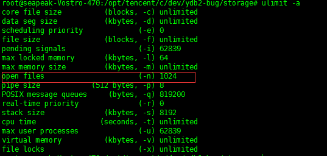
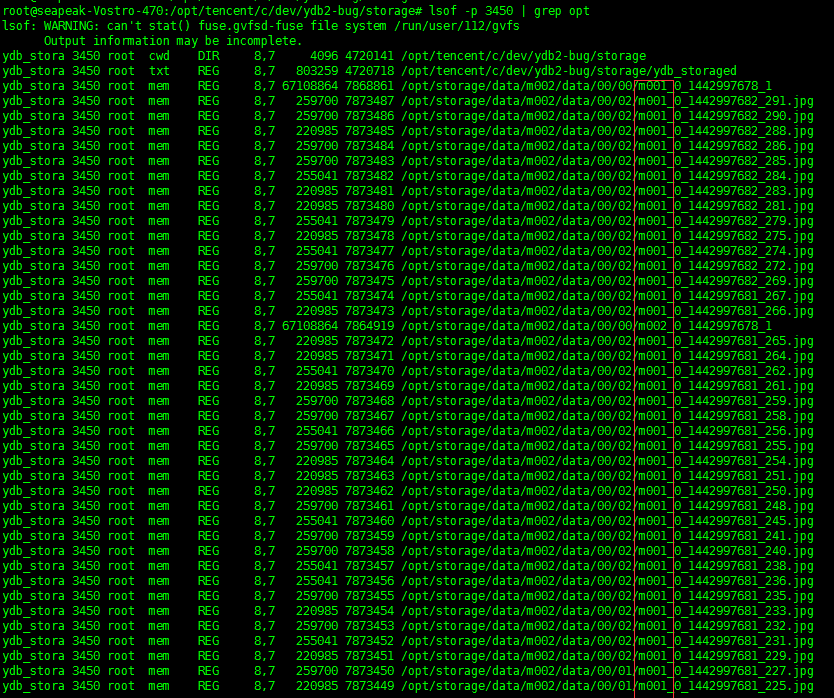

 
最近dfs开发到了最后的调试阶段，进过了艰苦卓越的斗争，终于还是解决了几个fd泄漏
和内存泄漏的问题。这里把一些经验记录下来，以备后患。  
那么先介绍一下dfs，dfs分为两部分，tracker和storage。
tracker只负责负载均衡和调度。storage负责数据
的存储和同步,基本的信息就是这样。  

 
#### 现象
1. dfs的storage在单机运行的时候没有问题，不管是upload，delete还是modify或者find都没有
任何问题，可以一直工作到磁盘塞满；  
2. 当存在多storage的时候，前期可以正常工作，但是进过了一段时间的运行，就会出错，
进程不会产生dump文件，但是日志会抛出errno=24,然后退出。

#### 初步诊断
通过errno得到信息，首先初步判断可能的问题是fd的泄漏，并且结合dump文件没有生成
而且还有log，那么说明我们已经捕获到这个问题。还有一个可能的原因是本身服务器设置
就有问题，比如fd设置的过小。但是基本上80%还是怀疑泄漏。现在的问题是，你知道了
问题的可能原因，但是你不知道问题出现的地方。fd泄漏是open了fd但是没有关闭，log的
信息提示是在你open的时候才提示的，所以log的地方并不是出现问题的事发现场。那么怎么
办？首先想到的是：怎么样去看一下程序运行时有多少个打开的文件？  

#### 解决办法
1. 先看一下fd的数量问题，运行ulimit -a命令看一下：  

文件fd的数量是1024，算一下进程正常运行需要的fd数量：module之间的pipe数量+线程
打开的文件数+log+binlog+synclog+marklog+mpstatue 差不多在300左右，远远小于1024
这样，可以排除这个问题应该不在这里；  
2. 那么下来就只能用lsof看一下了，用lsof -p pid得到如下：  

kao,那么多的文件，而且chunkfile和singlefine都存在。肯定是这里泄漏了。整理思绪，
在程序中，我们可能打开这些文件的地方是对文件的增删改查，还有一个就是sync。这里文件名
中带有m001，这个进程的业务id就是m001，这个并不能一次性的能确定是在那里。那么
我们通过lsof可以看到每个被打开文件的fd值，这就好办了，反正程序中打开文件的地方也不多，
索性在每个open的时候把fd给记录下来，结合lsof的fd，如果两个fd的值相同，比且出现在lsof
的命令输出里面，那么就是这个fd泄漏了。  

 
#### 现象
1. 在fd的泄漏解决后，程序能长时间跑了，但是随着跑的时间越来越长，系统也变得越来越慢。
开始以为是不是磁盘被塞满了而导致的，那就把磁盘的空间释放出来。释放磁盘后，再次运行
程序，现象依旧。  

#### 初步诊断
目前我们只有一个很浅显的系统越来越慢的现象，这个现象的形成99%的罪魁祸首是内存泄漏。
随着我们把磁盘的问题排除掉，那么剩下的选择真的不多了，不得不去面对让人头疼又无比痛苦的
内存泄漏问题。看一下程序，整个过程中内存的alloc和free都很多，不知道哪里可能会出现问题.
还是一个办法，需要查看程序runtime状态下的内存结构。  

#### 解决办法
1. 首先想到gdb，人工的去dump一个文件，然后对这个文件进行调试，可是理想是丰满的，
现实是骨感的。gdb好像并不能很好的去监控heap信息。看来此路不通，遂放弃。  
2. 也想过用一些静态内存检查工具，但是我们的程序有大量的pool机制，对于这些静态内存
检查工具，干扰太多了，也并不是太适合，关键是一直没怎么用过，不熟悉。
3. 那就只能寻求于系统了。翻一下linux的工具箱，有一个叫pmap的工具可以查看进程的内存
情况，那就用pmap试试。结果不试不知道，一试吓一跳：  

好多的打开文件没有关闭，而且还有大小，挺详细。算了一下，一共泄漏了12g+的内存，幸好
哥的机器是16g内存。那么现在知道是什么原因了，但是和fd泄露一样，事发地点在那儿？
4. 结合storage单机的时候可以稳定的运行，那八九不离十就是在sync部分了，那sync也分为
两部分，一部分是传给remote storage的，另一部分是从remote storage传过来的。看一下
pmap的出来的文件名，都是m001的文件，而这个进程的业务就是m001，那就是在发送的时候
发生了问题。现在范围又缩小了，但是通过工具也就只能缩小到这儿了，剩下的就只能看硬
看代码了。  
5. 还好函数不长，经过仔细的查看代码，每个文件都会被一个yssc对象管理着，每次sync后
都会通过yssc的fd。mptr和len进行fd的关闭和mmap的释放。应该不存在问题。那么为什么还会
有内存在进程中呢？再看一下这些值，启动gdb，attach到运行的进程，监听到yssc被free的
哪个地方，看一下它的值：  

len=0？问题找到了，在mmap的时候，没有给yssc的len赋值，导致在free的时候，mmap的内存
一点都没释放，怪不得pmap的结果上的内存大小正好和upload的大小吻合呢。  

#### 经验
1. 像fd泄漏，内存泄漏这种bug必须要去查看现场，经验可以增加判断的准确度，但是不能作为
唯一的标准。  
2. 必须要查看到runtime的信息，必须。  
3. 合理的利用linux的工具，可以加快bug的确定。  

