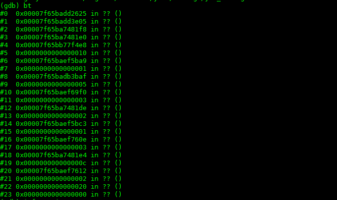
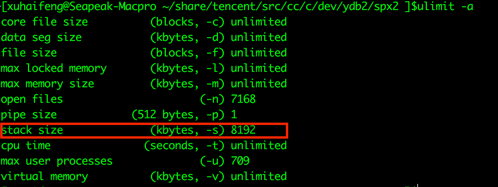

可惜这是一次完完全全的装逼不成反被X的典型例子。  

## 背景
有一天早晨刚到公司，运维小帅哥突然通知我，我们的dfs在平稳运行了一年时间后，在没有任何异常波动、没有任何资源报警、没有任何升级，也没有任何违规操作的情况下，毫无征兆的crash了。  
小帅哥一头雾水，我一脸懵逼。  
dfs是我们的核心服务，绝对不能down机的，所以就先紧急把它拉了起来。命好的是，起来后程序又平稳运行了，既不crash也不拒绝服务，服务和性能又都是杠杠的。这就让我更懵逼了。  

## 怀疑
首先怀疑的是内存泄漏一类的资源泄漏问题。毕竟dfs是c写的，内存、fd、locker等等的资源处理太多太杂了。特别是内存，几乎每个函数内都会出现。所以重点对象就是它。  
1. 找运维查看一下报警系统是不是有没有发出来的报警？查了一下没有。  
2. 自己还是不放心，直接看了一下线上产生的core文件，大小也只有mb级别，确定确实没有溢出。  

接下来，怀疑是fd或者locker。  
- 先说locker。dfs是我们自己设计的无锁处理算法，根本不存在locker的资源操作，所以这个也被排除了。  
- fd，文件描述符。如果fd有溢出，我们也对fd加了报警，报警系统是不会不报的。就算漏了，fd溢出的现象也不应该是进程直接crash，而是会无响应才对。而且去查看了一下log，并没有发现执行close有错误的迹象。    

到目前为止，所有所能想到的原因全部不成立，线索全部中断。那么如果非要弄清楚这次crash到底为了什么，唯一的办法就是去看程序的runtimes。  

## 碰碰运气
反正线上的core文件都已经生成了，不玩白不玩。通知运维把core给拿下来，我非得去看看到底为啥就crash了？不看不要紧，一看就自己打了自己的脸啊！    

1. 加载core文件，发现程序是因为收到信号6的原因进程被退出的。如下图：

信号6，也就是SIGABRT，Linux的man解释：由调用abort函数生成的信号。引起这个信号的可能性有很多，所以这一点没啥用。   
2. 加载可执行文件，然后看看crash的一瞬间的堆栈是一个什么情况，好做一个大概的判断：哪一行代码可能出现了问题。

执行bt命令后，显示出来的stack信息全是？？，出现这种情况的可能性有2个：
- 可执行被重新编译了，导致了新的可执行文件的元数据和core文件中的元数据对不上，这个首先被排除，我们的可执行文件都是从线上直接拖下来的，所以不可能出现这种情况（这里也要告诫大家，千万要保留运行时程序的可执行文件版本，包括.o文件等）；  
- stack已经被破坏了。这种情况很容易就会发生。程序在运行的过程中因为stack，array等溢出的问题没有第一时间被crash，接着在执行命令的时候，产生的core文件stack可能就会被破坏；  

目前来看，我们所能拿到的信息都已经指向了线索中断。操作系统给出的信号不能定位问题，使用gdb调试core因为stack被破坏无法再进一步。那么还有没有别的办法呢？  

## 再进一步
竟然stack已经被破坏，gdb也无法认出，按照正常的路子是解决不了这个问题了。所以这时候“野路子”（其实是更合理更深层次的解决方案）就上场了。既然被破坏，那就恢复它或者是想办法绕过它。  
恢复stack的难度有点大，你首先得知道core文件所有的元数据信息，然后和可执行文件的元数据信息一一合并，还要考虑程序在runtime状态下的内存状态，难度确实是相当的大。所以这一步首先被排除了。  
那就绕过它。考验计算机操作系统原理和计算机运行原理的时刻来了（所以要多读书）。  
首先我们知道所有的程序都是由cpu来执行机器指令的，和cpu执行指令相互配合的是寄存器，其中有几个寄存器记录了当前程序runtime状态下的地址，比如esp/rsp，ebp/rbp等寄存器。也就是说我如果知道程序crash的时候寄存器的值，可能就有希望能复原当时的stack。
方针已经制定，就看执行了。    
1. 首先看一下各个寄存器的值，如下图:

别的都不用看，只要看一下rbp和rsp的值就可以了。  
- rsp表示是当时程序runtime的时候栈顶的地址值；  
- rbp表示当时程序执行到的指令的地址值；  
2. 再看一下执行到rbp的指令的时候，程序前面都执行了什么指令，如下图：

哈哈，终于看到函数了。spx_socket_connect_nb和ydb_storage_heartbeat_send。按照stack的FILO的原理，是执行到spx_socket_connect_nb的时候程序发生了问题。具体的地址在函数的地址+611处。先看一下汇编，查一下地址看看能不能看出来一点什么？如图：

好像没啥，前面就是给connect构造结构体，后面就是调用connect。但是问题确实是在connect之前就crash了啊。查看一下代码:

    ```
    err_t spx_socket_connect_nb(int fd,string_t ip,int port,u32_t timeout){
        struct sockaddr_in addr;
        bzero(&addr,sizeof(addr));
        addr.sin_family = AF_INET;
        addr.sin_port=htons(port);
        addr.sin_addr.s_addr = inet_addr(ip);
        err_t err = 0;
        err_t rc = 0;
        if(0 > connect(fd,(struct sockaddr *) &addr,sizeof(addr))){
            //filter this errno,
            //socket is not connect to server and return at once
            if (EINPROGRESS == errno) {
                struct timeval tv;
                SpxZero(tv);
                tv.tv_sec = timeout;
                tv.tv_usec = 0;
                fd_set frd;
                FD_ZERO(&frd);
                FD_SET(fd,&frd);
                socklen_t len = sizeof(err);
                if (0 < (rc = select (fd+1 , NULL,&frd,NULL,&tv))) {
                    if(0 > getsockopt(fd,SOL_SOCKET,SO_ERROR,(void*)(&err),&len)) {
                        err = errno;
                        return err;
                    }
                    if (0 != err) {
                        return err;
                    }
                } else if(0 == rc) {
                    err = ETIMEDOUT;
                    return err;
                } else {
                    err = EXDEV;
                    return err;
                }
                SpxErrReset;
                return 0;
            } else {
                return errno;
            }
        }
        return 0;
    }
```
 
确实前面我们就构建了一个struct sockaddr_in的结构体，然后我们就直接connect了。貌似不会出问题，而且代码也已经运行了很久很久了。但是突然间，有种预感冥冥中就出来了。nm可能就这里出问题了。去看一下配置文件，其中的配置项：  
``` stacksize = 64kb ```
直刺眼睛啊！火辣辣的。  
这个配置项用来做什么的？其实这个配置项是用来限制系统的stack大小的。也许很多同学都没有听过东东，但是如果你在linux上运行一下命令：
``` ulimit -a```

会出来如上图的一排设置，其中红色框框圈出来的就是这个stacksize的值。在这台机器上默认的是8mb。stacksize的设置在每种linux发行版上的值可能都是不同的。当初就是为了“装逼”，显示自己的编程水平，将stacksize设置成了64kb，这样程序中每个线程最大的stack可用大小就是64kb，你看看我控制系统资源控制的多好？！结果，当碰上一不小心不注意的时候，stack的size马上就超出了64kb，这样stack就溢出了。当然程序就会crash，stack也当然的被破坏了。  
那么为什么我们的会出现这个问题呢？  
1. sockaddr_in的结构体其实并不是很大，但是它申请的是stack的内存，原来使用的内存大小+sockaddr_in的大小应该正好碰上临界点；所以sockaddr_in的申请应该是最后一根稻草；  
2. ydb_storage_heartbeat_send这个函数是在heartbeat线程中运行的，heartbeat线程是一个常驻线程，由timer事件来触发，每次都会向tracker发送心跳数据，所以可能会存在stack因为某些原因，导致了再一次运行中申请的内存比较多，比如log记日志的时候；  
3. 那么为什么不起来就出现这个问题呢，而是要在运行了一段时间后呢？这个问题其实没办法确定申请stack的时间点，比如因为网络的问题我需要记录日志，然而又不是时时刻刻网络不行的，正好在某个瞬间网络不行，申请stack内存记录日志，这样没有释放正好被抓到；  
4. 又因为heartbeat是常驻线程，所以stack基本上不太会被第一时间回收，肯定要在事件处理的最后被回收，所以在一次事件处理内一定要确保有适当的大小来满足程序对于stack的需求；  
原因也找到了，怎么解决这个问题呢？有几种办法：  
1. 不要装逼了，直接这个项不用设置。我们的程序使用的是事件模型，并不是像java一样的每个connection一个处理线程，dfs是一个线程对应着多个connection，所以线程数并不多，就算是每个线程最大的stacksize是8mb，也用不了多少的内存；  
2. 把配置文件中的stacksize改大一点，比如1024kb什么的就可以了。   

## 经验教训
因为stacksize这个项的设置导致了出问题的人我不是第一个，也不会是最后一个，仅仅在dfs出了这个问题的时候，我就知道还有别人因为同样的问题导致程序被crash，只是当时程序跑的好好的我就没有多加注意。所以在这里诚恳的告诫大家：  
莫装逼，装逼遭雷劈;  
莫装帅，装帅遭人踹;  
莫装吊，装吊遭狗咬…    