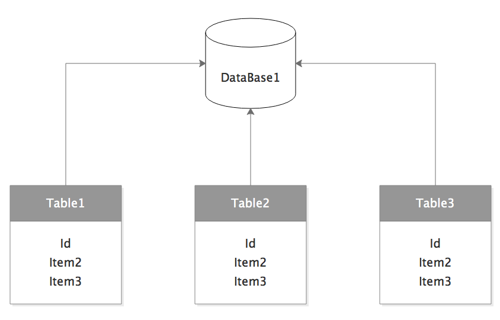
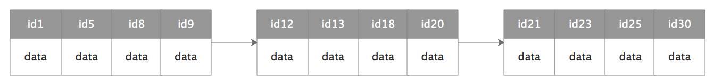
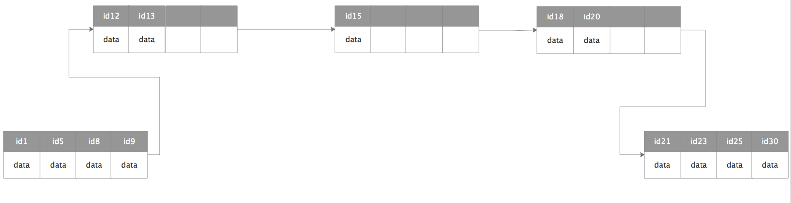
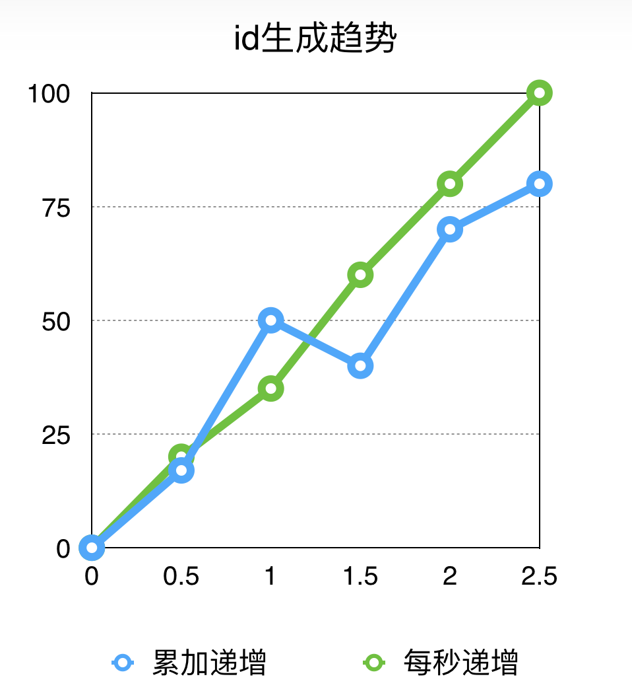
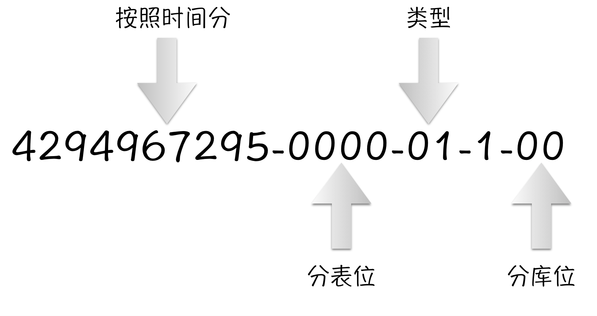
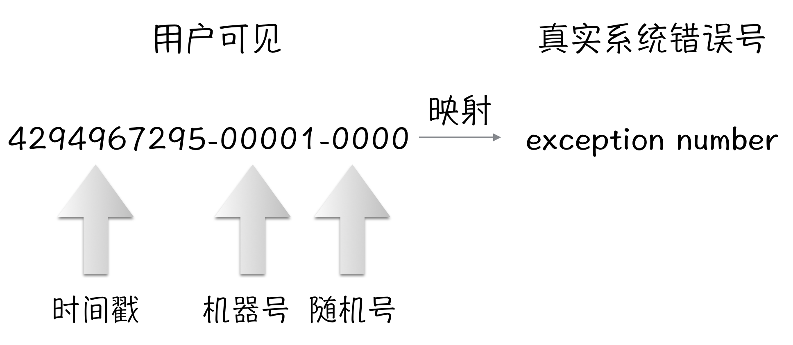
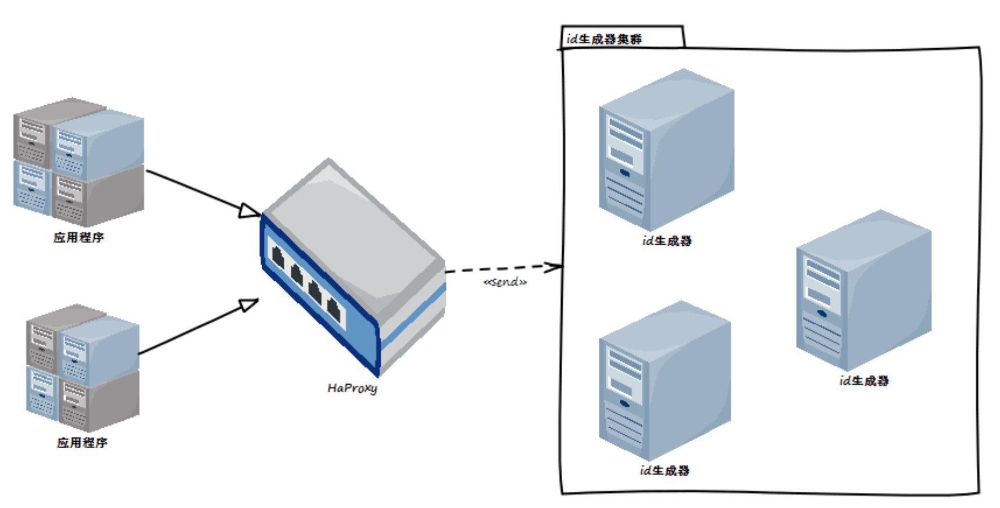

从mongodb的objectid到twitter的snowflake，目前国内的几个互联网大厂也开始重视到了分布式系统中数据id，甚至一些大厂已经公开了它们关于id生成器的设计和实现。我们当然也注意到了分布式系统中id的重要性，并且在系统开始开发的时候就设计并且实现了一个id生成器，我们称之为：Chaos。Chaos目前已经在我们内部运行了2年之久，在这2年内故障率为惊人0，可靠性达到不可思议的100%。那么我们为什么要设计Chaos呢？Chaos又和别人家的id生成器有什么不同呢？这些问题，首先得从我们以往的经验开始。

## 过往使用id的经验  

### int自增
通常情况下，说到id，我们第一个想到的就是int自增类型。它被各种“最佳实践”、教科书、论文...所推荐。然而，在现在这个信息爆炸的年代，自增id已经老态龙钟，显露颓势了！  
从学校到社会；从教科书到实践；从办公自动化到erp再到现在的互联网和大数据，不管什么时候，不管什么年代，我们接受到对于数据id的设计原则都来源于《数据库原理》这本书：  
1. 唯一标识，确保不重复；  
2. **确保主键是无意义的；**   
2. **首推采用int作为主键值；**  
3. 减少主键的变动；   

在单机、单数据库、dal+proc的年代，这些原则是可取的、现实的最佳实践。依照这些原则我们也一直用的很好。直到有一天，数据猛增，单表破千万甚至上亿，需要考虑拆分表甚至拆分库的时候，问题来了：  
**每个表的主键都是自增，数据库扩容怎么玩？**  

进过一番寻找，在数据库的int自增中找到一个属性：步长。可以根据数据表的个数来设置步长，这样就不会重复了。比如将一个单表分成3个表，那么就把步长设置为3，3个表的id就会按照如下的方式来增长：  
1. table-1 : 0,3,6,9,12...  
2. table-2 : 1,4,7,10,13...  
3. table-3 : 2,5,8,11,14...  
这种办法确实解决了id可能重复的问题，但是同时带来了一个很让人抓狂的问题：  
 
**每次扩容，都需要根据数据库表的数量来定义步长，一旦有疏忽，整个数据将会受到灾难性的破坏，最严重的情况下，数据根本无法重新平衡**  

所以int自增只能在单表的情况下才有最好的表现，一旦数据超过单表的最大限度，扩容是一件很麻烦的事情。

### String类型  
因为int自增id相当难扩容，我们想起了string。其实当时不是没有想过用int来自己组合一个id，但是因为那个年代普遍还是x32机器，x64刚刚开始起来，很多系统还没升级到x64，所以对于当时的系统来说，int的值太小了。一个id需要包含很多的信息，特别对于分布式系统来说，**包含业务信息简直就是一定需要的**，（PS：这里不得不说一下：我们的教材很多时候不能与时俱进。各位谨记：理论是理论，实践是实践。）所以我们第一想到了GUID（UUID）。  

#### GUID/UUID   

GUID作为id确实规避了int自增的一些问题，对于GUID来说：  
1. 肯定是唯一的，几乎不太可能碰见碰撞的问题；  
2. 也没有业务的意义，都是根据统一的规则（并非业务规则）生成；  
看上去倒是一个很好的id解决办法，确实也有很多公司在使用它，但是GUID也存在几个问题：  
1. 表的切分貌似只能有一种方法来确定：hash（guid）% table-count；  
2. 无法排序，对表的主键并不友好；  
3. 因为无业务意义，所以人类的识别度不高；  
那么这些问题怎么解决呢？既然GUID的字符串都可以，那我们把字符串变成自定义的不就妥了嘛？    

#### 自定义String  
自定义String是我们当时的解决方案。相比于GUID，自定义String有太多的优势：  
1. 自定义的string可以塞入任何你想要的信息，可定制性很强；  
2. 轻松的实现分库分表运算，并且不仅仅限制在hash算法；  
3. 人类的识别度很高，可以用字符串明确的标识；  
4. 可以使用本地生成，根本无延时；  
虽然string的id优势明显，也解决掉了切分方法和识别度的重要问题，但最重要的几个缺点还存在：  
1. string太长，且对于的运算过慢；  
2. 对排序和索引支持很不友好，对主键的索引块是破坏性的；  
就这些缺点来说，在当时还是可以接受。但是在现在这个时代，已经不可能了，那我们到底要什么样的id呢？    

**重要但很少考虑的问题**   

这里主要说一下id对于数据库索引的支持不友好问题！众所周知，我们目前使用的数据库，不管是sqlserver，oracle还是mysql，数据库的索引几乎都是清一色的btree或者是其衍生版。  
在数据库的主键中，当插入数据的时候（假设我们从来不会更新主键信息，一般也确实不会更新），db会主动维护一个btree结构，这个结构最终会序列化磁盘上，在磁盘上，索引的格式我们简化如图所示：  

每一小块表示一个id对应的信息，每一大块表示磁盘的文件块大小，每个索引最后都会被像这样子连接起来。如图看起来好像没问题，那么问题来了，如果我要插入一个id=15的值呢？结果就会像下图：  

因为前后的索引磁盘块都已经占满（或者是到一个阀值），数据库就会主动将原来的索引链断开，插入新数据，再连接上彼此的上下级索引。这种操作相比依次的插入，会带来更多的磁盘io。  
然而，如果使用string类型的id（特别是guid），因为没办法确定顺序，所以拆开索引-插入索引的操作将会经常发生，性能当然会有问题了。  

## 初涉id  

### 基本分析

在业务系统中，很多地方都会用到id，主要的地方有几种：  
1. 书、卷、章节等id；  
2. 分布式系统中，系统调用的错误码；  

对于id的几个需求：  
1. 最基本：作为数据库记录的主键；  
2. 加强型：被索引，对索引友好；  
3. 附带价值：作为分库分表的依据；  
4. 扩展功能：对象唯一标识，比如sessionid、批号、错误号；  

具体的分析一下在业务规则下的id，它必须具有以下的一些特性：  
1. 分库分表：因为分库分表的方式各种各样，并且会随着业务的变化而变化，所以对于id来说，它必须要包括时间戳、随机数、类型位、数据库标识等几种最基本的属性，以供各种分库分表的方法使用；  
2. 高可用性：机器位，这是为了分布式系统中id必须唯一而设置的；  
3. 数据可读性必须强；  
4. 递增还是随机？每秒递增？？累加递增？？ 

### 基本诉求  
必须要具备以下一些功能或者说特性：  
1. 唯一，必须唯一；  
2. 短，尽可能的短；  
3. 生成速度足够快；  
4. 运算足够简单，快速；  
5. 附带实体业务信息，比如时间、类型等；  
6. 部分信息可以自定义，比如路由信息；  
7. 不仅机器能识别，人类也可以识别；  
8. 对索引友好；  
9. 根据业务规则，能自定义排序等业务规则；  

### 基本方向 
1. 必须足够短，最好是uint32，最长uint64；  
2. 必须系统原生支持，不需要扩展类型；  
3. 比较运算足够快；  
4. 必须递增，可排序并对索引友好；  
5. id必须带业务性质，符合望文生义原则，通过id可以知道这个数据存在的数据库、表等信息，如果是错误号，必须能知道所发生的服务器；

## id的水还是很深的   
 
### snowflake

考虑实现id，twitter的snowflake算法是一个无法回避的问题，分析snowflake的算法，它有几个重要的特点：  
- 首先：snowflake由时间戳-机器位-随机数组成，分别是41位、10位、12位  
- 其次：snowflake选择了使用uint64类型，所以在这个算法下，最大值就是0XFFFF FFFF FFFF FFFF；  
来看一个例子，比如有一个数：  
**9223  3720 3257 7650 688**    
这个数代表了什么意思呢？首先得分析它的二进制，这个数的二进制是：  
**0111 1111 1111 1111 1111 1111 1111 1111 0000 0001 0001 0000 0100 0000 0000 0000**   
然后通过snowflake的组成机制，算得这个数的真实要代表的数：  
**2199023251472-264-0**  
不得不说，这种二进制移位的方法对于机器来说非常的简单、运算也更快，但是对于程序员来说，简直就是天书。所以snowflake算法我们并不满意，对于snowflake不满意的并不仅仅“把技术人员不当人”这一项，还有2个业务的问题snowflake也无法解决：  
1. 没有类型信息；  
2. 分库分表没有数据库定位信息；  

### Chaos的设计

#### 场景 

Chaos首先确定的就是放弃二进制而选用十进制。使用十进制最主要就是id的特殊场景。一般来说，id对于一个对象就像是身份证对于你一样，如果不去办银行卡、订酒店、订机票...，在日常生活中，身份证永远都是安静的躺在你的钱包里面；同理映射到技术人员的开发日常，当程序员要注意一个id的时候，就是当且仅当系统出问题了，需要排查。如果排错的时候，使用的还是snowflake这种二进制移位方法生成的id，同时领导、同事催促的电话频繁响起（往往这时候老板的电话特别多），然后第一句就是：怎么又出问题了？一身汗的同时你能第一时间确定这个id到底来自哪里？什么类型？用处是什么？... 这种情况下，你除了想打人已经没有别的想法了！    

#### 组成 

Chaos也和snowflake一样，选用了uint64类型，但是因为Chaos是10进制，所以对于Chaos，uint64的最大值是  
**1844 6744 0737 0955 1656**  
那么Chaos最大值只能是  
**9999 9999 9999 9999 999**  
直观来看，就是Chaos的id少了一位。这又是为什么呢？接着来看：  
和snowklake一样，Chaos也是选择了使用指定位数来确定业务信息，不同的是Chaos的位数是10进制位数。我们的算法：  
**时间戳-随机数位-类型位-机器位-数据库标识** ，10位 + 4位 + 2位 + 1位 + 2位  
这里就可以解释为什么Chaos的id会少一位了！Chaos的id最前面的几位是时间戳，而u64的最大值最前面的数值是1，如果坚持原定的位数Chaos生成id的时间戳就可能会溢出。所以Chaos的id干脆少一位，这样不管最前面的数值多大，就算是9，因为少了一位，所以肯定不会溢出。  

#### 序列号

在Chaos中，选择了序列号而并不是随机数来解决数的唯一性问题。之所以不选择随机数，是因为随机数在5位数的情况下，万分之一的碰撞概率对于10k qps的压力来说还是挺大的，所以随机数在Chaos的需求下并不是一个很好的方案。  
序列号就是一个计数器，从0-9999计数，9999后直接归0.这种累加方式在Chaos中被称之为累加递增。还有一些业务确实需要每次都是从0开始的数，这种情况下的递增在Chaos中被称之为每秒递增。  
从方案上来说，结合业务，累加递增可以让id更加均衡，id可以被更加均匀的分配到每个库和每个表中，所以它更适合用来做分库分表；而每秒递增更适合于重排序的情况。  

#### 递增性分析
上面讲到的序列号递增方法，因为序列号是id的一部分，所以序列号的递增性其实决定了整个id的递增性。也就是说，序列号决定了id的递增性。例如：  
**累加递增：秒内进位**  
429497-9998-01-1-00  
429498-9999-01-1-00  
429498-0000-01-1-00  
**每秒递增：设计成每秒10k个，超过不会放出id**   
429496-0000-01-1-00  
429497-0000-01-1-00  
429498-0000-01-1-00  

所以查看这上面的id，我们可以总结如下：

累加递增：长时间（2s内）内保证单调递增，短时间（1s内）内不保证单调递增  
每秒递增：它肯定是递增的，因为每秒都会从0开始，单位时间内都是单调递增

#### id的使用
对于分库分表的使用，chaos生成的id使用示意如下：  

对于错误号的使用，chaos生成的id使用示意如下：

### 服务器设计

chaos采用了水平的分布式设计。服务器都是无状态的，也是去中心化的。这样的设计可以更好的来适应后面压力增大后对于服务器的需求。目前Chaos只支持一个集群中最多有10台服务器提供id服务。是不是感觉少了一些，其实够用了。按照chaos的设计需求，10台chaos每秒可以生成：10(台) * 100(类型数) * 10000(每秒最大数量）= 1000 0000个id。  

## 总结
id，其实就是一个19位的数字。对于id来说，技术含量不在于纯技术，而在于对系统的架构控制，更是在于提升id对业务系统的最大化作用和控制。

