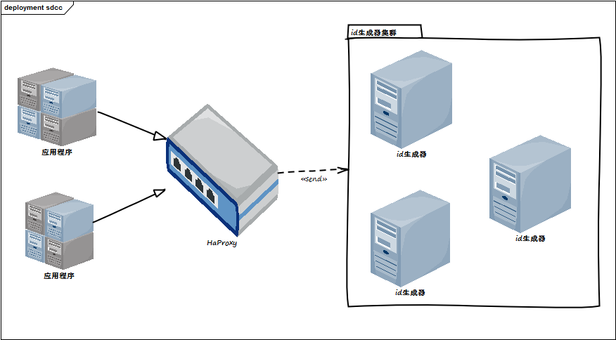
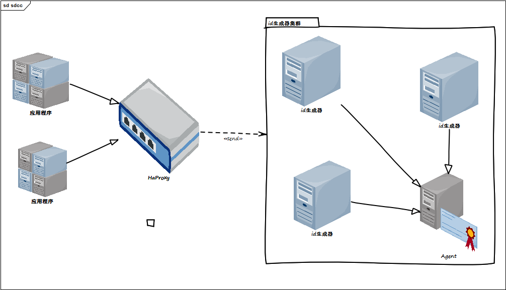
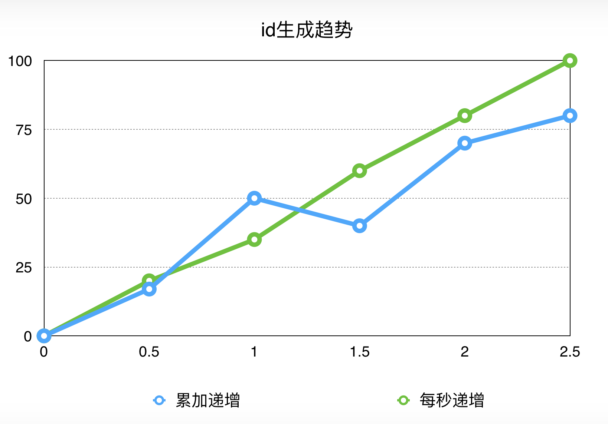
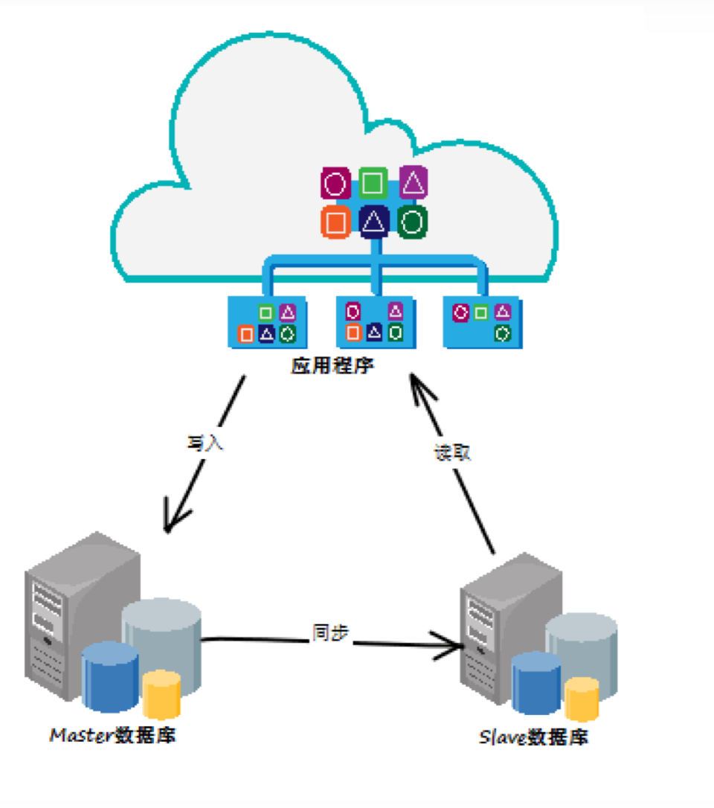
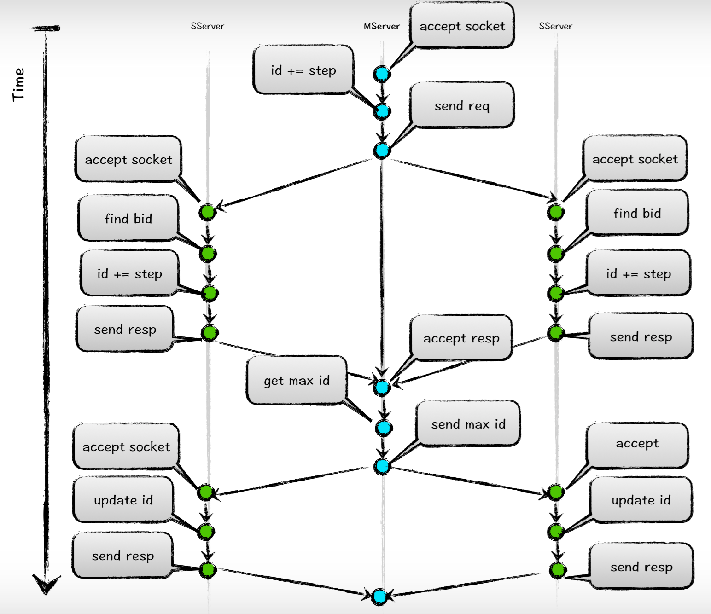
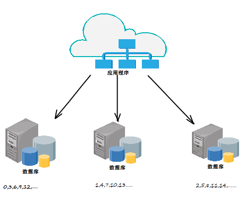
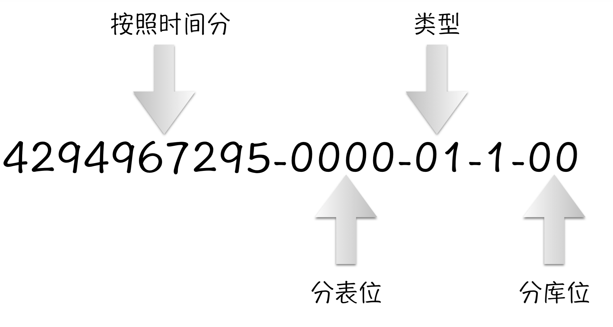
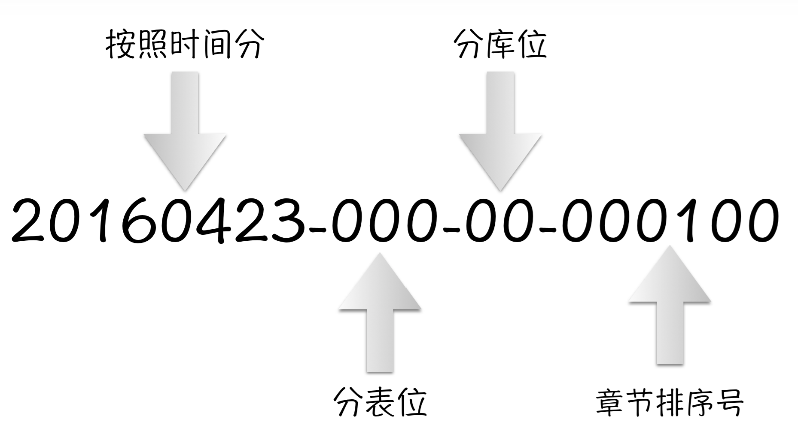

### 名词解释  

1. dfs: 分布式文件系统，具体的实现请参考 [这里] (/2015/DFS.html "分布式文件系统")  
2. idc: idcreator的缩写，是指id生成器本身  
3. albianj: 我们开发的一个分布式业务统一框架 具体实现请查考[这里](/2015/albianj.html "分布式统一框架")  
4. 数据路由: 业务系统中经常会用到的分库分表操作  

### 摘要  

我们设计并实现了一个分布式的id生成器。它是基于linux操作系统的，面向我们几乎所有
的业务操作，为我们所有的业务提供对象的唯一标识，也为我们的错误号提供标示。虽然
id生成器被设计成运行在廉价的linux机器上或者是混搭在别的业务机器上，但是它依然为
我们提供了良好的可访问性和可伸缩性。后期因为业务的需要，我们也让id生成器为我们
提供了良好的完整性和一致性。  

虽然id生成器比较简单，但是它确实出自于我们对于搭建一个分布式业务系统的实际需要
和我们对于搭建分布式业务系统的一个理解。它和我们搭建的dfs或者是albianj一样，并
不是出自于某些论文或者是高大上的理论。它更多的是被用来解决我们在系统中碰到的实
际问题，所以对于我们来说，它比某些开源或者是论文的更加的具有适应性、维护性和
可用性。  

id生成器已经被部署到我们的内容中心系统中，最初的版本已经稳定的运行了9个月，中间
没有一次的down机事故。现在它也被用来改造我们以前的老系统，改造我们从oracle或者
是mssql迁移到mysql的过程。目前为止，我们的id生成器已经部署了2套，一共6台机器，
它为我们源源不断的输出我们需要使用的业务id。  

本文档中我们会最终讨论我们现在id的生成方法和后期我们处理强增长模型id的解决办法,
还有现在的id生成办法和以前id的比较、我们使用id的方法等。当然，我们着重要介绍的
还是我们id生成器在分布式业务系统中的架构和特性。  

### 简介  

我们开发idc的初衷是确实碰到了业务大数据的问题。我们的书、章、章节等动辄百万、千万、
甚至上亿的记录需要被最后存储到数据库中。就目前的数据量，如果使用简单的方案，只
能寻求商业数据库的支持，但对于一个互联网公司来说，商业的数据库会大大的增加成本
。我们继而选择了使用开源的mysql来作为底层的关系型数据的存储。但因为mysql的单表
压力远远无法满足我们现实的压力需求。我们只能对业务数据进行了拆分，继而变相的对
我们提出了数据路由的功能。  

虽然数据路由的整体实现由[albianj](/2015/albianj.html "分布式统一框架")负责并且实现，但
是数据路由的规则必须由我们根据业务设定。而设计数据路由的前提是我们必须要存在一个可以作
为<b>数据路由标识</b>的载体。同样是路由，如果是web的负载均衡路由一般就会使用客
户端ip等作为标识，但是类似的解决方案并不适用于我们的数据存储，因为数据库的路由
除了存储数据之外，还要考虑可以通过标识能定位位置，继而还能读取这些记录。所以我
们必须具有一个明确的、不会改变的、唯一的标识来配合数据路由。这个标识就是我们这
里要介绍的id。  

我们为此设计并且实现了整个的idc。考虑到目前我们的现实情况，该idc除了具有高性能
的tcp接口和自定义的api外，我们还为此提供了一个语言无关性的http接口。和tcp的api
不一致之处在于tcp会单纯的返回id，而http的接口将会访问一个json对象，继而通过json
可以获取id或者是判断是否出现了访问错误。  

虽然idc是分布式的结构，但是和dfs之类的存储类分布式系统相比还是差别非常大的。对
于dfs中比较强调的数据一致性、数据可恢复等等要求，在id生成器中基本上不需要太多的
考虑。这是因为存储需要保存我们提交的内容，而id它只需要和时间成正相关性即可满足
要求。但idc也需要遵循统一的分布式系统的一些规则。idc同样要满足分布式系统的高可
用性、高稳定性、单点无关性等要求。  

在互联网行业，前期的考虑总觉得已经满足了需求。但是变化永远大于计划。在我们的idc
中，后来的需求还需要满足生成带有业务状态的id。这是我们的idc和别的idc有差别的地
方。在章节的顺序上，我们需要一个定步长并且只可递增不可乱序的id来满足我们的排序
要求。就这个要求，打破了我们前期对于idc的设计，我们对于idc增加了状态的管理，并
且设计了新的算法来满足此需求。  

### 设计目标  

按照往常一样，我们也对我们的idc提出了一些设计上的原则和目标。遵守这些原则、达到
这些目标可以让我们的idc能更好的为我们所用。和以前的dfs和albianj完全不一样，idc
的目标确实比较多，但是它的目标一般都比较的清晰。因为相比它们两个已经设计完的组
件，idc的功能相对简单而单一，对于idc更多还是在性能和扩展性上存在一些实现上的难
度。  

在上面的介绍中，我们重点介绍了我们的idc的背景和大概的用处，以及一些idc必须遵循
的规则。但是我们并没有说明我们的idc的设计构想。所以，下面我就讲一下我们的设计构
想。  

1. 唯一性。从我们的idc中生成的id必须是具有唯一性的。并且是全站唯一的id。这样的id
可以很方便的得到它的业务信息。不管是对于数据路由还是对于业务排错都会具有一个清
晰的、可维护的id；  

2. 短。idc生成的id必须要足够的短。最好是一个uint32的值，最长也不能长于uint64.一
来对于长于uint64的值存储将会是一个麻烦，另外运算也是需要借助移位等算法，对于编程语
言还无法使用语言内置的类型系统；  

3. 生成的速度要足够快。这大家都很好理解。没有一个程序是不追求速度的。而且对于我
们的业务系统来说，id的服务是对应于一个分布式的结构。在可用性、可维护性上相比本
地生成或者是数据库生成会有一次的tcp交互时间。所以我们要确保在业务系统正常运行的
情况下，idc能快速的给业务系统提供服务。尽可能的减少因为生成id所需要花费的时间；  

4. id的运算要足够简单。这是吸取以前使用字符串来作为id的时候的一个教训。不管是应
用程序还是数据库，使用字符串作为id是可以“为所欲为”，但是在运算上不管是排序还
是hash都会比int类型的数据慢很多，或者是多步骤。所以我们生成的id要尽可能的满足于
简单，最好就是一个数字，这样计算可以直接进行，而且可以直接使用内置简单类型；  

5. id不仅仅是一个无意义的id，而是一个带有业务性质的id。这应该是一条“毁三观”
的目标。因为我们的数据库教科书上有一条明确的规则：实体id最好是不要带业务性质的
，仅仅起标识作用的id。但是这也仅仅只是写在教科书上罢了。其实真的很误人子弟，或
者说是跟不上时代。在现实系统中，一个没有业务意义的id在分布式系统中几乎是寸步难
行。不仅仅是不好维护，而且还很不好扩展，不能自由的做数据路由，也不能给开发者或
者是维护者一个明确的“望文生义”的提示。  

6. 部分自定义位。idc中生成的id除了具有业务意义外，还必须具有一定的空间提供给业
务系统来进行自定义。业务系统中的业务路由也是强业务性质的，和业务结合的相当的紧密
，可以这么说，几乎每一个业务都会有一个不一样的数据路由的定制化功能。而我们需要
满足这些定制化功能。满足定制化功能的前提就是idc中生成的id并不是一个成品，而是一
个半成品。开发者可以通过这个半成品id进行业务加工，使其变成一个完整的、符合当前
业务需求的id；  

7. 可识别。可识别，也就是可读性。我们认为这是id作为一个标识最应该具有的一个特性
。一个只可计算机识别不可人类肉眼识别的信息几乎是没有任何用处的。我们的idc中生成
的id必须不是那种只为了计算机而存在的。开发应用程序、维护应用程序的都是我们开发
者或者是维护者，本质上说都是人。我们把开发和维护作为头等大事来对待，而机器运行
程序，这是我们程序的附属品，只是碰巧我们写了一个机器可以运行起来的程序而已。首
要条件还是人类友好。  

8. 对索引友好。这其实是我们开发idc第二个重要的原因。如果不要求索引，字符串是最
好的解决方式。但是字符串在排序上太差了，而这也会影响到数据库的速度。使用字符串
，插入数据的时候会对数据库的索引进行随即写入，而数据库最快的速度应该是尽量的避
免随机写，把随机写变成顺序写这样来提高速度。所以我们的idc中产生的id必须要满足这
个要求，也就是说，从一定意义上，idc中生成的id必须是有顺序的，是可以把对数据库
的随机写优化成顺序写的；  

上面说了很多我们对于idc生成的id的各种设计目标。这仅仅是我们对于这个idc系统
一部分的思考和实践。但是对于我们idc本身，我们也会有一定的设计目标或者说是设计
规则，用来满足我们的idc对于业务系统的支撑。  

1. 高可用性。我们的idc必须具备高可用性的特点。因为我们的idc被设计成分布式的方式
，又是被构建在廉价的linux普通服务器上，所以这些服务器具有易损坏的属性。但是我们
的idc集群不能因为服务器的损坏而不能为业务系统提供服务。我们必须设计一种或者多种
规则来规避单机down机的问题，从而达到整个集群的高可用；  

2. 数据一致性：起初这并不是idc的一个必须的属性。因为idc被设计为无状态，仅仅与时
间相关，所以这部分被忽略。但是因为现实业务的需求，我们需要带有状态的idc，故数据
的一致性便成为了整个idc集群的一个标准特性，也是必须被满足的特性；  

3. 单机承受能力：根据我们整个的业务系统中的业务压力，
引申出来我们的集群需要能支撑的一个量，这基本上就是我们的整个idc集群的最基础的应
对量。鉴于我们业务的发布量和发布态时间，我们的idc集群在前期基本上需要支持每秒5k
的QPS。在业务大量的导入后，预估计这个量在万的级别，应该不会超过百万。所以划分到
我们的单台机器，基本上在1w／s左右的qps即可扛住整个站点的压力；  

最后，也是最重要的一点是，我们的idc必须能在经受住我们系统的同时，可以方便对idc
自定义规则。这是我们比较关心的，毕竟业务随时在变，数据随时都在增加，而我们的应
对策略也一直都在变更。在整个的idc架构中，我们必须要保证留取一块地方，给我们的生
成算法服务，它可以方便的进行自定义，可以方便的嵌入或者重写算法。  

### 架构  

为了达到我们的设计目标，我们对于我们的idc进行了总体上的架构，并且对其架构进行了
细化切分。细分后的idc基本上等同于一个简单的tcp／http服务器。我们也对idc整体的功
能性上进行了细化。目前来说，我们主要的点有以下几个组成：  

#### 高可用架构  

对于一个分布式的集群来说，高可用永远是一个不可回避的话题，也是一个必须达到的话
题。我们的idc也不可避免的需要高可用的架构设计。对于idc来说，相对来说数据比较少
，而且相互之间的关系也没有dfs那么的紧密。起初我们设计的idc压根就是无状态的集群
。所有的id都与也仅仅与时间有关。所以我们的idc被设计成平行的无状态结构。从架构上
来说有点像memcached，服务器没有任何的管理服务器或者是状态服务器来为这些idc集群
提供负载均衡、状态管理和故障转移。  

但是和别的系统一样，业务总归是千变万化的，很多时候计划是赶不上变化的。没有多久
我们就需要一种强一致性的id，我们对于原有的idc集群需要一个重新的考量。为了不影响
现有idc的工作，我们在idc上增加了一个弱化的管理节点，它仅仅只是会管理集群中的idc
，而不会像dfs一样还要做一些负载均衡和故障转移的工作。所以这个增加的节点其实不能
叫做manager，而仅仅只是一个agnet的角色。因为我们这样一个特殊的agnet的架构，所以
对于我们的一致性问题也提出了一定的挑战，因为我们不能使用manager来平衡或者是分配
相同请求的master机器了。因为idc集群还是和以前一样都是平行的架构设计，所以就会带
来一个所有的idc都是master的问题。我们也确实使用一种算法规避了这个问题。具体的请
参考“一致性问题”。  

对于一个没有管理节点的集群，我们原定使用的负载均衡的方式很简单，就两种。一种是
轮训，另外一个是一致性hash。但是一致性hash还是比较少使用的，特别是后来我们使用
了一致性算法后，几乎就不需要一致性hash饿的存在了，轮询就已经可以满足我们的要求
了。因为我们已经不需要知道master机器在哪里，或者是让一台idc机器通过选举变成
master了。这对于系统的简单行和idc集群的性能是一个很大的提升。而我们这个负载均衡
是在客户端实现的。所以对于我们的客户端来说，也是省掉了很多的东西，只需要做一个
简单的哨兵来去维护轮询的idc即可。  

#### id的可视化问题  

说到id的可视化问题，有过id生成算法使用经验的同学肯定会想到snowflake算法。
snowflake算法其实是一种偏向计算机的算法。它通过将一个数转变成二进制，然后通过计
算机的移位算法来解决问题。这也是大家经常会想到的解决方法。这种方式将计算速度看
的非常重要，而忽略了了一个问题：那就是人的问题。系统是由人写出来的，也是由人来
维护的。一个好的代码不仅仅只是写出来给计算机来执行的。而应该是写出来给人看的，
好巧不巧的偏偏海能给计算机运行。所以我们并没有使用类似于snowflake的算法，而是使
用了十进制来生成ID。  

十进制，我们人类经常使用的一种记述算法。相比二进制，它更贴近我们的生活。以至于
到了我们人类一眼或者谁靠着简单的风格位数就可以区分出来数字的意义。这正是我们想
要一种方式，也可以称之为感觉。因为根据我们的经验，一般的id都是在数据路由中使用
，这个时候其实对于系统来说是二进制还是十进制没有什么差别，因为计算机都能处理，
我们人也不会去看；但是当我们维护人员要去看这个id的时候，往往都是在系统出现问题
的时候，这时候时间就会显得异常的宝贵，再加上当时哪种紧张的心理，如果这个id不是
哪种一眼就能看出来意思的id的话，往往会有很大的打击作用，进而会让维护人员产生更
大的焦虑症状。这并不是我们想要的。我们可以看一下以下的例子来感受一下：  

<b>9223  3720 3257 7650 688</b>这样的一个数字看起来还算相对整齐，但在系统中，它
看起来往往是这样的一个样子<b>9223372032577650688</b>,这就已经有点凌乱的。压根不
知道表示的是什么鬼。然而，按照snowflake算法，其实它的二进制应该是这样的：  

    0111 1111 1111 1111 1111 1111 1111 1111
    0000 0001 0001 0000 0100 0000 0000 0000

但是我们还是看不懂它表示的是什么意思，我们再对它进行移位计算，分别计算出来它的
各个位置上的值，其实它的真正的表示的值是这样的<b>2199023251472-264-0</b>(中间的
－是为了方便区分添加的)。敢问你现在是一种什么样的心情？  

但是是不是这种二进制算法就没用？其实也不是。我们也使用了这种算法的变种，我们将
它使用在我们的排错异常号上，具体的可以请参考虾面的使用id章节。  

#### id模型  

在我们的业务系统中，我们的id最主要的作用还是作为数据路由的一个标识。所以我们的id
其实最终决定了我们的业务系统数据库存储是不是会均衡或者是趋向于均衡。这就决定了我们
必须要采用一种算法来确定我们生成的id是线性的。又因为我们的id需要对数据库索引的
友好，我们放弃了随机数的算法，而是使用了简单轮询的算法来生成id。  

首先，放弃随机数算法是因为本质上我们没有办法确定随机数会对数据库索引友好。虽然
随机数可以满足线性这么的一个条件，但是先后生成的随机数的大小是我们没有办法决
定的,也就是说又50%的可能性后生成的那个随机数会比前面那个随机数小。这样的概率
显然太大，并不适合我们的要求。那么我们只能选择轮询这种算法。  

其次：我们不会存储轮询的哨兵的值。这个取决于我们的id并不仅仅更我们的轮询数有关，
还和我们的时间有关。我们的id是在时间的基础上增加轮询数来共同决定一个id的主体，
所以对于我们来说，对于轮询数的单调一致性要求并没有想象中的高。所以也会出现下面
的这种情况：  

    429497-9998-01-1-00
    429498-9999-01-1-00
    429498-0000-01-1-00

这个id中，第一部分是时间，第二部分就是轮询数。所以我们的id可能会出现这样的一个
情况：正如第二、第三两个id一样，因为递增到了一个临界值，又为了避免位数的溢出，
我们只能选择将id值的轮询数归0.这样的话，我们也可能会出现部分对索引不友好的情况
（后面生成的id小于前面生成的id）。但是这种情况只是小概率时间，因为这种情况只会
出现在1s之内，当跳过1s后，因为时间的真大，数的前半部分会变大，所以整个数也会变
大。这样就又回到了单调递增的条件下了。  

这种id适合做分库分表，但是对于单表的排序id并不适合，所以我们还提供了严格递增的
算法。  

严格的递增算法其实和轮询递增算法差不多，只是在我们的轮询数上做了一点点的改动。
我们把单调递增改成了秒内递增，溢出不饭号或者是从定向的方法。比如，生成的id号是
这样的：  

    429496-0000-01-1-00
    429497-0000-01-1-00
    429498-0000-01-1-00

这样的号，会随着前面的时间或者是中间的轮询数单调递增。永远不会出现变小的问题。
但是这仅仅是单台情况下的表现，如果是分布式的情况下，也会出现问题。所以这个id
同样不适用于严格的递增情况。后面我们会讲到碰到需要严格的递增的时候我们的
解决办法。  

这种id明显的看出来不适合按照轮询数来做数据路由。对于这种id，增长的曲线角度永远
是45，而且是每秒都会重新开始，所以就会导致这些id大概率的倾向于值小的路由。  

综上所述：我们目前的两种id增长曲线如图：

#### 简单唯一性算法  

唯一性在单机的系统中还是一个可以容易解决的事情。但是在分布式的系统中，唯一性对
于架构来说往往是一个挑战。终其原因会有很多，但是最大的问题就是：在分布式的系统
中没有一个精确的时钟。没有了精确的时钟，很多的解决方案就会失去作用，而且失去作
用的不仅仅是唯一性，可能的单调性也是一个问题。  

一般解决这个问题的方案是在服务器集群中放一台时间服务器，所有的机器都会每隔一个
心跳时间去这台时间服务器上校验和更新时间。但是就算是再频繁的同步，这种精度也就
是在毫秒甚至是秒级别了。不会有比这个更精确的度了。所以严格的来讲，这不能作为很
好的一个解决办法。  

我们的idc集群因为是分布式的也同样的存在这个问题。而我们也采取了一定的策略来去避
免这个问题。我们将我们的id设计成和时间、机器相关。这样一个带上机器编号的id，能
保证在整个的系统中唯一了。以此，我们的id方案为：  

<b>时间戳－轮询数－机器id－数据库位</b>  

这种解决办法确实解决了这个问题。但是也有一个副作用。因为考虑到我们的id要放下很
多的业务性质属性，所以留给我们的机器id位就会变的很少。我们现在的情况下留给机器
id位的长度仅有一位，也就是说：我们的idc集群最多支持10台机器。看上去10台机器很少
，但是我们单机的承压在每秒10k。所以基本上我们集群的id生成量在每秒100k。这仅仅是
一种类型的数量，在我们的idc中，一种支持100种类型的id，所以我们整个集群的量大概
在每秒1kk。  

#### IDC保存数据算法  
该来的还是会来的，只是设计的时候时候未到。我们开始的时候并没有考虑严格的带有递
增id的需求。但是这个需求在后面没多久就出现了。先来看看我们遇到的问题：我们在三
方内容合并的时候，为了迎合原来的各业务系统，不打破他们的使用规则，所以我们的章
节信息在正常的数据路由id使用的基础上，增加了一个排序id，这个id必须是严格递增的
，因为它代表了章节的前后次序。但是在我们的系统结构中，如下图，我们对于mysql使用
了读写分离的策略，那么问题来了，就算我的同步速度非常快，无限快，它也只是趋向于
实时，但并肯定就是实时的。也就是说同步是肯定要时间的，唯一的差别就是时间的长短
。这也就意味着可能会出现下面的情况：我们在master中插入一个正确编号的章节A，这时
候A还没同步到slave数据库，我们又要插入章节B，这时候我们需要一个编号，我们从
slave数据库中读取一个编号，这个编号是当时slave数据库中最大的编号，我们再加上步
长，其实这个编号和刚刚插入的章节A的编号是一样的。然后再插入master数据库，这时候
章节A和章节B的编号就会发生冲突。在我们的系统中，就会出现章节重复的问题。  

这确实是一个架构上的问题。本质就是写入和读取并不是来自于同一个数据库，所以造成
了数据上的误差。这种问题的解决办法业余很多，以前我们使用的一种办法是在修改数据
或者是需要严格数据一致性插入数据的时候，都要在master数据库中先load一下数据，其
实我们设计的albianj确实也有这个功能，这样做的好处是简单明了。坏处是破坏了架构的
一致性，后期也有可能在代码上引起混乱。而且就一个排序号，这个对我们来说是可以避
免去master数据库load数据的，所以我们采取了另外一个方式：让idc支持这样的一个id生
成。  

总体上来说，这样的需求也不是很难解决。但是因为章节是挂载到一本书的，所以这个id
只要在一本书内唯一并且按步长自增就可以了。没有必要做到全局唯一自增。这样的需求
其实更增加了我们的难度。如果只是全局内单调自增，那么我们只要记录下来一个id就可
以了；现在是每一本书都需要一个id序列，所以idc要为每一本书都记录下来它的id状态。
记录每一本书的算法采用了skiplist。我们将书的id作为唯一的key，当前编号和一些源信
息作为value。这样我们就构建了我们书数据中心的整个索引。每次更新或者查询都只是一
个skiplist的操作而已。  

我们的skiplist通常情况下都是常驻内存的，所以搜索的时候性能并不是问题。而且我们的
item经过测算是一个很小的值，大概只有10b级别。所以256mb的内存就可以存放大概1kw的
item数据，所以不管是内存还是io都不是我们这个skiplist的瓶颈和消耗点所在。  

多本书的问题解决后，我们解决状态的问题。我们给idc配备了一个后台的线程，每隔一个
固定的时间就会触发skiplist的IO化。IO线程会判断skiplist中的item的状态，将短期内
update或者是新增的item刷入到磁盘中。这样状态就会被保存下来。保存了状态后，每次
idc重启都会去判断是否有skiplist的持久化文件，如果有文件，就会先加载这些文件到内
存。如果没有文件，那么就去同逻辑组的idc中随便选取一台，同步skiplist的文件。然后
再加载。这种办法简单，有效。并不存在数据不一致的状态。这是因为我们在生成id的算
法上也会规避这个id状态的问题。  

#### 有状态id算法  
对于状态id的基本上情况下面已经介绍清楚了，但是我们到底怎么去生成这个id？这是我
们需要考虑的一个问题。其实仔细的分析这个id，貌似就是一个zookeeper就能解决的问题
。但是我们前面还有欠债，因为我们的idc已经上线，并且我们的idc是平行设计，并没有
master的角色。所以这就给我们提出了新的问题，怎么样在全是master的情况下，能生成
一个唯一id？  

提到zookeeper，我们肯定知道它决定谁是master的算法，也就是选举算法。这个算法被我
们采用，但是我们采用这个算法并不是产生一个master的idc，而是产生一个最大的id。如
下图：  

我们将zookeeper的集群启动选举变成一个常态。将每一次的请求都泛化成选举操作。当然
这仅仅出现在这种严格id的情况下，并不影响别的id的生成。所以它也并不会因为特殊的
需求而给整个集群带来性能的颠簸。我们平行的idc设计导致了每一台机器都可能会接收到
请求，所以我们干脆把这些接收到请求的机器全部当成master机器，然后他们会根据客户
端传输来的bookid得到目前当前机器上的id值，先预加上步长，然后会发送请求到集群中
的每一台idc，接到请求的idc也会根据bookid得到当前的id，然后加上步长，直接返回给
发送端机器，发送端机器拿到id后会和自己的做对比，选取最大的id作为当前这次批号的
id，然后把这个id再次通知到集群中的idc，他们会根据这个id和当前的本机id比较，如果
传输来的id更大，更新当前的id；反之不更新，直接返回。发送端接收到整个通知ok的消
息后，返回给客户端当前的id。这个id即是当前最大的id。  

有时候会发生一本书同时发章节的情况，这样我们idc集群可能会有2台机器同时接收到同
一id的申请，也就是所谓的并发，这样也不是不能处理。首先，从业务上来说，对于同一
个id的处理是不是可以被接受？如果不可以，那么我们在业务层就需要使用分布式锁的方
式来规避这个问题；如果业务上这种同时发生也是可行的，那么到我们的idc端是有可能碰
到前后不一致的情况，因为我们的idc集群对于同时到达的同一id的请求，采用的是“类彩
票”方式，也就是所谓的“比手速”，谁先进入idc集群谁就是前面的那一个，后进入的就
是后面那一个。这并不是idc的问题，而是idc其实也无法决定谁先到达这个难题。  

#### id长度问题  

    数据路由: 343429497-9998-01-1-00
    有状态id：20160423-000-00-000100

看一下这两个数字，对于一个uint64类型的值来说，最大的数是1844 6744 0737 0955 1656，
应该是20位，而我们的数字缺只有19位，少了一位这是为什么呢？  

这其实是idc的一个坑，很多时候并不会碰到，但是当碰到的时候可能就已经来不及了，而
且现象会非常的奇怪。这个问题就是曾经被老生常谈的：溢出。我们的千几位是被时间占
用的，而时间会随着年代的久远越来越多。就算我们不以1970－01-01作为起始时间点（其
实我们也是这样做的），我们按照站点上线的时间点作为一个起始点，那么一个uint32的
值也是有限的，如果我们取的时间精度再高一些，值会更大。而其实溢出会更快，因为我
们看一下uint64的最大值，最高位是18XXXXXXXX,所以只要最高到19XXXXXX就会溢出。所以
为了避免这个问题，我们只能把整个id的值缩短到不管怎么变化，都不会过它的最高第二
位。这样，就永远也不会溢出了。所以我们想到了直接缩掉一位，也就是将最大值直接取
1/2，这样就不会溢出了。  

这里还提到一个问题，这样设计的idc到底可以用多少时间？其实这个时间非常的长，用
int32最大的值来算，基本上我们的idc使用的年限在175年左右。到176年的时候就会溢出。  

### id生成器的id和传统id的比较   

传统上，我们经常会使用数据库的自增int作为对象的唯一标识，稍微符合现在的系统设计
原则的就会使用GUID／UUID等字符串唯一标识，再进步一些就会自定义一个字符串的唯一
标识，这个字符串不仅仅满足唯一性还会增加一些业务的标识。不管使用何种的算法，它
都和我们对于id的需求又较大的差距，那么这些差距到底表现在哪些方面呢？  

#### 和数据库生成ID相比   

数据库生成id的方案现在基本上只有2种方案：一种是直接int自增，步长为1；另外一种也
是int自增，但是步长可以自定义，一般步长定义成数据库表的个数。  

int自增、步长为1的方案其实是扩展性最差的方案。首先：它的事务性要求很高，插入数
据和获取id必须在一个事务中操作，否则id就有偏差的可能。第二个步长固定，无法对应
现在互联网大数据的分库分表操作。这个方案一般都会被用在传统企业的数据库设计中，
因为他们的数据库一经设计基本上不太会变更。  

那么第二种步长可自定的方案(如下图)是对上一种方案的优化。将步长设置成数据库表的
数量可以解决当前的数据库分库分表的问题，也减小了数据库的压力。当步长严重依赖于
数据库的表数量，在扩展的时候还需要更改表的设置，从运维和dba的角度来说，其实相当
的不方便。而且对于业务来说，因为步长固定，又为了数据的均衡性，只能选择loop的算
法来进行数据路由。  

#### 和字符串id相比  

使用字符串的方案一般也是有两种：一种是GUID／UUID，另外一个是自定义字符串。GUID
／UUID一般情况下是不太可能会碰撞的，所以唯一性倒是能保证的。对于数据路由，一般
是将GUID／UUID做一个hash，然后取模，使用GUID／UUID的很少使用loop等数据路由算法
，也不太好做。又因为GUID／UUID没有业务性质，所以也很难按照业务类型做数据路由。
和数据库生成id一样。所以也在GUID／UUID的基础上产生了自定义字符串id的算法。  

自定义字符串id一般使用的也是32位长度id。只是可以根据自己的实际情况来给这32位长
度的字符串赋值。这种的字符串的算法一般会使用本地生成，带上机器信息、类型、时间
戳、顺序号。这样的id可以保证唯一性，也可以满足复杂的数据路由功能。但是没有办法
排序，对数据库索引也不友好。  

不管是GUID／UUID还是自定义字符串，总体来说都不是很对我们的需求，我们将它们的优
缺点罗列了一个表：如下：  

| 序号 | 优点 | 缺点 |
| :---: | :---: | :---: |
| 1 | 自定义性强，可以根据实际情况自己定义 | String有点太长了 |
| 2 | 可以轻松的实现复杂的数据路由算法 | String截取部分内容或者是整体的hash运算 都会有额外的消耗 |
| 3 | 自定义算法id有人类识别度， 而且后期运维也方便 | UUID/GUID没有业务性质，人类识别度不高 |
| 4 | 本地生成，无事务性、也无延时 | 一样无可排序性，对索引和写入都不友好 |

### 我们使用id的方法  

idc服务器生成的id在我们的系统中已经被广泛的使用。在我们的业务系统中，所有的业
务对象的id都是由idc生成的。我们使用这些id进行了我们的数据路由的设计和实现。目前
的数据路由基本上在单数据库1000张表起。我们的idc和albianj相互配合，完成了我们整
个复杂业务层的数据层。  

我们也不单单将id使用在数据路由中，还将id使用在排错中。这也是一种以前几乎很少会
使用的解决方案，目前使用下来，运行良好。还未出现异常情况。  

下面我们将讨论我们的id使用方案，这仅仅是我们使用的方法而已，并不是标准。根据idc
的id，可以很方便的根据自己的业务来决定自己的数据路由规则。  

#### 数据路由  

idc生成的id，不管是自增id还是章节唯一id，至少都保证了3个我们经常会使用的元素：
时间戳、序号、库位。在业务系统中，经常会被使用的数据路由算法有几种：根据时间划
分数据库和表，比如将一个月分成3部分，1-10的放在01表中、11-20放在02表中、21号以
后的放在03表中，这样每个月就产生3张表；使用序号的方式有很多，最常见的是使用取模
或者是最后几位确定，比如我们的分表位是3位长度，那么可以表示0-999的数据，这样可
以把一张表分成1000张分表，获取分表位的数值，根据这个数值推出来这个数据应该放在
那张表中，再插入数据。  

至于库位。其实就是数据库的编号。这个编号也是经常会被忽视的地方。原因是很多时候
，我们其实也可以根据分表位的数值来推导出来应该将数据放在那个表里。但是这种方法
的问题在于。如果我们要扩展数据库，那么我们只有导数据，将数据先重现平衡，然后再
提供服务的一种办法。虽然我们也可以使用“类二叉树”的方法将导数据的量减小一半，
但是依然挺烦人的。所以我们抛弃了这种做法，我们在我们的id上留了2个位置，专门来给
我们的数据库指定位置。这样我们的数据库在扩展的时候可以不用动我们的历史数据。这
也是我们特殊的业务决定的。一般的业务可能不适合使用这套方法。因为这样的做法可能
会将热数据全部放到新加上来的db中，而我们没有这个问题。所以我们在设计的时候可以
不用考虑这个问题  

还有一种数据路由的方式是根据类型来划分。这也是经常需要使用的一种方法。所以我们
在自增的id上增加了类型的位，已方便数据层使用类型进行数据路由。但是我们在章节唯
一id上却没有相应的类型位，这是因为章节自增id其实是我们id的一个垂直细分，也就意
味着只要使用这种id就一定明确的知道你在使用哪种类型的数据，所以这样的意思就是暗
示使用者可以明确的知道正在使用的id用途。所以并不需要类型id。  

#### 异常排错  

这应该是我们特有的一种id的使用方法。它主要解决两个问题：  

1. 将系统内部的异常或者是错误信息给报给了客户，引起信息外泄，导致数据不安全；  
2. 定义一个全局的类似于linux的errno的机制，后期需要维护这个列表的成本太高，并
不是一个很好的解决方案；  

我们经过仔细的考虑，我们觉得对于一个系统来说，过滤异常只要知道异常类型就可以了；
对于异常信息，不应该报给客户，或者说少报给用户，但是系统却必须完整的记录下来，以
方便后期的排查。所以其实非常的简单，对于我们来说，我们只要构建一个桥梁，将报给用户
的信息和系统内部的信息连结上，然后提供给用户的只是简洁的信息，系统记录详情即可。
这样我们就设计了一个这样的id，它甚至不需要使用十进制，二进制的snowflake算法都一样
能达到目的。因为它只要唯一性，只要能和系统内部一一对应起来即可。  

我们使用这种策略，当发生问题的时候，我们只需要问客户要一个id号，然后使用这个id
号到我们的系统中去查询，即可确定用户当时到底发生了什么问题。这个id仅仅相当于这
个用户一个系统级的sessionid而已。  

### 总结  
我们重新设计和实现了一个完整的、分布式的id生成器。它设计的过程中，我们也碰到了
各种各样的为题，但是最后我们还是一一解决了。  

这个id生成器相对来说还是简单的，但是通过这次的idc设计和实现，我们觉得我们最大的
收获是不迷信“高大上”的算法和“高大上”的公司，踏踏实实的根据自己的业务来自己
实现一个符合我们自己业务的id生成器，即保证了我们的业务系统顺利的完成上线，又锻
炼了我们解决实际问题的能力。  

这个id生成器到目前为止已经在公司内部稳定的运行了9个月多，中间没有一次出现问题和
异常，可以说我们很好的完成了任务，也更深层次的解决了分布式系统的问题。  
