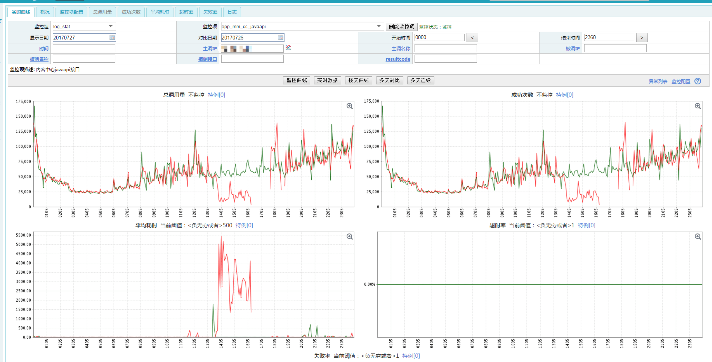
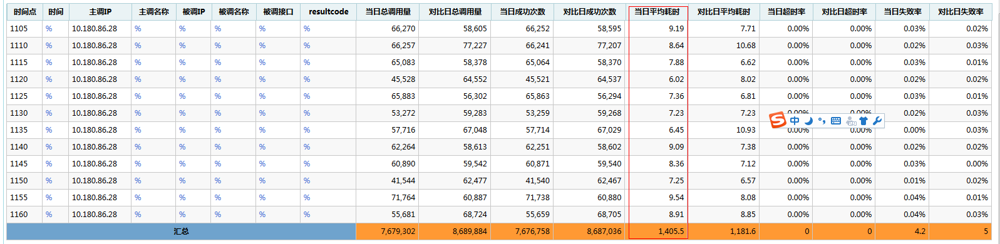

感谢我们的木木同学给了我写这篇文章的灵感和机会。  

## 起因
我们的项目组一直在使用albianj作为开发框架在开发应用。使用至今倒也是没有出现很大的问题，但最近加过监控的接口基本上都会在使用一段时间后，突然之间执行数据库操作变得很慢。虽然会变慢，但持续的时间比较短，一般1分钟左右，然后会自动恢复正常。但是过了一段时间，这个现象又会出现，周而复始。从监控看，发生的时间点并无规律，有的时候一天发生3次，有的也会有4-5次。虽然从规律上并无法去查找，那就只能从别的地方想办法：增加一些详细的日志，从日志上看一下问题所在。  
详细日志版本刚刚上去，立刻就发生问题了。如下图：



看一下左下角的曲线图，突然飙高，然后在1500ms的高位不下来。经过查找日志（PS：sorry。写文章的时候日志已经被自动清除，没法截图了），发现程序卡在了getConnection这个方法上，并且卡住的时间从60s开始越来越长。

## 分析
getConnection是一个synchronized方法，主要是从连接池中获取数据连接！卡住时间越来越长这个现象倒是很简单就可以解释：因为getConnection是synchronized的，所以所有的线程到getConnection的时候全部等待，等待的时间越长当然时间越长了。关键在于为啥卡住呢？  
当时有两种可能的想法：  
1. 连接池设置的太小，连接在使用的时候来不及被返还，导致了积压；  
2. 连接池的设置有问题，返回的连接有问题。如果是这个问题，那可能会比较难查；  

第一种情况显然不会存在，查看albianj的数据库配置，所有的配置对于连接池的设置MinSize为5，MaxSize为20.对于我们的应用来说肯定是够用的。那么就是第二个问题了。

首先检查连接复用问题，对于数据库的连接字符串，我已经增加了重连的设置：

```
autoReconnect=true&failOverReadOnly=false&zeroDateTimeBehavior=convertToNull&maxReconnect=3&autoReconnectForPools=true
```

显然autoReconnect没有起作用。查了一下mysql的客户端说明，后背发凉。基本上的大意翻译过来是这样的**“即使在创建Mysql时url中加入了autoReconnect=true参数,一但这个连接两次访问数据库的时间超出了服务器端wait_timeout的时间限制,还是会CommunicationsException: The last packet successfully received from the server was xxx milliseconds ago. ”**。赶快去查一下日志，发现并没有报这个错误。那应该不是这个问题。

既然不能重连接，那么最大的可能就是**“返回的连接本来可能就是有问题的，但是程序确认为没有问题”**。发生这种问题的最大可能应该就是：**数据库连接池的连接过期时间大于mysql的wait_timeut设置**。查了一下代码，发现我们默认的数据库连接池连接过期时间是300-30=270s。再去问一下DBA木木，让他查一下线上的数据库wait_timeout设置，被告知是180.瞬间懵逼：连接池的生命周期时间远远参与真实的连接生命周期时间。
  
原因是找到了，但是这个问题其实前一段时间已经发现并且已经改过了。因为去年我记得很清楚：又一次我们的probactor（job调度系统）报了上文提到的CommunicationsException异常，后来找到了问题就是因为程序对于连接池中连接的alivetime长于数据库的wait timeout设置，随后我千叮咛万嘱咐这个设置必须要小心小心再小心，但这次还是中招了。因为连接池和网络的问题，我们有同事直接放弃连接池，改用每次连接数据库。放弃连接池确实能解决连接不会出现问题，但是侧面也导致了wait_timeout被设置的过小了。但其实只要把连接池中连接的过期时间设置的比wait_timeout小一些就完全可以了。

经过更改后的程序终于恢复了正常，看一下更改后的效果：  


## 科普
何为wait_timeout？  
wait_timeout是mysql的一个设置，主要是用来断开不使用的数据库连接。当连接空闲的时间达到wait_timeout设置的最大值时，mysql会主动切断这个连接，以供别的客户端连接数据库。这个值一般是28800，也就是8小时。在mysql中可以通过：
``` show variables like “%timeout%”;```
获取。  
另外，当数据库主动切断连接的时候，java的mysql客户端并不知道这个连接已经被切断，所以程序并不知道其已经无效了，然后加上mysql的客户端不支持ReConnect，双重的问题叠加在一起就导致了连接池返回无效连接的可能。这是一个比较扯淡也是一个比较难以发现的问题，但是它确确实实的存在了。大家一定要多加注意。  

这个值可以根据自己网络的环境和业务的并发性来调整。
