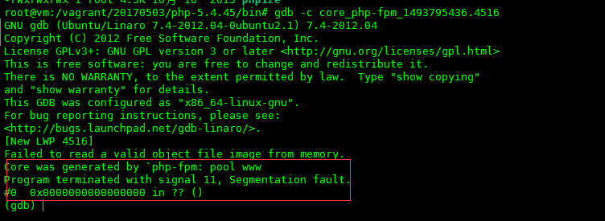
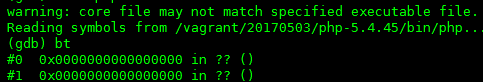
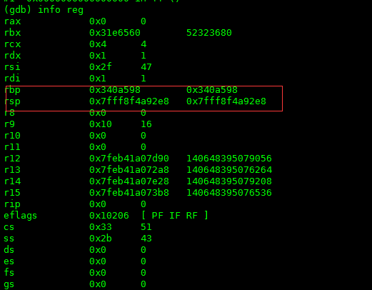
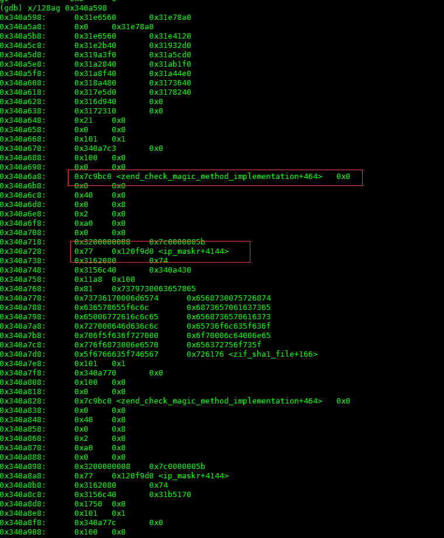

这次不是装逼，是真的帮忙找问题。对于php，一脸懵逼啊！因为就从来没写过，根本不懂php！

## 发车
正常发布日，因为dfs的php客户端需要增加api而更新，就是在更新的过程中发生了问题，具体的表象为：  
- 程序无响应，访问web网页没有显示，直接报无响应；  
- CPU100%，服务器的CPU一直100%，非常“稳定”；  
- 磁盘100%，磁盘监控显示也是100%，但是我们没有任何的磁盘操作啊，除了读php的文件，懵逼ing；  
- 机器非常慢，执行命令非常慢，慢到无法忍受，甚至打命令都很一个字母一个字母的延迟；  
更加诡异的是虽然我们确实更新了php插件，但是这个插件属于提前更新，业务代码并没有使用到这个插件新的api，所以首先排除是因为新插件新增功能的bug导致的，而老的api我们已经用了一年多了，也不会出现问题。那么只有更新的方式不对了？但是这个更新的方式也用了2年多了，以前一直没问题，怎么就今天出现问题了呢？幸好我们打开了core，php进程在crash的时候生成了core，我们可以用gdb调试一下。  

## 开车
还是老路子，首先压入core文件，如下图：
    
从这个图中我们可以得到2个信息，红色的已经标注：  
1. 首先core是由php-fpm引起的，问过同事才知道这个是一个php提供web的组件；    
2. 生成core是因为信号11，也就是段错误。引起这个问题一般的问题就是内存错误，比如内存没有释放，使用了野指针，或者是溢出等等；    

导入php的可执行文件，执行bt查看一下当前的stack情况，如下图：  
    
和上次一样，又是stack info全是？？。但是这次有所不同的，上次的dfs中stack问题是因为stack乱掉，虽然编译的时候加了-g参数，可执行文件保存了调试信息，但还是乱掉了，全是？。而这次的php是因为编译的时候没有加-g参数，所以调试信息压根就没有保存下来，所以在这里看不见到stack info是很正常的；  

还是借助寄存器吧，上次就是通过寄存器最后解决了问题，获取一下寄存器的值，如下图：    
    

再通过x命令看一下rbp之前的stack，如下图：    
    
通过这个命令可以看到有3个标识出现了，分别是：zend_check_magic_method_implementation，ip_maskr和zif_sha1_file。因为对php很不熟悉，所以只能g一下php的源码，知道一下这3个到底是啥玩意。如下：    
- zend_check_magic_method_implementation：这个是php的一个函数，主要用来做调用php函数之前的校验之类的用的，这个应该关系不大；      
- ip_maskr：这个是一个staic struct,在php的内核crypt_freesec.c文件中182行，大小为8*256，有2048b=2k啊，好大，有重点嫌疑；    
- zif_sha1_file： 这个是用来计算每个申请访问文件的hash值的，在这个函数中需要用到ip_maskr的值，这个也是有重大嫌疑；  

## 分析
综上所述，好像发现了一点什么。看最后一张图，上面显示的是ip_maskr+4144，也就是说在ip_maskr的偏移4144处。ip_maskr一共就2k啊，指针的指向不对了，越界了，所以导致了程序crash。那么为什么会指针有问题呢？再要查一下。    

这里就和我们更新php的方式有关了。我们使用reload模式更新，难道是因为reload模式的问题？接触这个疑惑的办法就是我们去看一下php在执行reload的时候执行了哪些代码。所有的bug都是由代码导致的，所以看代码还是根本。    
- 首先，查看了一下php-pfm的代码，reload使用了SIGUSR2的信号，这个没有问题，大家都是这么玩的；    
- 然后，查看SIGUSR2的信号回调函数，如下：    

```
    static void sig_soft_quit(int signo)
    {
        int saved_errno = errno;
        /* closing fastcgi listening socket will force fcgi_accept() exit immediately */
        close(0);
        if (0 > socket(AF_UNIX, SOCK_STREAM, 0)) {
            zlog(ZLOG_WARNING, "failed to create a new socket");
       }
       fpm_php_soft_quit();
       errno = saved_errno;
    }
```

问题基本上就是这里了，php确实关掉了监听的socket，但是已经连接了的socket呢，怎么处理了？应该就是因为没有关闭的连接继续执行而静态区的数据已经被破坏，内存映射出现了偏差导致的。g一下，发现php社区其实已经发现了这个问题，bug号：60961。有兴趣大家可以关注一下。可悲的是，我们不小心踩了雷。     

问题最后是找到了，但是上面cpu和磁盘都100%的问题又是什么原因呢？     
这个其实是牵连问题，也和php有关系。因为php使用fastcgi来处理web请求，执行之间使用父子进程模式，父进程监控子进程的健康状况和重启子进程；而子进程是多子进程，是真正执行处理的地方，我们的服务器上开了有300个子进程，php的客户端访问会被分配到每个执行的子进程上。然而悲剧的也就是子进程多的时候，当子进程crash的时候，我们又给系统开了core文件生成，所以这300个进程又同时写core文件，所以CPU和磁盘肯定都是100%的负载。    

## 解决办法 
处理办法也很简单，堵住问题的引起点就行了。不要使用reload模式，而是先把服务器下线，然后确保没有连接后，使用restart方式重启php，再将更新完成的php上线就没有问题了。    

  

