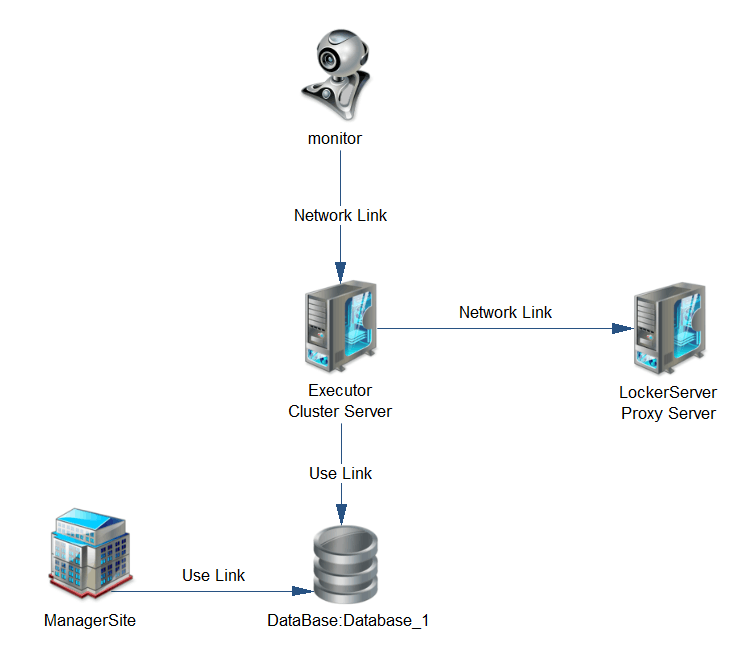

## 背景
我们原本的调度系统是由quartz为基准DIY的系统，但因为quartz的很多问题，特别是可扩展设计是在太差、自定义功能太麻烦，我们不得不自行设计了一个调度系统，内部称为：probactr。probactr分为下面几个节点：  
- monitor：监视器，主要负责监视Executor的状态和Executor执行的job状态，如发现Executor出现down机或者job出现问题，会对其进行清理。此节点为可平行扩展集群；  
- Executor：运行器，主要负责从数据库中获取欲执行的job，然后执行job。此节点为可平行扩展集群；    
- LockerServer：分布式锁服务器，为probactr提供一致性功能。目前使用redis替代，有计划将其替换成我们自主研发的lax605；  
- ManagerSite：后台管理系统，可以在这里对job进行添加、删除、暂停等等的管理，也可以查看job的执行状态；    
- database：数据库，所有的job数据全部存入数据库；  

系统结构图如下：

## 问题表现
probactr在开发环境中没有任何的问题，运行一切正常。上到test环境运行一段时间后发现有几个问题：  
1. 可并行job（job分为可并行和不可并行2种）的统计状态不对；  
2. 打开邮箱发现报警邮箱已经被塞爆，据报警信息可知：更新job的状态和统计信息失败，并且基本上1s内可以产生3-4封同样的mail；  

## 分析问题
1. 首先，分析一下报警的mail，除了知道是更新状态和统计信息失败以外，还发现一个问题：所有报警的job都是可并行的job，且同一个trigger触发了很多个job；  
2. 接着，看一下job的Executor机器监控，发现CPU很高，有一些核能飙到100%；  
3. 然后，再查看一下数据库，发现被报警的trigger同时运行的job数特别大（我们当时没有对同一个trigger可以触发的job数进行限制）；  
4. 再查看一下别的job，发现一些不可并行的trigger并没有被触发，都被积压了；  

到这里问题已经很清楚了，出问题的应该是可并行job导致的。首先想到的是可能是**我们没有限制可并行的job数**，导致了可并行job并发特别厉害，我们设置阀值，应该就没有问题了。  

我们增加了这个功能，并且上test。发现确实问题减轻了很多，但是并不能完全杜绝。还是会有同样的报警mail出现，只是数量上少了很多。这可以证明问题只是得到了缓解，而并没有彻底解决。所以我们再去找原因。更新job状态的代码只有2处：  
1. job在启动的时候：trigger被scher扫描到，并且scher认为trigger满足被触发的条件。probactr会执行以下路径的代码：获取job的locker->启动job->更新job的状态->释放locker；    
2. job执行完毕的时候：job执行完毕后，也会执行上面同样的逻辑；  

但是问题出现的位置应该不会是在job启动时，因为我们对于job的启动进行了weak化，job起不来没关系，下次scher扫描到再起来即可。但是在job结束时却是要强制性的，因为这一步job已经执行完成，必须要更新job的状态和信息，所以必须要成功，否则整个probactr的状态就会出问题。  

找到问题就好办了。

再排查下去，更新数据库应该没有问题，因为就一条特别简单的sql语句，唯一能出现问题的地方应该是获取锁了。在job执行完成后，我们需要同时更新job和trigger的状态，所以必须要先获取locker。那么如果可并行job在同一时间结束，而且在同一时间去获取locker，确实可能会出现获取不到锁，然后相当于一直阻塞的状态。我们把并发job的数量改小，相当于同一时间获取的locker的请求量变小了，但是不保证一定没有，所以看起来问题减轻了。但这一步获取locker必须成功，所以保不齐肯定会磕到门牙，问题还是存在。那么为什么有时候CPU会飙升呢？因为我们必须要获取锁，所以一直在loop这个获取锁的功能，CPU当然撑不住。   

## 解决办法
首先想到的解决办法是：能不能放弃最后一步获取locker。但是很遗憾，经过一遍代码回溯发现行不通。不要locker的话还是存在数据不一致问题，job的属性状态和job的统计信息会不对；    
第二：调整获取锁的算法，使用sleep的方式来进行，比如sleep(100ms),这个方法在一定程度上是可以的，但还是会有问题，如果两个job同时抢占locker，如果sleep的时间一样，除了cpu的切换以外，还有一定的概率会第二次，第三次同时被唤醒；    
最后：我们使用了随机值的算法，在一定的范围内，根据我们的算法生成一个值，然后sleep这个随机值。这样可以巧妙的规避掉同时获取locker失败的问题。    
