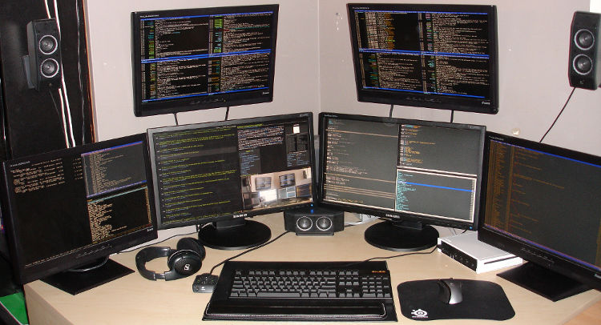

#### 摘要
多年来，具体来说5年了，我一直使用ub+awesome的工作环境。在过程中，被公司的同事
笑成为"生活在CUI"中的另类。我选中ub是因为方便，apt-get实在让我无法自拔，并且ub
对于desktop的支持也是很多别的linux发行版无法比拟的。cos等等都比较适合部署在
server环境上。选中awesome，是因为喜欢它简洁的界面，瓦片式的管理也让屏幕的任何
一部分都不会被浪费。再加上我本身就喜欢CUI，所以awesome就成了首选。这些年来，积
累了一些配置文件，个人觉得还算用着顺手，这里就拿出来分享一下。  



1. 声音。  
ub的root默认是不开的，我又不喜欢使用sudo，就是不喜欢那种隔一层纱的感觉，所以虽
然自知linux不推荐开启root，但是我还是喜欢使用root的直接。所以一般我第一件事情
就是把root开启。开启的root的命令是：
```
sudo pwsswd root
```
然后输入你的root密码，这样就算是打开了，但是还不能登陆。还需要更改登陆配置。找
到/etc/gdm/gdm.conf，然后把AllowRoot改为true。  
如果你的root账户还不能登陆，你还需要去"系统->系统管理->登陆窗口"中的安全页中把
"允许本地系统管理员登陆"选项打开。  
2. 声音。  
root登陆后，你会发现声音没了。对我这种上班就带上耳机的人来说这是相当不能接受的
。所以你也要把声音打开。找到pulseaudio文件，然后把文件内的两个选项改成以下这样：
```
PULSEAUDIO_SYSTEM_START=1
DISALLOW_MODULE_LOADING=0
```
重启，就会有声音了。但是还有一个问题就是不知道为什么，有的时候启动的时候也是没
有声音，但是重启一下就正常了，分析了一下日志也没发现有什么问题，如果你知道，请
你告诉我。  
3. chrome在root下无法启动。  
ub的root环境下，chrome无法启动，所以必须得给它加一个脚本，自定义user-data-dir
参数，就可以了。  
```
# /bin/bash
google-chrome \-\-user-data-dir=/root/.config/google-chrome &
```
4. awesome  
安装awesome  
```
apt-get install awesome
```
awesome在/etc/下有一个文件夹是有它的配置文件的，awesome的配置文件使用lua写的，
个人的配置文件如下：  


    -- Standard awesome library
    require("awful")
    require("awful.autofocus")
    require("awful.rules")
    -- Theme handling library
    require("beautiful")
    -- Notification library
    require("naughty")
    -- Load Debian menu entries
    require("debian.menu")

    -- Themes define colours, icons, and wallpapers
    beautiful.init("/usr/share/awesome/themes/default/theme.lua")

    -- This is used later as the default terminal and editor to run.
    terminal = "x-terminal-emulator"
    editor = os.getenv("EDITOR") or "editor"
    editor_cmd = terminal .. " -e " .. editor

    -- Default modkey.
    -- Usually, Mod4 is the key with a logo between Control and Alt.
    -- If you do not like this or do not have such a key,
    -- I suggest you to remap Mod4 to another key using xmodmap or other tools.
    -- However, you can use another modifier like Mod1, but it may interact with others.

    modkey = "Mod4"
    --modkey = "alt"

    -- Table of layouts to cover with awful.layout.inc, order matters.
    layouts =
    {
        awful.layout.suit.floating,
        awful.layout.suit.tile,
        awful.layout.suit.tile.left,
        awful.layout.suit.tile.bottom,
        awful.layout.suit.tile.top,
        awful.layout.suit.fair,
        awful.layout.suit.fair.horizontal,
        awful.layout.suit.spiral,
        awful.layout.suit.spiral.dwindle,
        awful.layout.suit.max,
        awful.layout.suit.max.fullscreen,
        awful.layout.suit.magnifier
    }

    -- Define a tag table which hold all screen tags.
    tags = {}
    for s = 1, screen.count() do
        -- Each screen has its own tag table.
        tags[s] = awful.tag({ 1, 2, 3, 4, 5, 6, 7, 8, 9 }, s, layouts[2])
    end

    -- Create a laucher widget and a main menu
    myawesomemenu = {
        { "manual", terminal .. " -e man awesome" },
        { "edit config", editor_cmd .. " " .. awful.util.getdir("config") .. "/rc.lua" },
        { "restart", awesome.restart },
        { "quit", awesome.quit }
    }

    mymainmenu = awful.menu({ items = { { "awesome", myawesomemenu, beautiful.awesome_icon },
    { "Linux", debian.menu.Debian_menu.Debian },
    { "shell", terminal },
                    }
                })
    mylauncher = awful.widget.launcher({ image = image(beautiful.awesome_icon),
    menu = mymainmenu })

    -- Create a textclock widget
    mytextclock = awful.widget.textclock({ align = "right" })
    -- Create a systray
    mysystray = widget({ type = "systray" })
    -- Create a wibox for each screen and add it
    mywibox = {}
    mypromptbox = {}
    mylayoutbox = {}
    mytaglist = {}
    mytaglist.buttons = awful.util.table.join(
    awful.button({ }, 1, awful.tag.viewonly),
    awful.button({ modkey }, 1, awful.client.movetotag),
    awful.button({ }, 3, awful.tag.viewtoggle),
    awful.button({ modkey }, 3, awful.client.toggletag),
    awful.button({ }, 4, awful.tag.viewnext),
    awful.button({ }, 5, awful.tag.viewprev)
    )
    mytasklist = {}
    mytasklist.buttons = awful.util.table.join(
    awful.button({ }, 1, function (c)
        if not c:isvisible() then
            awful.tag.viewonly(c:tags()[1])
        end
        client.focus = c
        c:raise()
    end),
    awful.button({ }, 3, function ()
        if instance then
            instance:hide()
            instance = nil
        else
            instance = awful.menu.clients({ width=250 })
        end
    end),
    awful.button({ }, 4, function ()
        awful.client.focus.byidx(1)
        if client.focus then client.focus:raise() end
    end),
    awful.button({ }, 5, function ()
        awful.client.focus.byidx(-1)
        if client.focus then client.focus:raise() end
    end))

    for s = 1, screen.count() do
        -- Create a promptbox for each screen
        mypromptbox[s] = awful.widget.prompt({ layout = awful.widget.layout.horizontal.leftright })
        -- Create an imagebox widget which will contains an icon indicating which layout we're using.
        -- We need one layoutbox per screen.
        mylayoutbox[s] = awful.widget.layoutbox(s)
        mylayoutbox[s]:buttons(awful.util.table.join(
        awful.button({ }, 1, function () awful.layout.inc(layouts, 1) end),
        awful.button({ }, 3, function () awful.layout.inc(layouts, -1) end),
        awful.button({ }, 4, function () awful.layout.inc(layouts, 1) end),
        awful.button({ }, 5, function () awful.layout.inc(layouts, -1) end)))
        -- Create a taglist widget
        mytaglist[s] = awful.widget.taglist(s, awful.widget.taglist.label.all, mytaglist.buttons)
        -- Create a tasklist widget
        mytasklist[s] = awful.widget.tasklist(function(c)
            return awful.widget.tasklist.label.currenttags(c, s)
        end, mytasklist.buttons)
        -- Create the wibox
        mywibox[s] = awful.wibox({ position = "top", screen = s })
        -- Add widgets to the wibox - order matters
        mywibox[s].widgets = {
            {
                mylauncher,
                mytaglist[s],
                mypromptbox[s],
                layout = awful.widget.layout.horizontal.leftright
            },
            mylayoutbox[s],
            mytextclock,
            s == 1 and mysystray or nil,
            mytasklist[s],
            layout = awful.widget.layout.horizontal.rightleft
        }
    end

    root.buttons(awful.util.table.join(
    awful.button({ }, 3, function () mymainmenu:toggle() end),
    awful.button({ }, 4, awful.tag.viewnext),
    awful.button({ }, 5, awful.tag.viewprev)
    ))

    globalkeys = awful.util.table.join(
    awful.key({ modkey,           }, "Left",   awful.tag.viewprev       ),
    awful.key({ modkey,           }, "Right",  awful.tag.viewnext       ),
    awful.key({ modkey,           }, "Escape", awful.tag.history.restore),
    awful.key({ modkey,           }, "j",
    function ()
        awful.client.focus.byidx( 1)
        if client.focus then client.focus:raise() end
    end),
    awful.key({ modkey,           }, "k",
    function ()
        awful.client.focus.byidx(-1)
        if client.focus then client.focus:raise() end
    end),
    awful.key({ modkey,           }, "w", function () mymainmenu:show(true)        end),
    -- Layout manipulation
    awful.key({ modkey, "Shift"   }, "j", function () awful.client.swap.byidx(  1)    end),
    awful.key({ modkey, "Shift"   }, "k", function () awful.client.swap.byidx( -1)    end),
    awful.key({ modkey,           }, ",", function () awful.screen.focus_relative( 1) end),
    awful.key({ modkey,           }, ".", function () awful.screen.focus_relative(-1) end),
    awful.key({ modkey,           }, "u", awful.client.urgent.jumpto),
    awful.key({ modkey,           }, "Tab",
    function ()
        awful.client.focus.history.previous()
        if client.focus then
            client.focus:raise()
        end
    end),
    -- Standard program
    awful.key({ modkey,           }, "Return", function () awful.util.spawn(terminal) end),
    awful.key({ }, "XF86AudioRaiseVolume",    function () awful.util.spawn("amixer set Master 3+") end),
    awful.key({ }, "XF86AudioLowerVolume",    function () awful.util.spawn("amixer set Master 3-") end),
    --define by myself
    --              awful.key({ modkey,           }, "F11", function () awful.util.spawn("dmenu_run") end),
    --awful.key({ modkey,           }, "v", function () awful.util.spawn("gnome-volume-control-applet") end),
    --awful.key({ modkey,"Control"  }, "n", function () awful.util.spawn("nm-applet") end),
    awful.key({ modkey,		    }, "x", function () awful.util.spawn("xlock") end),
    awful.key({ modkey, "Control" }, "r", awesome.restart),
    awful.key({ modkey, "Shift"	  }, "q", awesome.quit),
    awful.key({ modkey,           }, "l",     function () awful.tag.incmwfact( 0.05)    end),
    awful.key({ modkey,           }, "h",     function () awful.tag.incmwfact(-0.05)    end),
    awful.key({ modkey, "Shift"   }, "h",     function () awful.tag.incnmaster( 1)      end),
    awful.key({ modkey, "Shift"   }, "l",     function () awful.tag.incnmaster(-1)      end),
    awful.key({ modkey, "Control" }, "h",     function () awful.tag.incncol( 1)         end),
    awful.key({ modkey, "Control" }, "l",     function () awful.tag.incncol(-1)         end),
    awful.key({ modkey,           }, "space", function () awful.layout.inc(layouts,  1) end),
    awful.key({ modkey, "Shift"   }, "space", function () awful.layout.inc(layouts, -1) end),
    -- Prompt
    awful.key({ modkey },            "r",     function () awful.util.spawn("dmenu_run") end)
    )

    clientkeys = awful.util.table.join(
    awful.key({ modkey,           }, "f",      function (c) c.fullscreen = not c.fullscreen  end),
    awful.key({ modkey,		  }, "c",      function (c) c:kill()                         end),
    awful.key({ modkey, "Control" }, "space",  awful.client.floating.toggle                     ),
    awful.key({ modkey, "Control" }, "Return", function (c) c:swap(awful.client.getmaster()) end),
    awful.key({ modkey,           }, "o",      awful.client.movetoscreen                        ),
    awful.key({ modkey, "Shift"   }, "r",      function (c) c:redraw()                       end),
    awful.key({ modkey,           }, "n",      function (c) c.minimized = not c.minimized    end),
    awful.key({ modkey,           }, "m",
    function (c)
        c.maximized_horizontal = not c.maximized_horizontal
        c.maximized_vertical   = not c.maximized_vertical
    end)
    )

    -- Compute the maximum number of digit we need, limited to 9
    keynumber = 0
    for s = 1, screen.count() do
        keynumber = math.min(9, math.max(#tags[s], keynumber));
    end
    -- Bind all key numbers to tags.
    -- Be careful: we use keycodes to make it works on any keyboard layout.
    -- This should map on the top row of your keyboard, usually 1 to 9.
    for i = 1, keynumber do
        globalkeys = awful.util.table.join(globalkeys,
        awful.key({ modkey }, "#" .. i + 9,
        function ()
            local screen = mouse.screen
            if tags[screen][i] then
                awful.tag.viewonly(tags[screen][i])
            end
        end),
        awful.key({ modkey, "Control" }, "#" .. i + 9,
        function ()
            local screen = mouse.screen
            if tags[screen][i] then
                awful.tag.viewtoggle(tags[screen][i])
            end
        end),
        awful.key({"Control",     	}, "#" .. i + 9,
        function ()
            if client.focus and tags[client.focus.screen][i] then
                awful.client.movetotag(tags[client.focus.screen][i])
            end
        end),
        awful.key({ modkey, "Control", "Shift" }, "#" .. i + 9,
        function ()
            if client.focus and tags[client.focus.screen][i] then
                awful.client.toggletag(tags[client.focus.screen][i])
            end
        end))
    end
    clientbuttons = awful.util.table.join(
    awful.button({ }, 1, function (c) client.focus = c; c:raise() end),
    awful.button({ modkey }, 1, awful.mouse.client.move),
    awful.button({ modkey }, 3, awful.mouse.client.resize))
    -- Set keys
    root.keys(globalkeys)

    awful.rules.rules = {
        -- All clients will match this rule.
        { rule = { },
        properties = { border_width = beautiful.border_width,
        border_color = beautiful.border_normal,
        focus = true,
        keys = clientkeys,
        buttons = clientbuttons } },
        { rule = { class = "MPlayer" },
        properties = { floating = true } },
        { rule = { class = "pinentry" },
        properties = { floating = true } },
        { rule = { class = "gimp" },
        properties = { floating = true } },
        -- Set Firefox to always map on tags number 2 of screen 1.
        -- { rule = { class = "Firefox" },
        --   properties = { tag = tags[1][2] } },
    }

    -- Signal function to execute when a new client appears.
    client.add_signal("manage", function (c, startup)
        -- Add a titlebar
        -- awful.titlebar.add(c, { modkey = modkey })
        -- Enable sloppy focus
        c:add_signal("mouse::enter", function(c)
            if awful.layout.get(c.screen) ~= awful.layout.suit.magnifier
                and awful.client.focus.filter(c) then
                client.focus = c
            end
        end)
        if not startup then
            -- Set the windows at the slave,
            -- i.e. put it at the end of others instead of setting it master.
            -- awful.client.setslave(c)
            -- Put windows in a smart way, only if they does not set an initial position.
            if not c.size_hints.user_position and not c.size_hints.program_position then
                awful.placement.no_overlap(c)
                awful.placement.no_offscreen(c)
            end
        end
    end)

    client.add_signal("focus", function(c) c.border_color = beautiful.border_focus end)
    client.add_signal("unfocus", function(c) c.border_color = beautiful.border_normal end)

    awful.util.spawn_with_shell("nm-applet")
    awful.util.spawn_with_shell("gnome-sound-applet") --sine ubuntu 12.04.02
    --awful.util.spawn_with_shell("gnome-volume-control-applet")
    --            awful.util.spawn_with_shell("xautolock -time 10 -locker 'xlock -lockdelay 10'")
    --                awful.util.run_once("xautolock -time 1 -locker 'xlock -lockdelay 1'")
    function run_once(cmd)
        findme = cmd
        firstspace = cmd:find(" ")
        if firstspace then
            findme = cmd:sub(0, firstspace-1)
        end
        awful.util.spawn_with_shell("pgrep -u $USER -x " .. findme .. " > /dev/null || (" .. cmd .. ")")
    end
    run_once("xautolock -time 30 -locker 'xlock -lockdelay 30'");



</br>
在使用awesome的过程中，需要dmenu加以配合，这样你的CUI才能真正的用起来，算起来
。  
5. 关机  
关机需要xlockmore和xautolock两个软件进行配合，使用apt-get就可以。  
xlockmore是锁屏和关机的，xautolock是自动启动屏保啥的。  
然后在增加一个shutdown的bash文件，你就可以使用这个文件来关机或者休眠了。  



#! /bin/sh

ACTION=`zenity --width=90 --height=200 --list --radiolist --text="Select logout action" --title="Logout" --column "Choice" --column "Action" TRUE Shutdown FALSE Reboot FALSE LockScreen FALSE Suspend`

if [ -n "${ACTION}" ];then
  case $ACTION in
  Shutdown)
    shutdown -h now
    ## or via ConsoleKit
    # dbus-send --system --dest=org.freedesktop.ConsoleKit.Manager 
    # /org/freedesktop/ConsoleKit/Manager org.freedesktop.ConsoleKit.Manager.Stop
    ;;
  Reboot)
    reboot
    ## Or via ConsoleKit
    # dbus-send --system --dest=org.freedesktop.ConsoleKit.Manager 
    # /org/freedesktop/ConsoleKit/Manager org.freedesktop.ConsoleKit.Manager.Restart
    ;;
  Suspend)
    #gksudo pm-suspend
    dbus-send --system --print-reply --dest=org.freedesktop.Hal 
    /org/freedesktop/Hal/devices/computer 
    org.freedesktop.Hal.Device.SystemPowerManagement.Suspend int32:0
    # HAL is deprecated in newer systems in favor of UPower etc.
    # dbus-send --system --dest=org.freedesktop.UPower /org/freedesktop/UPower org.freedesktop.UPower.Suspend
    ;;
  LockScreen)
    slock
    # Or gnome-screensaver-command -l
    ;;
  esac
fi



6. 小红点  
因为一直使用Thinkpad的笔记本，但是ub对于小红点的支持貌似不是太好，刚刚开始的几
个ub的版本好像还不支持小红点，所以就使用一个第三方的软件来加以支持，这个软件叫
gpointing-device-settings,安装以后还是相当好用的，但是你还需要加一个配置文件。
当然，后来的ub好像已经开始支持小红点了，具体忘了，很久没用Thinkpad了。



#! /bin/sh
#close touch
synclient TouchpadOff=1
</br>
#开启小红帽+中键
xinput set-int-prop "TPPS/2 IBM TrackPoint" "Evdev Wheel Emulation" 8 1
xinput set-int-prop "TPPS/2 IBM TrackPoint" "Evdev Wheel Emulation Button" 8 2
xinput set-int-prop "TPPS/2 IBM TrackPoint" "Evdev Wheel Emulation Y Axis" 8 4 5
xinput set-int-prop "TPPS/2 IBM TrackPoint" "Evdev Wheel Emulation X Axis" 8 6 7



7. CUI中文件夹的颜色  
当你使用CUI的时候，使用ls列出来的文件和文件夹都是一样的颜色，你也不能很好的辨
认出来，所以，你增加一个dircolors文件，并且做一个软连接到这个文件就可以：

\# Configuration file for dircolors, a utility to help you set the
\# LS_COLORS environment variable used by GNU ls with the --color option.
\# Copyright (C) 1996, 1999-2011 Free Software Foundation, Inc.
\# Copying and distribution of this file, with or without modification,
\# are permitted provided the copyright notice and this notice are preserved.
\# The keywords COLOR, OPTIONS, and EIGHTBIT (honored by the
\# slackware version of dircolors) are recognized but ignored.
\# Below, there should be one TERM entry for each termtype that is colorizable
TERM Eterm
TERM ansi
TERM color-xterm
TERM con132x25
TERM con132x30
TERM con132x43
TERM con132x60
TERM con80x25
TERM con80x28
TERM con80x30
TERM con80x43
TERM con80x50
TERM con80x60
TERM cons25
TERM console
TERM cygwin
TERM dtterm
TERM eterm-color
TERM gnome
TERM gnome-256color
TERM jfbterm
TERM konsole
TERM kterm
TERM linux
TERM linux-c
TERM mach-color
TERM mlterm
TERM putty
TERM rxvt
TERM rxvt-256color
TERM rxvt-cygwin
TERM rxvt-cygwin-native
TERM rxvt-unicode
TERM rxvt-unicode-256color
TERM rxvt-unicode256
TERM screen
TERM screen-256color
TERM screen-256color-bce
TERM screen-bce
TERM screen-w
TERM screen.Eterm
TERM screen.rxvt
TERM screen.linux
TERM terminator
TERM vt100
TERM xterm
TERM xterm-16color
TERM xterm-256color
TERM xterm-88color
TERM xterm-color
TERM xterm-debian
\# Below are the color init strings for the basic file types. A color init
\# string consists of one or more of the following numeric codes:
\# Attribute codes:
\# 00=none 01=bold 04=underscore 05=blink 07=reverse 08=concealed
\# Text color codes:
\# 30=black 31=red 32=green 33=yellow 34=blue 35=magenta 36=cyan 37=white
\# Background color codes:
\# 40=black 41=red 42=green 43=yellow 44=blue 45=magenta 46=cyan 47=white
\#NORMAL 00 # no color code at all
\#FILE 00 # regular file: use no color at all
RESET 0 # reset to "normal" color
DIR 01;34 # directory
LINK 01;36 # symbolic link. (If you set this to 'target' instead of a
\# numerical value, the color is as for the file pointed to.)
MULTIHARDLINK 00 # regular file with more than one link
FIFO 40;33 # pipe
SOCK 01;35 # socket
DOOR 01;35 # door
BLK 40;33;01 # block device driver
CHR 40;33;01 # character device driver
ORPHAN 40;31;01 # symlink to nonexistent file, or non-stat'able file
SETUID 37;41 # file that is setuid (u+s)
SETGID 30;43 # file that is setgid (g+s)
CAPABILITY 30;41 # file with capability
STICKY_OTHER_WRITABLE 01;34 # dir that is sticky and other-writable (+t,o+w)
OTHER_WRITABLE 01;34 # dir that is other-writable (o+w) and not sticky
STICKY 01;34 # dir with the sticky bit set (+t) and not other-writable
\# This is for files with execute permission:
EXEC 01;32
\# List any file extensions like '.gz' or '.tar' that you would like ls
\# to colorize below. Put the extension, a space, and the color init string.
\# (and any comments you want to add after a '#')
\# If you use DOS-style suffixes, you may want to uncomment the following:
\#.cmd 01;32 # executables (bright green)
\#.exe 01;32
\#.com 01;32
\#.btm 01;32
\#.bat 01;32
\# Or if you want to colorize scripts even if they do not have the
\# executable bit actually set.
\#.sh 01;32
\#.csh 01;32
\# archives or compressed (bright red)
.tar 01;31
.tgz 01;31
.arj 01;31
.taz 01;31
.lzh 01;31
.lzma 01;31
.tlz 01;31
.txz 01;31
.zip 01;31
.z 01;31
.Z 01;31
.dz 01;31
.gz 01;31
.lz 01;31
.xz 01;31
.bz2 01;31
.bz 01;31
.tbz 01;31
.tbz2 01;31
.tz 01;31
.deb 01;31
.rpm 01;31
.jar 01;31
.war 01;31
.ear 01;31
.sar 01;31
.rar 01;31
.ace 01;31
.zoo 01;31
.cpio 01;31
.7z 01;31
.rz 01;31
\# image formats
.jpg 01;35
.jpeg 01;35
.gif 01;35
.bmp 01;35
.pbm 01;35
.pgm 01;35
.ppm 01;35
.tga 01;35
.xbm 01;35
.xpm 01;35
.tif 01;35
.tiff 01;35
.png 01;35
.svg 01;35
.svgz 01;35
.mng 01;35
.pcx 01;35
.mov 01;35
.mpg 01;35
.mpeg 01;35
.m2v 01;35
.mkv 01;35
.webm 01;35
.ogm 01;35
.mp4 01;35
.m4v 01;35
.mp4v 01;35
.vob 01;35
.qt 01;35
.nuv 01;35
.wmv 01;35
.asf 01;35
.rm 01;35
.rmvb 01;35
.flc 01;35
.avi 01;35
.fli 01;35
.flv 01;35
.gl 01;35
.dl 01;35
.xcf 01;35
.xwd 01;35
.yuv 01;35
.cgm 01;35
.emf 01;35
\# http://wiki.xiph.org/index.php/MIME_Types_and_File_Extensions
.axv 01;35
.anx 01;35
.ogv 01;35
.ogx 01;35
\# audio formats
.aac 00;36
.au 00;36
.flac 00;36
.mid 00;36
.midi 00;36
.mka 00;36
.mp3 00;36
.mpc 00;36
.ogg 00;36
.ra 00;36
.wav 00;36
\# http://wiki.xiph.org/index.php/MIME_Types_and_File_Extensions
.axa 00;36
.oga 00;36
.spx 00;36
.xspf 00;36


8. 外接投影仪或者显示器
外接显示器或者投影器，你必须使用xrand来支持。开机的时候awesome好像默认会检测你
的屏幕数量然后加以显示。如果没有自动，那么你只需要运行一下一下的代码就可以了。

\#/usr/bin/env bash
case $1 in
	"-c")
		# 打开外接显示器(--auto:最高分辨率)，与笔记本液晶屏幕显示同样内容（克隆）
		xrandr --output VGA1 --same-as LVDS1 --auto
		;;
	"-cs")
		# 打开外接显示器(分辨率为1280x1024)，与笔记本液晶屏幕显示同样内容（克隆）
		xrandr --output VGA1 --same-as LVDS1 --mode 1280x1024
		;;
	"-el")
		# 打开外接显示器(--auto:最高分辨率)，设置为右侧扩展屏幕
		xrandr --output VGA1 --left-of LVDS1 --auto 
		;;
	"-er")
		# 打开外接显示器(--auto:最高分辨率)，设置为右侧扩展屏幕
		xrandr --output VGA1 --right-of LVDS1 --auto
		;;
	"-f")
		# 关闭外接显示器
		xrandr --output VGA1 --off
		;;
	"-oe")
		# 打开外接显示器，同时关闭笔记本液晶屏幕（只用外接显示器工作）
		xrandr --output VGA1 --auto --output LVDS1 --off
		;;
	"-oo")
		# 关闭外接显示器，同时打开笔记本液晶屏幕 （只用笔记本液晶屏）
		xrandr --output VGA1 --off --output LVDS1 --auto
		;;
	"")
		echo "-c: 打开外接显示器(--auto:最高分辨率)，与笔记本液晶屏幕显示同样内容（克隆）"
		echo "-cs: 打开外接显示器(分辨率为1280x1024)，与笔记本液晶屏幕显示同样内容（克隆）"
		echo "-er: 打开外接显示器(--auto:最高分辨率)，设置为右侧扩展屏幕"
		echo "-el: 打开外接显示器(--auto:最高分辨率)，设置为left侧扩展屏幕"
		echo "-f: 关闭外接显示器"
		echo "-oe: 打开外接显示器，同时关闭笔记本液晶屏幕（只用外接显示器工作）"
		echo "-oo: 关闭外接显示器，同时打开笔记本液晶屏幕 （只用笔记本液晶屏）"
		echo "如果使用awesome，modkey+ctrl+j,modkey+ctrl+k,切换不同的screen"
		;;

	"-h")
		echo "-c: 打开外接显示器(--auto:最高分辨率)，与笔记本液晶屏幕显示同样内容（克隆）"
		echo "-cs: 打开外接显示器(分辨率为1280x1024)，与笔记本液晶屏幕显示同样内容（克隆）"
		echo "-e: 打开外接显示器(--auto:最高分辨率)，设置为右侧扩展屏幕"
		echo "-f: 关闭外接显示器"
		echo "-oe: 打开外接显示器，同时关闭笔记本液晶屏幕（只用外接显示器工作）"
		echo "-oo: 关闭外接显示器，同时打开笔记本液晶屏幕 （只用笔记本液晶屏）"
		echo "如果使用awesome，modkey+ctrl+j,modkey+ctrl+k,切换不同的screen"
		;;
esac

<br/>
#### 结束语
这些配置文件都是可以直接拿来用的，我已经经过了测试。保证可以使用。  
因为现在也不太用ub+awesome了，改用了mac，但是说实话，mac没有ub+awesome好用和自
如。如果还能选择，我想还是ub+awesome来的更适合我一些。
