事情的起因是安装llvm+clang的时候一直不成功。提示说没有磁盘空间了。因为制作vagrant的box的时候，我选择的是自动扩展虚拟磁盘，所以也没有往磁盘真的没有了这个问题上想。还以为编译的时候有些operation没有选对，捣鼓了一阵子。后来执行了一下df才发现vagrant中的虚拟磁盘竟然真的不够用了。这至少告诉我们2个问题：
1. vagrant不能自动扩展磁盘；        
2. 使用vagrant制作的vbox的映像不能继承原来vbox中的设置；        
那怎么样才能让vagrant中的磁盘映像扩大呢？

我的vagrant是架在mac上的，因为穷，所以虚拟机选择了vbox。根据vagrant和vbox的关系，vagrant实际上是接管了在vbox中启动的虚拟机。所以重点还是要扩展在vbox中这个虚拟机映像的磁盘大小。

起先，还是想到了老办法：原来在用虚拟机的时候记得可以直接在虚拟机中就可以调整磁盘大小的，但是这招在这里不可行，没有找到任何可以设置或者扩展磁盘大小的设置。然后找了一下vbox的文档，发现VBoxManage命令可以更改磁盘印象的大小。

1. 先要找到vagrant接管的磁盘映像放在了哪里？执行命令：`VBoxManage list hdds`，如下：
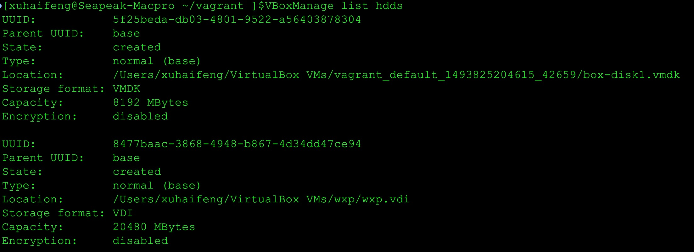

2. 找到了磁盘映像后就可以更改其大小了。这里有两种方法，一种使用磁盘路径作为参数，另外一种是使用如图所示的第一行UUID作为参数。我们使用UUID（因为短），执行命令：
    `VBoxManage modifyhd "5f25beda-db03-4801-9522-a56403878304" --resize 15360`
    将磁盘映像调整到15G，结果报错，如下图：
    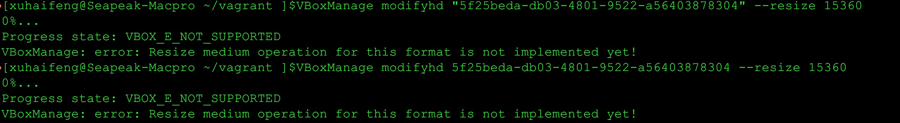    

3. 报错提示“格式不支持执行的操作”。但是找了半天，都说vmdk格式也可以动态扩展大小，但是不知道为什么VBoxManage不支持（HEI：难道是因为vmdk是vmware标准格式？）。但是VBoxManage命令支持vdi格式(HEI：vdi是vbox私有的格式。)。那就把vmdk格式转换成vdi吧！还是使用VBoxManage命令：
    `VBoxManage clonehd /Users/xuhaifeng/VirtualBox\ VMs/vagrant_default_1493825204615_42659/box-disk1.vmdk /Users/xuhaifeng/VirtualBox\ VMs/vagrant_default_1493825204615_42659/box-disk1.vdi --format VDI`    
    转换成功，结果如图所示：    
     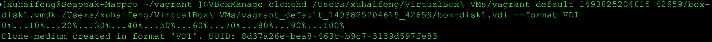

4. 再扩展vdi的大小，还是使用VBoxManage命令，但因为vdi没有被挂载在系统中，所以参数使用路径，如下：
     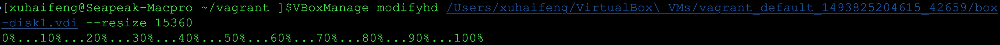
     扩展成功。
     
5. 将原来vagrant接管的虚拟机的vmdk磁盘映像换成刚刚生成的这个vdi的磁盘映像。打开vbox，点击SATA端口的右边将其换掉，如图所示：
 

5. 启动vagrant，发现报了很多“磁盘空间不够”的错误。如下图：
 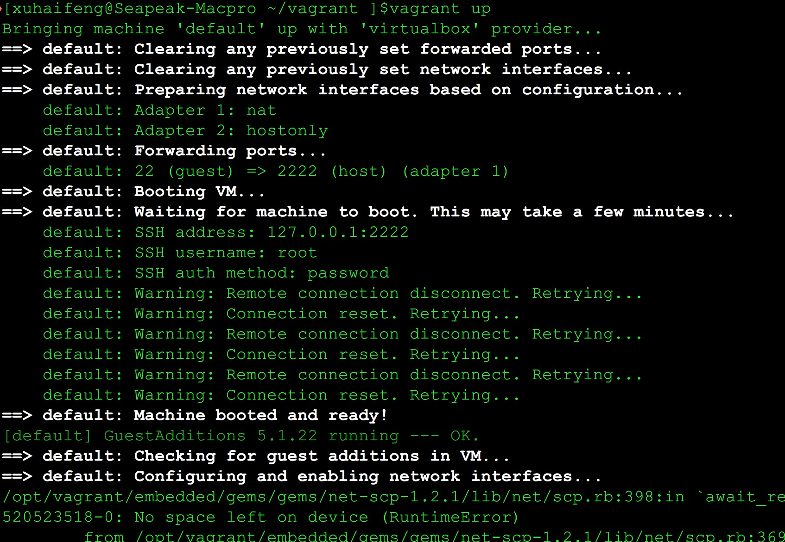

登陆系统，发现扩展的空间确实没有被加上去，如下图：
 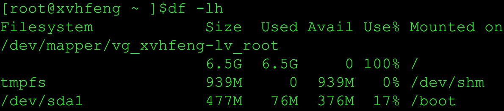

但是使用fdisk查看一下，发现磁盘的大小确实已经加上了，但是没法使用。如图所示：
 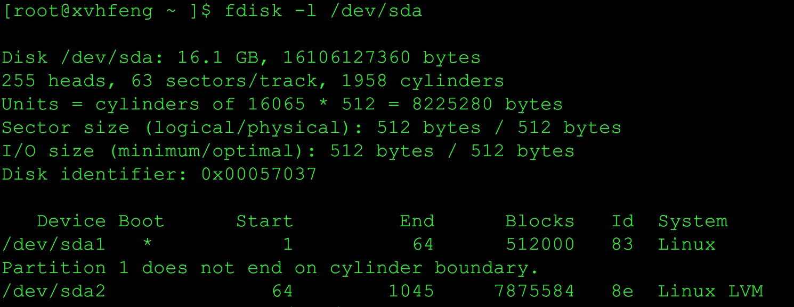

7. 把新扩展的磁盘大小给加上去。还是使用fdisk命令：
    `fdisk /dev/sda`    
    沿着命令，一路根据提示，输入：
    `n `{new partition}     
   ` p` {primary partition}
    `3` {partition number}
    [提示修改大小，默认直接回车]
    `t `{change partition id}
   ` 3` {partition number}
    `8e` {Linux LVM partition}
    `w`
    如图所示：
     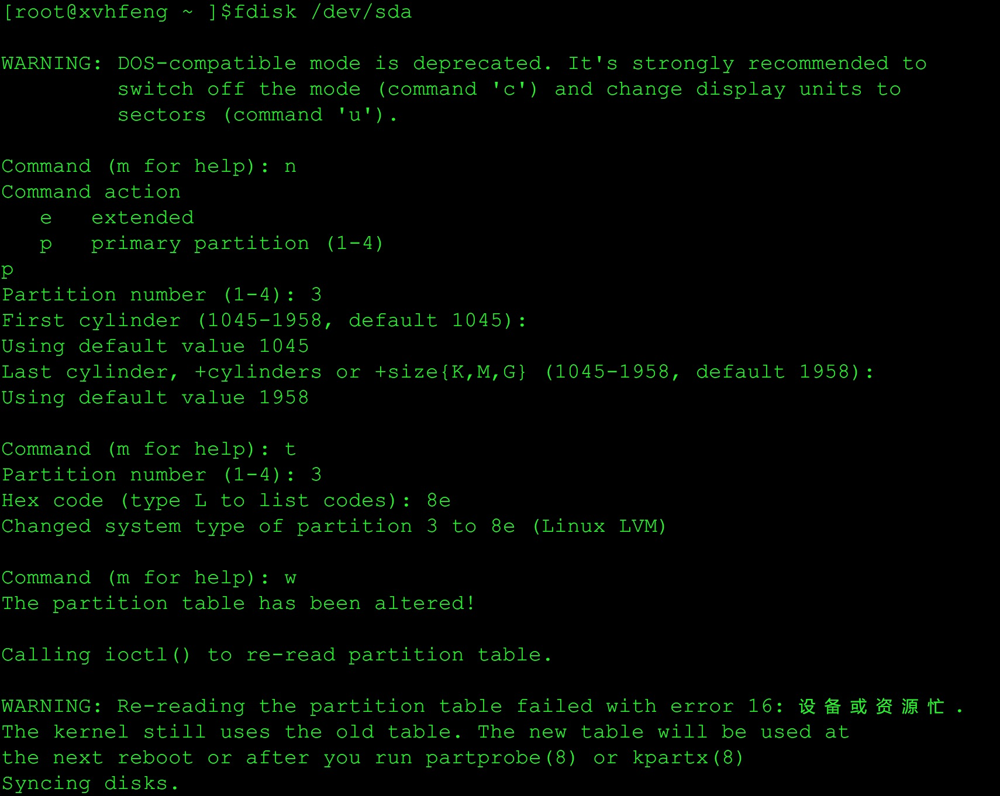

8. 再重启vagrant，发现启动的时候还是很多“磁盘空间不足”的报错信息，先忽略它。登入系统后，执行命令：
 `fdisk -l /dev/sda`    
 发现我们加上去的那块磁盘已经又块设备的标识了。如下图：
 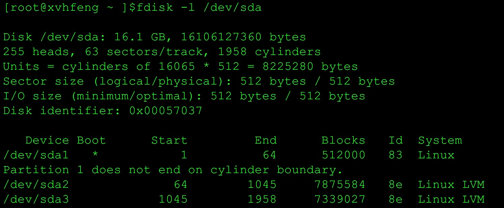

9. 调整卷的大小，使用命令：`vgdisplay `先看一下卷的信息，记住 VG Name这个选项的值，然后我们依次使用命令 
    1. `pvcreate /dev/sda3`    
    2. `vgextend vg_xvhfeng /dev/sda3`    
    3. `lvextend /dev/vg_xvhfeng/lv_root /dev/sda3`    
    4. `resize2fs /dev/vg_xvhfeng/lv_root `    
    将其合并到原来的挂载点中。如下图所示：
 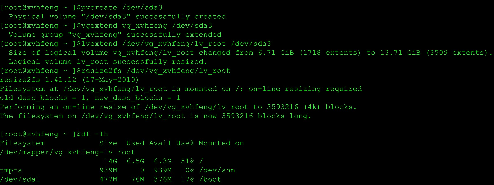

10.最后，再重启机器，登录后执行df命令，发现磁盘的大小终于被扩展大了。如下图：
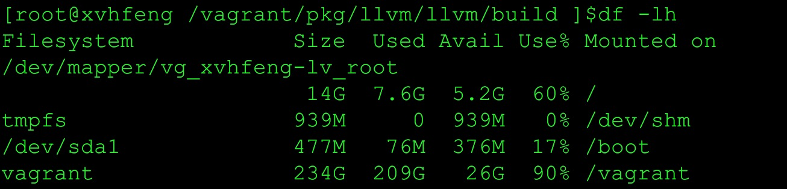

大功告成。

