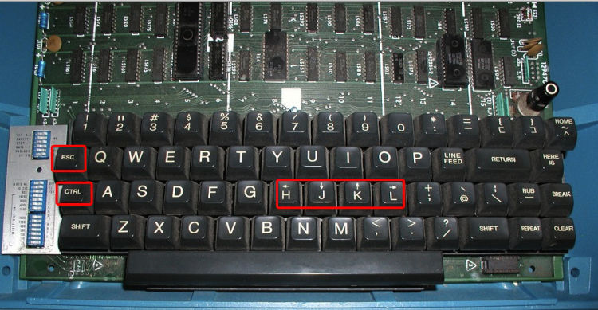

#### 摘要
这次主要讲讲VIM对于一些"古怪"安静绑定的前因后果。这有助于我们更加了解VIM的历史
。然后再讲一下，在现在的键盘上，我们怎么通过"经济"的办法来达到使用VIM时，能保
证小手指尽量的舒适，一些按键能尽量的控制在键盘的大区内；然后，我会讲一下我的
VIM配置文件的组成，以及为什么我要用这种方法来配置我的VIM。最后当然是重头的VIM
配置文件。  

#### 解放你的小手指
讲VIM的小手指问题，我们得先讲讲VIM的出生年代。在Bill Joy开发VI的时候，其实他使
用的机器是ADM-3A。这款机器的键盘和现在机器的键盘是不一样的，详细看图：  

这是理解了吧。这不是Joy有意，实在是他使用的键盘CTRL的按键确实很方便，所以快捷
键很多都是CTRL。后来计算机键盘的发展把CTRL放到了下角，才导致了现在使用VIM的时
候，只要时间一长，小手指就像不是你的一样。  
再看一下键盘的上下左右按键，分别对应的是HJKL，所以VIM也就使用这几个键来作为基
本的移动按键。我觉得如果但是的键盘上有单独的上下左右按键，Joy应该也会随大流吧
。PS：其实后来有一款游戏CS（一款对战游戏）还重新定义了一种叫做WASD的移动风格。  
还有一个就是ESC，对于ESC按键，当初在键盘上的位置就在CTRL上边，就是现在我们TAB
键的位置，你按按TAB键试试，是不是很上手？  
那么面对这种情况，我们不是没有改变的办法，我们改变的办法就是重新绑定我们这几个
功能键，把它绑定到我们自己认为舒服的位置就可以。  
具体的方法就是，在你的HOME下新建一个.Xmodmap文件就可以，然后输入以下内容：  

<pre><code>
keycode 66 = Control_L
keycode 108 = Escape
clear Lock
add Control = Control_L
keycode 135 = Caps_Lock
add Lock = Caps_Lock
</code></pre>  

有的时候，你具体的键值可能是不一样的，这个时候你必须要使用软件来检测一下你的键
盘上CAPS、CTRP，ALT（right）和ESC的键值各是多少，然后根据你的实际情况换进去就
可以。  
如果你的米足够，并且是一个键盘党，那么这里推荐一款键盘，HHKB。其貌不扬的外观下
面是一颗静电容的芯。目前我使用的就是这款，它的键盘布局就非常适合Linux的CUI操作
用户，特别是VIMer。但是不适合Emacer（因为按键太少了，也没带脚踏板功能！)  

#### VIM配置的进化
在很久之前，好像是3年吧。那个时候VIM的插件管理还没有什么好的办法。一般的做法都
是从vim.org上下载一个插件，然后解压，在cp到你的.vim目录下。如果有需要，再在
vimrc中配置一下插件，个性化一下或者重新绑定几个快捷键什么的。但是这种插件的管
理方法看似很简单，实则非常落后。主要是
1. 乱，你的.vim文件夹的子文件夹内到处充满了不知道是什么插件的问题；  
2. 不要禁用插件。当你想试用一下某个插件，等你安装完后觉得不爽，想删除的时候，
因为它是散落在多个文件夹的，所以你根本无法去删除或者是删除干净；  
3. 版本不好控制。这种方式一般都是自己管理版本。把vimrc和.vim下面的文件全部签到
你自己的github或者googlecode上，这样就可以了，但是如果插件本身升级了，你还得手
动的去下载一个插件，覆盖掉你本地的插件，然后在签入自己的。或者你fork一个子项目
，然后定期更新什么的。反正比较麻烦。  
后来，估计是有几个VIMer对于这种方式实在恼火了，vundle这类"全家旅游，杀人越货"
级别的必备良药出现了。大家很快就使用了这种方式来管理。瞬间"这个世界变的清静了
".  

#### VIM配置文件
首先，我的配置文件由4个分文件构成。原因就是全部写在一个vimrc中的话，这个文件实
在太长了，也无法很好的定位和管理。所以我就把这个总的vimrc文件分成了4个文件。具
体如下:  
1. main.vimrc 这个是主vimrc文件，里面加载另外的3个文件，并且一些基本的vim配置
都是在这个文件中完成；  
2. bundle.vimrc 这个vimrc文件主要配置了你需要使用的第三方插件；要使用这个文件
，必须先安装vundle插件；  
3. keymmaping.vimrc 这个文件是快捷键绑定文件，主要就是一些vim内置功能（不包括第
三方插件，第三方插件的快捷键在bundle.vimrc中配置）的快捷键；  
4. function.vimrc 这个文件主要管理一些自定义的功能函数。一般都是使用vim script
写的简单功能。  
<pre><code>
"==========================================
" Base Settings  基本设置 main.vimrc
"==========================================
 
:set nocompatible
 
"""""""""""""""""""""""""""""""""""""""""""
" Include vimrc 读取子vimrc
"""""""""""""""""""""""""""""""""""""""""""
" install Vundle bundles
if filereadable(expand("~/.vim/myvim/bundle.vimrc"))
  source ~/.vim/myvim/bundle.vimrc
endif
 
" ensure ftdetect et al work by including this after the Vundle stuff
filetype plugin indent on
 
"loading key-mapping
if filereadable(expand("~/.vim/myvim/keymapping.vimrc"))
  source ~/.vim/myvim/keymapping.vimrc
endif
 
"loading function
if filereadable(expand("~/.vim/myvim/function.vimrc"))
  source ~/.vim/myvim/function.vimrc
endif
 
"自动启用vimrc配置
autocmd! bufwritepost .vimrc source ~/.vimrc
:set switchbuf=useopen
"设置光标可以到最后一个字面后
set virtualedit=onemore
"设置快捷键等待时间
 " set timeout timeoutlen=300
 set timeout ttimeoutlen=-1
"设置退格键为删除键
set backspace=indent,eol,start
"设置移动命令在行首或者行尾时依然有效
set whichwrap+=b,s,<,>,[,]
set whichwrap+=<,>,h,l
"设置历史命令保存数
set history=1000
"关闭智能补全预览窗口
set completeopt=longest,menu
"设置鼠标可以选择文本
set selectmode+=mouse
"设置自动读取外面对于文件的变更
set autoread
"设置命令行高度为2
set cmdheight=1
set nobackup
set nowb
set noswapfile
"与windows共享剪贴板
set clipboard+=unnamed
"set clipboard+=unamedplus
"增强模式中的命令行自动完成操作
set wildmenu
"开启鼠标
set mouse=a
" 启动的时候不显示那个援助索马里儿童的提示
set shortmess=atI
" 不让vim发出讨厌的滴滴声
set novisualbell         " don't beep
set noerrorbells
"自动切换当前目录为当前文件所在目录
set autochdir
"打开时忽略文件名后缀
set wildignore+=\*.o,\*.obj,\*.pyc,\*.db,\*.swp,\*.bak,\*.class
"默认就是全buffer搜索
set gdefault
"切换到当前tab打开文件的路径下
autocmd BufEnter * cd %:p:h
"检测文件类型
filetype on
"针对不同的文件类型采用不同的缩进格式
filetype indent on
"允许插件
filetype plugin on
"启动自动补全
filetype plugin indent on
"create undo file
set undolevels=1000         " How many undos
set undoreload=10000        " number of lines to save for undo
if v:version >= 730
    set undofile                " keep a persistent backup file
    set undodir=/tmp/vimundo/
endif
" 修复ctrl+m 多光标操作选择的bug，但是改变了ctrl+v进行字符选中时将包含光标下的字符
"set selection=exclusive
" set selection=inclusive
" set selectmode=mouse,key
" No annoying sound on errors
set title                " change the terminal's title
set t_vb=
set tm=500
" Remember info about open buffers on close"
set viminfo^=%
" For regular expressions turn magic on
set magic
 
"==========================================
" Display Settings 展示/排版等界面格式设置
"==========================================
"设置一行字数
set tw=78
"折行
set lbr
"中文折行不断字
set fo+=mB
:set formatoptions+=mM "format for chinese
" 高亮显示匹配的括号
set showmatch
"带有如下符号的单词不要被换行分割
set iskeyword+=$,@,%,#,-,__
set ambiwidth=double
"开启行号显示
:set number
"显示当前的行号列号：
set ruler
""在状态栏显示正在输入的命令
set showcmd
" Show current mode
set showmode
" Set 7 lines to the cursor - when moving vertically using j/k 上下滚动,始终在中间
set scrolloff=7
" 命令行（在状态行下）的高度，默认为1，这里是2
 set statusline=%<%f\ %h%m%r%=%k[%{(&fenc==\"\")?&enc:&fenc}%{(&bomb?\",BOM\":\"\")}]\ %-14.(%l,%c%V%)\ %P
" Always show the status line
set laststatus=2
" 取消换行。
" set nowrap
" How many tenths of a second to blink when matching brackets
set mat=2
" 突出显示当前行等
" set cursorcolumn
set cursorline          " 突出显示当前行
 
"设置文内智能搜索提示
" 高亮search命中的文本。
set hlsearch
" 搜索时忽略大小写
set ignorecase
" 在搜索时，输入的词句的逐字符高亮（类似firefox的搜索）
set incsearch
" 有一个或以上大写字母时仍大小写敏感
set smartcase     " ignore case if search pattern is all lowercase, case-sensitive otherwise
 
" 代码折叠
set foldenable
" 折叠方法
" manual    手工折叠
" indent    使用缩进表示折叠
" expr      使用表达式定义折叠
" syntax    使用语法定义折叠
" diff      对没有更改的文本进行折叠
" marker    使用标记进行折叠, 默认标记是 {{{ 和 }}}
set foldmethod=marker
set foldlevel=1
 
" 缩进配置
set smartindent   " Smart indent
set autoindent    " always set autoindenting on
set copyindent
" never add copyindent, case error   " copy the previous indentation on autoindenting
"c程序可以在v模式中按=格式化
set cin
set cursorline
 
" tab相关变更
set tabstop=4     " 设置Tab键的宽度        [等同的空格个数]
set shiftwidth=4  " number of spaces to use for autoindenting
set softtabstop=4 " 按退格键时可以一次删掉 4 个空格
set smarttab      " insert tabs on the start of a line according to shiftwidth, not tabstop 按退格键时可以一次删掉 4 个空格
set expandtab     " 将Tab自动转化成空格    [需要输入真正的Tab键时，使用 Ctrl+V + Tab]
set shiftround    " use multiple of shiftwidth when indenting with '<' and '>'
set cindent shiftwidth=4
set autoindent shiftwidth=4
 
" A buffer becomes hidden when it is abandoned
" 允许在有未保存的修改时切换缓冲区，此时的修改由 vim 负责保存
set hidden
set autowrite
set wildmode=list:longest
set ttyfast
 
"设置 退出vim后，内容显示在终端屏幕, 可以用于查看和复制
"好处：误删什么的，如果以前屏幕打开，可以找回
set t_ti= t_te=
 
"==========================================
" FileEncode Settings 文件编码,格式
"==========================================
" 设置新文件的编码为 UTF-8
set encoding=utf-8
" 自动判断编码时，依次尝试以下编码：
set fileencodings=ucs-bom,utf-8,cp936,gb18030,big5,euc-jp,euc-kr,latin1
 
"如果帮助无法显示中文,增加这句试试:
set helplang=cn
 
" 下面这句只影响普通模式 (非图形界面) 下的 Vim。
set termencoding=utf-8
 
" Use Unix as the standard file type
set ffs=unix,dos,mac
 
" 如遇Unicode值大于255的文本，不必等到空格再折行。
set formatoptions+=m
 
" 合并两行中文时，不在中间加空格：
set formatoptions+=B
 
if has("win32") || has("win64")
	set fileencoding=chinese
else
	set fileencodings=utf-8,chinese,latin-1
endif
 
if !has("gui_running")
	:set tenc=utf-8,gb2312,chinese
endif
 
"解决consle输出乱码
language messages zh_CN.utf-8
 
"==========================================
" Theme Settings  主题设置
"==========================================
 
" Set extra options when running in GUI mode
if has("gui_running")
    set guifont=Monaco:h14
    set guioptions-=T
    set guioptions+=e
    set guioptions-=r
    set guioptions-=L
    set guitablabel=%M\ %t
    set showtabline=1
    set linespace=2
    set noimd
    " set t_Co=256
    "定义givm的颜色和去掉gvim的工具栏
	set guioptions-=T
 
    "高亮显示
    if &t_Co > 2
        syntax on
        set hlsearch
    endif
endif
 
"当终端支持颜色显示时打开彩色显示
if &t_Co > 1
	syntax enable
endif
 
" theme主题
"背景变暗dark，亮设置为light
set background=dark
"colorscheme solarized
" colorscheme elise
set t_Co=256
 
hi cursorline guibg=#333333 	" highlight bg color of current line
hi CursorColumn guibg=#333333   " highlight cursor
 
"设置标记一列的背景颜色和数字一行颜色一致
hi! link SignColumn   LineNr
hi! link ShowMarksHLl DiffAdd
hi! link ShowMarksHLu DiffChange
 
"" for error highlight，防止错误整行标红导致看不清
highlight clear SpellBad
highlight SpellBad term=standout ctermfg=1 term=underline cterm=underline
highlight clear SpellCap
highlight SpellCap term=underline cterm=underline
highlight clear SpellRare
highlight SpellRare term=underline cterm=underline
highlight clear SpellLocal
highlight SpellLocal term=underline cterm=underline
 
"==========================================
" others 其它设置
"==========================================
autocmd! bufwritepost _vimrc source % " vimrc文件修改之后自动加载。 windows。
autocmd! bufwritepost .vimrc source % " vimrc文件修改之后自动加载。 linux。
 
" 自动补全配置
"让Vim的补全菜单行为与一般IDE一致(参考VimTip1228)
set completeopt=longest,menu
 
"离开插入模式后自动关闭预览窗口
autocmd InsertLeave * if pumvisible() == 0|pclose|endif
 
" if this not work ,make sure .viminfo is writable for you
if has("autocmd")
  au BufReadPost * if line("'\"") > 1 && line("'\"") <= line("$") | exe "normal! g'\"" | endif
endif
</code></pre>
 
<pre><code>  
"==========================================
    "配置插件管理 bundle.vimrc
"==========================================
filetype off
 
set rtp+=~/.vim/bundle/vundle/
call vundle#rc()
 
Bundle "vundle"
 
" 多语言语法检查
Bundle 'scrooloose/syntastic'
let g:syntastic_error_symbol='>>'
let g:syntastic_warning_symbol='>'
let g:syntastic_check_on_open=1
let g:syntastic_enable_highlighting = 0
let g:syntastic_python_checkers=['pyflakes'] " 使用pyflakes,速度比pylint快
highlight SyntasticErrorSign guifg=white guibg=black
 
Bundle 'genutils'
 
Bundle 'xvhfeng/c.vim'
map &lt;c-x>c \cc
map &lt;c-x>u \co
 
" Bundle 'The-NERD-Commenter'
Bundle 'ShowTrailingWhitespace'
 
Bundle 'EasyMotion'
let g:EasyMotion_leader_key = 'f'
 
Bundle 'FencView.vim'
 
Bundle 'The-NERD-tree'
let NERDTreeWinPos = "left" "where NERD tree window is placed on the screen
let NERDTreeWinSize = 30 "size of the NERD tree
nmap &lt;F7> &lt;ESC>:NERDTreeToggle&lt;RETURN>" Open and close the NERD_tree.vim separately
 
Bundle 'auto_mkdir'
 
Bundle 'bufexplorer.zip'
:vmap &lt;c-x>b &lt;esc>:w!&lt;esc>,be
:nmap &lt;c-x>b &lt;esc>:w!&lt;esc>,be
 
Bundle 'CRefVim'
if !hasmapto('&lt;Plug>CRV_CRefVimInvoke')
    map &lt;silent> &lt;unique> &lt;Leader>ci &lt;Plug>CRV_CRefVimInvoke
endif
 
Bundle 'DoxygenToolkit.vim'
let g:DoxygenToolkit_briefTag_pre="@Remark:"
let g:DoxygenToolkit_paramTag_pre="@Param:"
let g:DoxygenToolkit_returnTag="@Returns:"
map &lt;c-x>f &lt;ESC>:Dox&lt;cr>
 
Bundle 'grep.vim'
:nmap &lt;c-g> &lt;ESC>:Grep&lt;CR>
 
Bundle 'lookupfile'
" lookup file with ignore case
        function! LookupFile_IgnoreCaseFunc(pattern)
        let _tags = &tags
        try
            let &tags = eval(g:LookupFile_TagExpr)
            let newpattern = '\c' . a:pattern
            let tags = taglist(newpattern)
        catch
            echohl ErrorMsg | echo "Exception: " . v:exception | echohl NONE
            return ""
        finally
            let &tags = _tags
        endtry
    " Show the matches for what is typed so far.
        let files = map(tags, 'v:val["filename"]')
        return files
    endfunction
 
let g:LookupFile_LookupFunc = 'LookupFile_IgnoreCaseFunc'
let g:LookupFile_MinPatLength = 2
let g:LookupFile_PreserveLastPattern = 0
let g:LookupFile_PreservePatternHistory = 1
let g:LookupFile_AlwaysAcceptFirst = 1
let g:LookupFile_AllowNewFiles = 0
"if filereadable("./filenametags")
"let g:LookupFile_TagExpr = '"./filenametags"'
"endif
nmap &lt;silent> &lt;leader>lf :LookupFile&lt;cr>
nmap &lt;silent> &lt;leader>lb :LUBufs&lt;cr>
nmap &lt;silent> &lt;leader>lw :LUWalk&lt;cr>
 
Bundle 'ShowMarks'
 
Bundle 'statusline.vim'
 
Bundle 'taglist.vim'
let Tlist_Exit_OnlyWindow = 1
"taglist窗口是否出现在右边，默认是左边
let Tlist_Use_Right_Window = 1
"是否在选择了taglist后自动关闭taglist窗口
let Tlist_Close_On_Select = 0
"是否在打开了taglist的同时把焦点设置到taglist窗口
let Tlist_GainFocus_On_ToggleOpen = 1
"当多个文件在taglist从显示的时候，只打开当前文件，折叠别的文件
let Tlist_File_Fold_Auto_Close = 0
let Tlist_Auto_Update = 1
"map &lt;silent> &lt;leader>tl :TlistToggle&lt;cr>
map &lt;F8> &lt;ESC>:TlistToggle&lt;cr>
 
Bundle 'vmark.vim--Visual-Bookmarking'
 
Bundle 'terryma/vim-multiple-cursors'
let g:multi_cursor_use_default_mapping=1
let g:multi_cursor_next_key='&lt;C-n>'
let g:multi_cursor_prev_key='&lt;C-p>'
let g:multi_cursor_skip_key='&lt;C-k>'
let g:multi_cursor_quit_key='&lt;Esc>'
 
Bundle 'Yggdroot/indentLine'
"config for indentLine
let g:indentLine_indentLevel = 5
let g:indentLine_enabled = 1
"hi Conceal ctermfg=red ctermbg=red
"let g:indentLine_char = '|'
 
Bundle 'a.vim'
"设置c语言的header和c文件转换
:nmap &lt;C-x>h &lt;ESC>:w!&lt;ESC>:A!&lt;CR>
 
Bundle 'Valloric/YouCompleteMe'
let g:ycm_global_ycm_extra_conf = '~/.ycm_extra_conf.py'
let g:ycm_error_symbol = '>>'
let g:ycm_warning_symbol = '>*'
let g:ycm_min_num_of_chars_for_completion = 2
let g:ycm_min_num_identifier_candidate_chars = 0
" 直接触发自动补全
let g:ycm_key_invoke_completion = '&lt;c-x>&lt;c-o>'
let g:ycm_cache_omnifunc = 1
let g:ycm_auto_trigger = 0
let g:ycm_enable_diagnostic_signs = 0
let g:ycm_enable_diagnostic_highlighting = 1
let g:ycm_echo_current_diagnostic = 1
"youcompleteme  默认tab  s-tab 和自动补全冲突
let g:ycm_key_list_select_completion=['&lt;c-n>']
" let g:ycm_key_list_select_completion = ['&lt;Down>']
let g:ycm_key_list_previous_completion=['&lt;c-p>']
" let g:ycm_key_list_previous_completion = ['&lt;Up>']
let g:ycm_complete_in_comments = 1  "在注释输入中也能补全
let g:ycm_complete_in_strings = 1   "在字符串输入中也能补全
let g:ycm_collect_identifiers_from_comments_and_strings = 1   "注释和字符串中的文字也会被收入补全
let g:ycm_seed_identifiers_with_syntax=1   "语言关键字补全, 不过python关键字都很短，所以，需要的自己打开
let g:ycm_collect_identifiers_from_tags_files = 1
nnoremap &lt;leader>gd :YcmCompleter GoToDeclaration&lt;CR>
nnoremap &lt;leader>gi :YcmCompleter GoToDefinition&lt;CR>
nnoremap &lt;leader>gb :YcmCompleter GoToDefinitionElseDeclaration&lt;CR>
nmap &lt;leader>yd :YcmDiags&lt;CR>
nmap &lt;F11> :YcmRestartServer&lt;CR>
 
Bundle 'terryma/vim-expand-region'
map + &lt;Plug>(expand_region_expand)
map _ &lt;Plug>(expand_region_shrink)
 
Bundle 'tpope/vim-commentary'
 
" 代码片段快速插入
"Bundle 'SirVer/ultisnips'
" Snippets are separated from the engine. Add this if you want them:
 
"Bundle 'snipMate'
 
Bundle 'honza/vim-snippets'
let g:UltiSnipsExpandTrigger = "&lt;tab>"
let g:UltiSnipsJumpForwardTrigger = "&lt;tab>"
" 定义存放代码片段的文件夹 .vim/additional_snippets下，使用自定义和默认的，将会的到全局，有冲突的会提示
let g:UltiSnipsSnippetDirectories=["additional_snippets", 'UltiSnips']
 
" 自动补全html/xml标签
Bundle 'docunext/closetag.vim'
let g:closetag_html_style=1
 
" 快速加入修改环绕字符
Bundle 'tpope/vim-surround'
 
" for repeat -> enhance surround.vim, . to repeat command
Bundle 'tpope/vim-repeat'
 
" 快速去行尾空格 [, + &lt;Space>]
Bundle 'bronson/vim-trailing-whitespace'
map &lt;leader>es :FixWhitespace<cr>
 
" 文件搜索
Bundle 'kien/ctrlp.vim'
let g:ctrlp_map = '&lt;leader>p'
let g:ctrlp_cmd = 'CtrlP'
map &lt;leader>f :CtrlPMRU&lt;CR>
"set wildignore+=*/tmp/*,*.so,*.swp,*.zip     " MacOSX/Linux"
let g:ctrlp_custom_ignore = {
    \ 'dir':  '\v[\/]\.(git|hg|svn|rvm)$',
    \ 'file': '\v\.(exe|so|dll|zip|tar|tar.gz)$',
    \ }
"\ 'link': 'SOME_BAD_SYMBOLIC_LINKS',
let g:ctrlp_working_path_mode=0
let g:ctrlp_match_window_bottom=1
let g:ctrlp_max_height=15
let g:ctrlp_match_window_reversed=0
let g:ctrlp_mruf_max=500
let g:ctrlp_follow_symlinks=1
 
"状态栏增强展示
" Bundle 'Lokaltog/vim-powerline'
"if want to use fancy,need to add font patch -> git clone git://gist.github.com/1630581.git ~/.fonts/ttf-dejavu-powerline
"let g:Powerline_symbols = 'fancy'
" let g:Powerline_symbols = 'unicode'
 
"括号显示增强
Bundle 'kien/rainbow_parentheses.vim'
let g:rbpt_colorpairs = [
    \ ['brown',       'RoyalBlue3'],
    \ ['Darkblue',    'SeaGreen3'],
    \ ['darkgray',    'DarkOrchid3'],
    \ ['darkgreen',   'firebrick3'],
    \ ['darkcyan',    'RoyalBlue3'],
    \ ['darkred',     'SeaGreen3'],
    \ ['darkmagenta', 'DarkOrchid3'],
    \ ['brown',       'firebrick3'],
    \ ['gray',        'RoyalBlue3'],
    \ ['black',       'SeaGreen3'],
    \ ['darkmagenta', 'DarkOrchid3'],
    \ ['Darkblue',    'firebrick3'],
    \ ['darkgreen',   'RoyalBlue3'],
    \ ['darkcyan',    'SeaGreen3'],
    \ ['darkred',     'DarkOrchid3'],
    \ ['red',         'firebrick3'],
    \ ]
let g:rbpt_max = 40
let g:rbpt_loadcmd_toggle = 0
au VimEnter * RainbowParenthesesToggle
au Syntax * RainbowParenthesesLoadRound
au Syntax * RainbowParenthesesLoadSquare
au Syntax * RainbowParenthesesLoadBraces
 
"################### 显示增强-主题 ###################"
 
"主题 solarized
Bundle 'altercation/vim-colors-solarized'
"let g:solarized_termcolors=256
let g:solarized_termtrans=1
let g:solarized_contrast="normal"
let g:solarized_visibility="normal"
 
"主题 molokai
Bundle 'tomasr/molokai'
"let g:molokai_original = 1
 
"###### Python #########
" python fly check, 弥补syntastic只能打开和保存才检查语法的不足
Bundle 'kevinw/pyflakes-vim'
let g:pyflakes_use_quickfix = 0
 
" for python.vim syntax highlight
Bundle 'hdima/python-syntax'
let python_highlight_all = 1
 
"###### Markdown #########
Bundle 'plasticboy/vim-markdown'
let g:vim_markdown_folding_disabled=1
 
"###### HTML/JS/JQUERY/CSS #########
 
" for javascript
Bundle "pangloss/vim-javascript"
let g:html_indent_inctags = "html,body,head,tbody"
let g:html_indent_script1 = "inc"
let g:html_indent_style1 = "inc"
 
"for jquery
Bundle 'nono/jquery.vim'
 
"###### Jinja2 #########
Bundle 'Glench/Vim-Jinja2-Syntax'
 
"###### nginx #########
Bundle 'evanmiller/nginx-vim-syntax'
 
Bundle 'SQLComplete.vim'
let g:sql_type_default = 'mysql'
"SQLSetType mysql
 
"the markdown editer
Bundle 'plasticboy/vim-markdown'
 
"the properties file editor
Bundle 'kamichidu/vim-edit-properties'
 
"auto input the right ) ] or }
"Bundle 'jiangmiao/auto-pairs'
 
"undo tree
Bundle 'mbbill/undotree'
nnoremap &lt;F12> :UndotreeToggle&lt;cr>
if has("persistent_undo")
    set undodir='~/.vim/undodir/'
    set undofile
endif
"
" golang
" " Go
" We are using cespare's modification,
" which uses bradfitz's goimports instead of gofmt.
" With goimports, you can add missing imports automatically.
" To install goimport:
"   go get github.com/bradfitz/goimports
" Bundle 'cespare/vim-golang'
" To install godef:
"   go get code.google.com/p/rog-go/exp/cmd/godef
" Bundle 'dgryski/vim-godef'
" To install gocode:
"   go get github.com/nsf/gocode
" Bundle 'Blackrush/vim-gocode'
" Bundle 'bradfitz/goimports'
" Bundle 'UltiSnips'
"Bundle 'AutoClose' -- this plug change the timeout and ttimeout fuck.
" 代码缩进
" https://github.com/nathanaelkane/vim-indent-guides
"Bundle 'nathanaelkane/vim-indent-guides'
"let g:indent_guides_auto_colors = 0
"autocmd VimEnter,Colorscheme * :hi IndentGuidesOdd  guibg=red   ctermbg=3
"autocmd VimEnter,Colorscheme * :hi IndentGuidesEven guibg=green ctermbg=4
"hi IndentGuidesOdd  guibg=red   ctermbg=3
"hi IndentGuidesEven guibg=green ctermbg=4
"hi IndentGuidesOdd  ctermbg=black
"hi IndentGuidesEven ctermbg=darkgrey
 
filetype on
</code></pre>
 
<pre><code>
"==========================================
" HotKey Settings  自定义快捷键设置 keymmaping.vimrc
"==========================================
let mapleader = ","
nnoremap ; :
 
" F1 - F6 设置
" F1 废弃这个键,防止调出系统帮助
" F2 行号开关，用于鼠标复制代码用
" F3 显示可打印字符开关
" F4 换行开关
" F5 粘贴模式paste_mode开关,用于有格式的代码粘贴
" F6 语法开关，关闭语法可以加快大文件的展示
 
" I can type :help on my own, thanks.  Protect your fat fingers from the evils of &lt;F1>
noremap &lt;F1> &lt;Esc>
""为方便复制，用&lt;F2>开启/关闭行号显示:
function! HideNumber()
  if(&relativenumber == &number)
    set relativenumber! number!
  elseif(&number)
    set number!
  else
    set relativenumber!
  endif
  set number?
endfunc
nnoremap &lt;F2> :call HideNumber()&lt;CR>
nnoremap &lt;F3> :set list! list?&lt;CR>
nnoremap &lt;F4> :set wrap! wrap?&lt;CR>
"set paste
"when in insert mode, press &lt;F5> to go to
"paste mode, where you can paste mass data
"that won't be autoindented
set pastetoggle=&lt;F5>
 
" disbale paste mode when leaving insert mode
au InsertLeave * set nopaste
nnoremap &lt;F6> :exec exists('syntax_on') ? 'syn off' : 'syn on'&lt;CR>
 
" 关闭方向键, 强迫自己用 hjkl
map &lt;Left> &lt;Nop>
map &lt;Right> &lt;Nop>
map &lt;Up> &lt;Nop>
map &lt;Down> &lt;Nop>
 
"空格即选中当前项
inoremap &lt;expr> &lt;Space>       pumvisible() ? "\&lt;C-y>\&lt;Space>" : "\&lt;Space>"
 
"上下左右键的行为 会显示其他信息
inoremap &lt;expr> &lt;Down>     pumvisible() ? "\&lt;C-n>" : "\&lt;Down>"
inoremap &lt;expr> &lt;Up>       pumvisible() ? "\&lt;C-p>" : "\&lt;Up>"
inoremap &lt;expr> &lt;PageDown> pumvisible() ? "\&lt;PageDown>\&lt;C-p>\&lt;C-n>" : "\&lt;PageDown>"
inoremap &lt;expr> &lt;PageUp>   pumvisible() ? "\&lt;PageUp>\&lt;C-p>\&lt;C-n>" : "\&lt;PageUp>"
 
"tab 缩进
:nmap &lt;tab>  v>&lt;esc>
:nmap &lt;s-tab> v&lt;&lt;esc>
:vmap &lt;tab> >gv
:vmap &lt;s-tab> &lt;gv
"Reselect visual block after indent/outdent.调整缩进后自动选中，方便再次操作
" 在visual模式下缩进 (无限可重复)
:vnoremap &lt; &lt;gv
" 译释：:vnoremap 重定义了visual模式下 < 符号的含义
" 把它定义成 &lt;gv
" 即：先<向外缩进，然后gv重新选择上一次选择了的区域
" 这样在visual模式下就可以实现连续按<而连续缩进了
:vnoremap > >gv
" 同里，内缩
":vmap &lt;tab> >gv
":imap &lt;s-tab> &lt;Left>
 
"粘贴后剪切版不变
xnoremap p pgvy
noremap vp viwpgvy
noremap vy yiw
noremap Y y$
 
"设置复制使用window粘贴板
:nmap &lt;C-p> "+p
:vmap &lt;C-y> "+y
:nmap Y y$
:vmap Y y$
" y$ -> Y Make Y behave like other capitals
map Y y$
 
"emacs style
":set winaltkeys=no
:imap &lt;C-e> &lt;END>
:imap &lt;C-a> &lt;HOME>
:imap &lt;C-b> &lt;Left>
:imap &lt;C-n> &lt;Down>
:imap &lt;C-p> &lt;Up>
:imap &lt;C-f> &lt;Right>
:imap &lt;C-v> &lt;PageDown>
:imap &lt;C-u> &lt;PageUp>
:imap &lt;C-d> &lt;Delete>
:imap &lt;C-r> &lt;BackSpace>
:imap &lt;c-w>&lt;c-b> &lt;s-left>
:imap &lt;c-w> &lt;s-right>
:imap &lt;c-e>&lt;c-b> &lt;END>&lt;Left>
 
nmap &lt;leader>w :w!&lt;cr>
nmap &lt;leader>e :e&lt;SPACE>
nmap &lt;leader>s i&lt;space>&lt;esc>
nmap K i&lt;cr>&lt;esc>
 
"格式化c语言块
:map &lt;leader>fmt &lt;ESC>=a{
 
nmap &lt;c-e>i &lt;esc>guiw
nmap &lt;c-e>u &lt;esc>gUiw
 
nmap wv     &lt;C-w>v     " 垂直分割当前窗口
nmap wc     &lt;C-w>c     " 关闭当前窗口
nmap ws     &lt;C-w>s     " 水平分割当前窗口
 
"set listchars=tab:./ ,trail:.   " 将制表符显示为'.   '
 
"范围折叠
noremap &lt;c-x>z &lt;esc>zf%
 
" 用空格键来开关折叠
nmap &lt;space> za
 
"清除c-x对于数字的按键，为组合键让步
map &lt;c-x> &lt;ESC>
 
"the mapping for the cmd-line
" start of line
:cnoremap &lt;C-A> &lt;Home>
" back one character
:cnoremap &lt;C-B> &lt;Left>
" delete character under cursor
:cnoremap &lt;C-D> &lt;Del>
" end of line
:cnoremap &lt;C-E> &lt;End>
" forward one character
:cnoremap &lt;C-F> &lt;Right>
" recall newer command-line
:cnoremap &lt;C-N> &lt;Down>
" recall previous (older) command-line
:cnoremap &lt;C-P> &lt;Up>
" back one word
:cnoremap &lt;Esc>&lt;C-B> &lt;S-Left>
" forward one word
:cnoremap &lt;Esc>&lt;C-F> &lt;S-Right>
cnoremap &lt;C-j> &lt;t_kd>
cnoremap &lt;C-k> &lt;t_ku>
 
"Treat long lines as break lines (useful when moving around in them)
"se swap之后，同物理行上线直接跳
map j gj
map k gk
 
" Go to home and end using capitalized directions
noremap H ^
noremap L $l
 
" select all
map &lt;Leader>sa ggVG"
 
" select block
nnoremap &lt;leader>v V`}
 
" w!! to sudo & write a file
cmap w!! w !sudo tee >/dev/null %
 
" kj 替换 Esc
inoremap kj &lt;Esc>
 
" 滚动Speed up scrolling of the viewport slightly
nnoremap &lt;C-e> 2&lt;C-e>
nnoremap &lt;C-y> 2&lt;C-y>
 
"Jump to start and end of line using the home row keys
nmap t o&lt;ESC>k
nmap T O&lt;ESC>j
 
" Swap implementations of ` and ' jump to markers
" By default, ' jumps to the marked line, ` jumps to the marked line and
" column, so swap them
nnoremap ' `
nnoremap ` '
 
" remap U to &lt;C-r> for easier redo
nnoremap U &lt;C-r>
 
" Quickly edit/reload the vimrc file
nmap &lt;silent> &lt;leader>ev :e $MYVIMRC&lt;CR>
nmap &lt;silent> &lt;leader>sv :so $MYVIMRC&lt;CR>
 
" 搜索相关
" 进入搜索Use sane regexes"
nnoremap / /\v
vnoremap / /\v
 
" 去掉搜索高亮
noremap &lt;silent>&lt;leader>/ :nohls&lt;CR>
"Keep search pattern at the center of the screen."
nnoremap &lt;silent> n nzz
nnoremap &lt;silent> N Nzz
nnoremap &lt;silent> * *zz
nnoremap &lt;silent> # #zz
nnoremap &lt;silent> g* g*zz
</code></pre>

 
<pre><code>
"==========================================
" Function Settings  自定义函数功能 function.vimrc
"==========================================
function! RunShell(Msg, Shell)
	echo a:Msg . '...'
	call system(a:Shell)
	echon 'done'
endfunction
 
function! ReName()
    let old_name = expand("&lt;cword>")
    let old_name = input("old name:",old_name)
	let new_name = input("new name:",old_name)
    let exec = input("are sure to refactor(y/n|Y/N):")
    if 'y' == exec || 'Y' == exec
        let cmd = printf("/opt/sys/settings/bin/vim/shell/ref.sh %s %s",old_name,new_name)
        echo cmd
        :call RunShell("refactoring",cmd)
    endif
endfunction
 
let g:spx_begin = 0
 
function! GetCurrentCursor()
    let g:spx_begin = line('.')
    let g:spx_begin = g:spx_begin + 0
    echo "get current line idx:".g:spx_begin
endfunction
 
function! ClearCurrentCursor()
    let g:spx_begin = 0
    echo "clear current cursor is success"
endfunction
 
function! CopyLinesToSystem()
    let begin_idx = 0
    if 0 != g:spx_begin
        let begin_idx = g:spx_begin
        let g:spx_cpy_begin = 0
    else
        let begin_idx = line(".")
        let begin_idx = input("begin line idx:",begin_idx)
    endif
    let end_idx = line(".")
    let end_idx = input("end line idx:",end_idx)
    let begin_idx = begin_idx + 0
    let end_idx = end_idx + 0
    if begin_idx > end_idx
        let tmp = begin_idx
        let begin_idx = end_idx
        let end_idx = tmp
    endif
    let list = getline(begin_idx,end_idx)
    let lines = join(list,"\n")
    call setreg("+",lines)
    echo "copy lines to system begin:" . begin_idx . " end:" . end_idx
endfunction
 
function! DeleteLines()
    let begin_idx = 0
    if 0 != g:spx_begin
        let begin_idx = g:spx_begin
        let g:spx_cpy_begin = 0
    else
        let begin_idx = line('.')
        let begin_idx = input("begin line idx:",begin_idx)
    endif
    let end_idx = line('.')
    let end_idx = input("end line idx:",end_idx)
    let begin_idx = begin_idx + 0
    let end_idx = end_idx + 0
    if begin_idx > end_idx
        let tmp = begin_idx
        let begin_idx = end_idx
        let end_idx = tmp
    endif
    let cur = getpos('.')
    let cur[1] = begin_idx + 0
    let result = setpos('.',cur)
    if(0 != result)
        echo "delete lines begin:" . begin_idx . " end:" . end_idx ." is fail"
        return
    endif
    let lines = abs(begin_idx - end_idx) + 1 "add the line self
    "for fold
    execute ":". begin_idx . "," . end_idx . "de"
    echo "delete lines begin:" . begin_idx . " end:" . end_idx
endfunction
 
noremap &lt;leader>xg :call GetCurrentCursor()&lt;cr>
noremap &lt;leader>xc :cal ClearCurrentCursor()&lt;cr>
noremap &lt;leader>xy :call CopyLinesToSystem()&lt;cr>
noremap &lt;leader>xd :call DeleteLines()&lt;cr>
noremap &lt;leader>xr :call ReName()&lt;cr>
 
nmap &lt;M-g> :call GetCurrentCursor()&lt;cr>
nmap &lt;M-c> :call ClearCurrentCursor()&lt;cr>
nmap &lt;M-y> :call CopyLinesToSystem()&lt;cr>
nmap &lt;M-d> :call DeleteLines()&lt;cr>
nmap &lt;M-r> :call ReName()&lt;cr>
 
"设定当前列高亮
function! SetColorColumn()
    let col_num = virtcol(".")
    let cc_list = split(&cc, ',')
    if count(cc_list, string(col_num)) <= 0
        execute "set cc+=".col_num
    else
        execute "set cc-=".col_num
    endif
endfunction
map &lt;leader>ch :call SetColorColumn()&lt;CR>
 
" 定义函数AutoSetFileHead，自动插入文件头
autocmd BufNewFile *.sh,*.py,*.md exec ":call AutoSetFileHead()"
function! AutoSetFileHead()
    "如果文件类型为.sh文件
    if &filetype == 'sh'
        call setline(1, "\#!/bin/bash")
    endif

    "如果文件类型为python
    if &filetype == 'python'
        call setline(1, "\#!/usr/bin/env python")
        call append(1, "\# encoding: utf-8")
    endif
    if &filetype == 'mkd' || &filetype == 'md'
        call setline('.',"---")
        normal ==o
        call setline('.',"layout: post")
        normal ==o
        call setline('.',"categories: []")
        normal ==o
        call setline('.',"title: \" \"")
        normal ==o
        call setline('.',"tags: []")
        normal ==o
        call setline('.',"---")
        normal ==o
    endif

    normal G
    normal o
    normal o
endfunc
 
" 保存文件时删除多余空格
" Delete trailing white space on save, useful for Python and CoffeeScript ;)
func! DeleteTrailingWS()
  exe "normal mz"
  %s/\s\+$//ge
  exe "normal `z"
endfunc
autocmd BufWrite *.py :call DeleteTrailingWS()
autocmd BufWrite *.c :call DeleteTrailingWS()
autocmd BufWrite *.h :call DeleteTrailingWS()
autocmd BufWrite *.vimrc :call DeleteTrailingWS()
 
" 相对行号      行号变成相对，可以用 nj  nk   进行跳转 5j   5k 上下跳5行
set relativenumber number
au FocusLost * :set norelativenumber number
au FocusGained * :set relativenumber
" 插入模式下用绝对行号, 普通模式下用相对
autocmd InsertEnter * :set norelativenumber number
autocmd InsertLeave * :set relativenumber
function! NumberToggle()
  if(&relativenumber == 1)
    set norelativenumber number
  else
    set relativenumber
  endif
endfunc
nnoremap &lt;C-t> :call NumberToggle()&lt;cr>
 
function InsertHeadDef(firstLine, lastLine)
    if a:firstLine &lt;1 || a:lastLine> line('$')
        echoerr 'InsertHeadDef : Range overflow !(FirstLine:'.a:firstLine.';LastLine:'.a:lastLine.';ValidRange:1~'.line('$').')'
        return ''
    endif
    let sourcefilename=expand("%:t")
    let definename=substitute(sourcefilename,' ','','g')
    let definename=substitute(definename,'\.','_','g')
    let definename = toupper(definename)
    exe 'normal '.a:firstLine.'GO'
    call setline('.', '#ifndef _'.definename."_")
    normal ==o
    call setline('.', '#define _'.definename."_")
    normal ==o
    call setline('.', '#ifdef __cplusplus')
    normal ==o
    call setline('.', 'extern "C" {')
    normal ==o
    call setline('.', '#endif')
    normal ==o
    exe 'normal =='.(a:lastLine-a:firstLine+1).'jo'
    call setline('.', '#ifdef __cplusplus')
    normal ==o
    call setline('.', '}')
    normal ==o
    call setline('.', '#endif')
    normal ==o
    call setline('.', '#endif')
    let goLn = a:firstLine+2
    exe 'normal =='.goLn.'G'
endfunction
function InsertHeadDefN()
    let firstLine = 1
    let lastLine = line('$')
    let n=1
    while n < 20
        let line = getline(n)
        if n==1
            if line =~ '^\/\*.*$'
                let n = n + 1
                continue
            else
                break
            endif
        endif
        if line =~ '^.*\*\/$'
            let firstLine = n+1
            break
        endif
        let n = n + 1
    endwhile
    call InsertHeadDef(firstLine, lastLine)
endfunction
nmap ha :call InsertHeadDefN()&lt;CR>
</code></pre>
