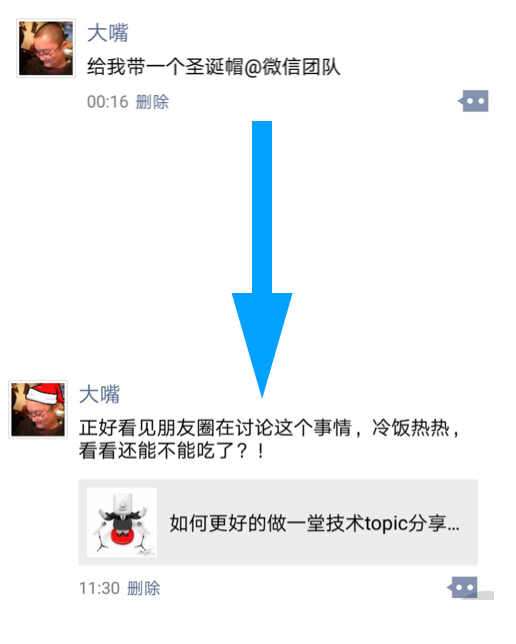
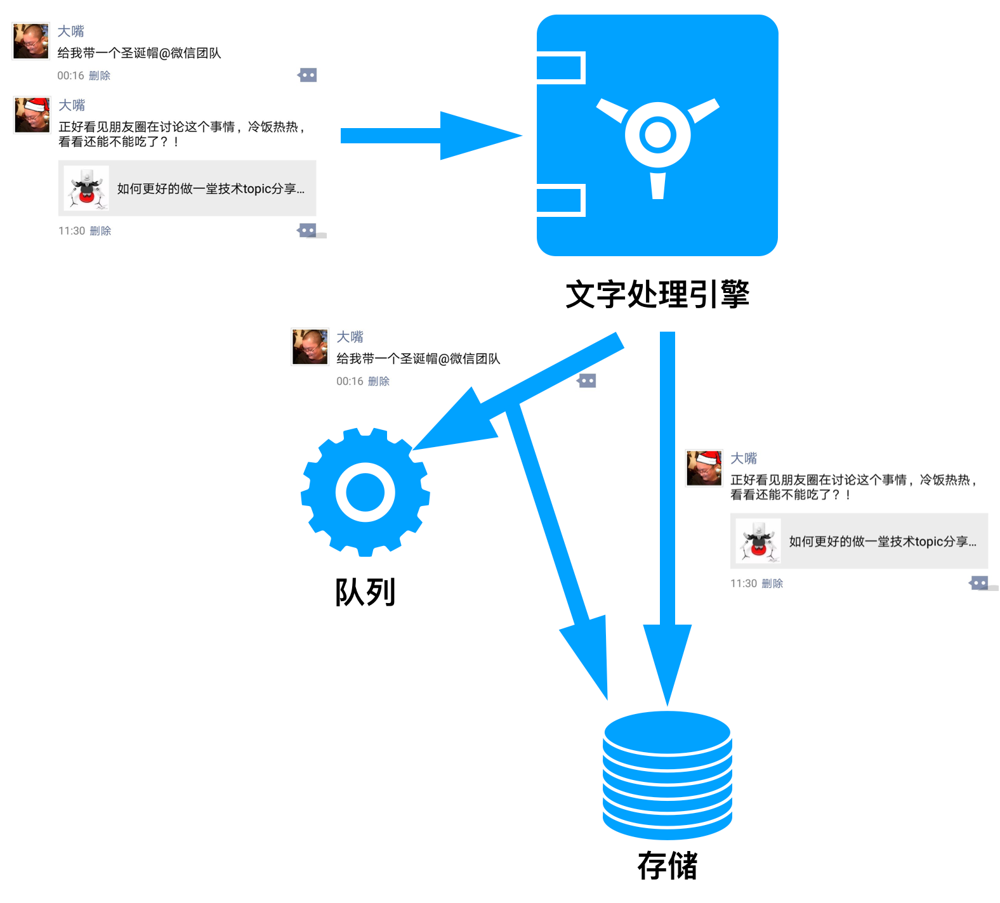
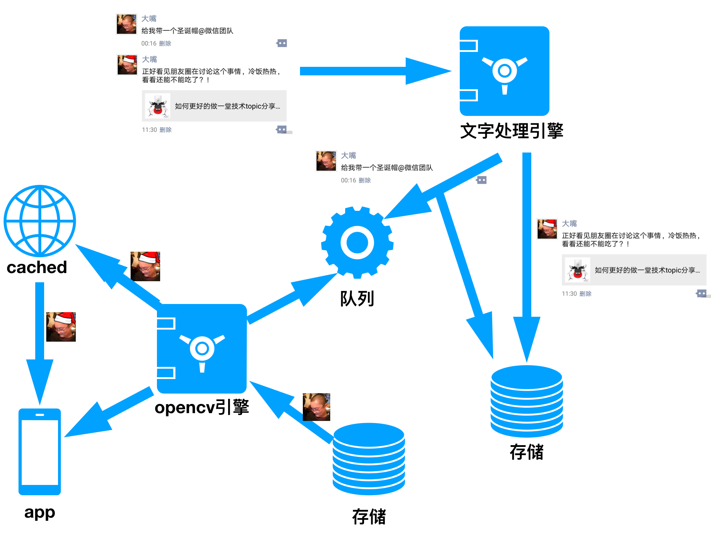

首先我声明：我的主要目的是来科普的，请叫我雷锋！   

起因我就不多说了，相信大家都已经被微信朋友圈内“@微信官方，请给我一顶圣诞帽”刷屏了！如图：

但结果........望穿秋水!

诚然，微信没有实现这个功能。    

本来就知道是恶作剧，我自己也在群里玩。作为技术人员，虽然稍微的想了一下技术方案，但是也没深究。原本这件事情就在嘻嘻哈哈中过去了，但下午看到CSDN技术头条的一篇推送，主要讲述了“朋友圈@微信官方头像添加圣诞帽”是无法实现的，原因......吧啦吧啦吧啦吧啦........！哎，好歹也是技术社区，怎么说也去知乎啥的发个帖，怎么就引用了娱乐版的“悟空问答”呢？

虽然微信没这个功能，但并不代表实现不了！在现有的技术环境下，这点需求都实现不了也未免太看不起我们程序员了吧？！哎，难得星期天放个假，还是一个大晴天，我还不闲着非要较个真？这么简单的功能无法实现？我终于知道为啥很多公司的产品经理和程序员之间一直水火不容了。

废话不说了，作为一个“好人”，重点还是我们的“科普大业”：怎么样全自动无手工干预的实现“朋友圈@微信官方头像添加圣诞帽”。

首先，我们先变身为产品，分析需求，如下：

从上图可以看出：“@”是发动者，头像更变是最后的结果。对于程序员来说，需要处理的问题点有几个：    
1. 如何知道用户发起来需要戴圣诞帽的要求；       
2. 如何识别出用户头像图片中的头部位置及其走向，然后尽可能正确的加上圣诞帽；        
3. 如何通知微信程序更新最新头像；    

首先，我们来解决第一个难点： 如何知道用户发起需要戴圣诞帽的要求？      
用户发一条朋友圈，微信服务器可以完整的得到该朋友圈的内容，所以微信后台可以对其进行内容解析。只要解析到朋友圈内容中带有“@微信官方”并且内容是“加/戴圣诞帽”相关的，就将该条朋友圈看做是用户需要更改头像。在技术上，我们将其视为给微信发送了一个通知，考虑到朋友圈的发送量和改变图片的实时性需求，稍微延迟一点更改头像也没有特别大的关系，所以将处理头像设计成异步模式，最简单的办法就是将通知放入队列，缓存起来。架构图如下：

第二步：解决图片识别问题。     
鉴于头像图片识别头部的需求，我们不需要太过于精确，所以也没有必要大张旗鼓的使用很多的AI脸部识别技术（PS：当然有更好），目前开源的项目中opencv即可解决识别问题。opencv可以识别出人脸在图片中位置，将其用坐标的形式“框”起来。考虑到有些用户头像的头部有干扰项：比如头部正好是黑色背景、头像中的人是光头......，可以适当的增加一些抗干扰的考虑项；如果要求更高一些，还可以根据眼睛、鼻子、耳朵等头部特征将头部的走向（防止有歪头的）大体计算清楚。这样在得到头部大体大小、坐标、走向的情况下，适当的调整圣诞帽的大小、坐标、走向，合并成一张图片即可；    

最后：通知微信更新最新头像。    
微信作为一个社交产品，它肯定会考虑加圣诞帽这个需求的时间效应：圣诞帽头像严格意义上说是具有极强时间效应的，所以这个头像存在的时间很短。用户更改头像的初衷并不是出于真心的喜欢，而只是图新鲜，2-5天度过圣诞节后即没用了。所以微信没必要真正的去更改用户的头像，这也就意味着我们根本不需要更改任何数据库的操作，我们直接从原头像的基础上更改，将更改好的图片使用原来头像的文件名推入缓存系统、并且通知微信app更新即可。只要保证在2-5之内头像存在就可以完成任务。当然，如果需要永久保留图片，这就增加数据库标志位字段，然后将加好帽子的图片存入到图片服务器，并且更新缓存服务器的头像图片；

综上所述，整套架构如下所示：

整个架构图都画出来，但是肯定还有很多的同学会懵逼，竟然不把生成的图片都存储下来？好吧，顺便也科普一下行业内存储图片和处理图片的常用方案。    
业内处理图片有一个不成文的规定：** 存原图，给效果图。** 展开来说就是：
** 程序在存储用户上传图片的时候尽量不处理或者少处理用户的图片，等到用户获取的时候再由程序根据当时的需求给出不同的图片。 **

我们最常见的图片操作：加水印、裁剪图片、缩放图片、压缩图片大小......，很多时候我们都在上传的时候解决了。这种方案不是不可以，但是并不好。不好的地方主要有2个：
1. 浪费存储空间。上传的时候进行处理，也就意味着程序要存储一张原图，还有n张效果图。这就是存储可能被扩大了n倍；      
2. 扩展难。目前的业务需求图片是200*200；过了3个月，业务方需要400*400；又过了2个月，业务方又需要一个300*300的......，纵使我们新需求可以通过更改代码来解决，老图片是不是还要创建一个job来遍历的跑一下才行？    

所以，图片处理正确的做法应该是：在用户获取图片的时候交给图片的http服务器处理。这种解决方案会在一定程度上增加http服务器的压力，但我们可以使用varlish/squid/cdn等成熟的缓存系统将其做到“尽可能的一次写N次读”。图片只有在第一次被访问的时候需要图片http服务器对其进行处理，以后只要这张图片不过期/不被回收，这张图片一直存在于缓存中，根据反向代理原理，请求在缓存处已经获取文件，故不会对图片http产生任何压力。虽然技术实现难度有所增加，但是却解决上面提到的2个最主要的问题。

注：以上方案纯属大体方向和个人揣测，实践中还需要再根据具体的业务做具体的调整。
       如有雷同，纯属巧合！

